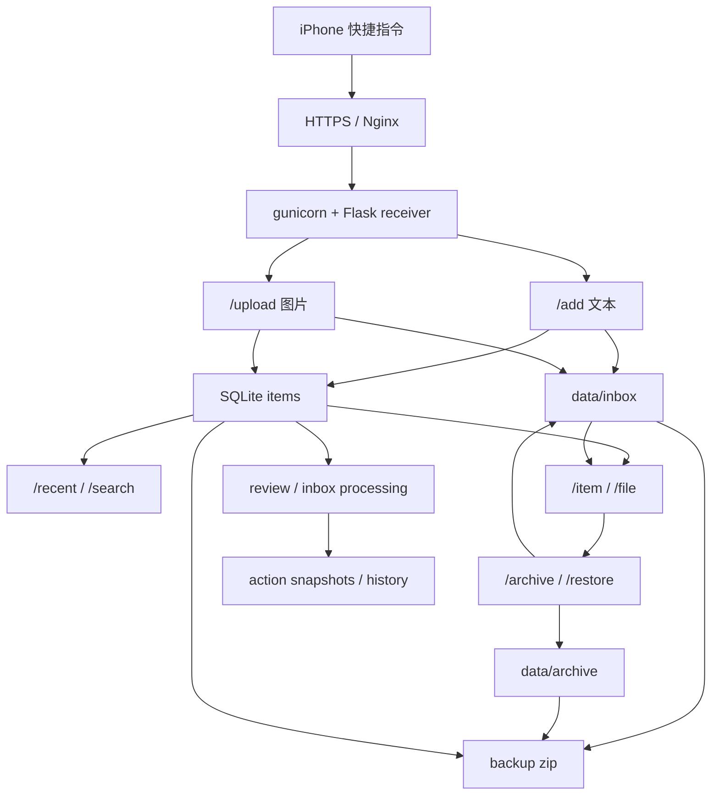

# Axiom

Axiom 是个人“外脑系统”的后端工程。它先把输入、存储、检索、备份、回顾底稿和安全处理链路跑通，再逐步接入更复杂的 AI 能力。

## 当前运行基线

当前线上基线已经部署在 VPS：

```text
iPhone / iOS 快捷指令
  -> https://pengweitai.me
  -> Nginx
  -> gunicorn
  -> Flask receiver
  -> 文件系统 + SQLite
  -> 备份 / 回顾 / inbox 处理自动化
```

当前技术栈：

- Python
- Flask
- SQLite
- 文件系统
- Nginx + gunicorn + systemd
- iOS 快捷指令作为输入端

这些是已经验证过的运行基线，不再作为永久硬约束。以后如果有明确收益，可以调整数据库、框架、部署形态或数据结构，但每次大改都要先写清收益、风险、迁移路径、回滚方案和验证办法。

## 当前能力

receiver 已提供：

- `/health`：服务和数据库健康检查
- `/stats`：总量、类型、来源、存储区统计
- `/add`：文本写入
- `/upload`：图片上传
- `/item/<id>`：读取单条元数据
- `/file/<id>`：按 item id 取回文件
- `/archive/<id>`：归档 item 文件
- `/restore/<id>`：从 archive 恢复到 inbox
- `/recent`：分页读取最近记录，支持类型、存储区、来源、时间过滤
- `/search`：关键词检索，支持相关性、时间和过滤条件
- `/artifacts`：列出 `data/reviews` 下的自动化产物
- `/artifacts/summary`：直接读取各类自动化产物的最新摘要
- `/artifacts/file/<path>`：取回 markdown artifact 文件

脚本侧已提供：

- 备份与恢复演练基础
- 文件和数据库一致性检查
- Markdown 导出
- 日回顾 / 周回顾底稿
- inbox 处理报告
- inbox action dry-run / apply 留痕
- action history 日 / 周汇总
- VPS systemd 定时任务模板

## 当前状态图



## 架构决策规则

以后可以改架构，但按下面顺序推进：

1. 先说明当前痛点和证据。
2. 再说明准备改什么，以及为什么值得改。
3. 明确会影响哪些真实数据、脚本、部署配置和文档。
4. 准备迁移步骤和回滚步骤。
5. 本地测试通过后，再考虑 VPS 部署。
6. 涉及真实数据前先备份。
7. 大变动提交前同步 README、DeepWiki 和上下文文档；小变动只更新 `docs/ITERATION_LOG.md`。

## 关键代码

- `core/receiver.py`：receiver 主入口，负责 API、鉴权、落盘、入库、查询、归档和恢复
- `core/init_db.py`：独立数据库初始化脚本，复用 receiver 的建表逻辑
- `scripts/backup_axiom.py`：备份 SQLite、inbox、archive 并生成 manifest
- `scripts/check_consistency.py`：检查文件系统和 SQLite 索引是否一致
- `scripts/smoke_test_receiver.py`：receiver 本地冒烟测试
- `scripts/build_review_markdown.py`：生成日 / 周回顾 Markdown
- `scripts/save_review_snapshot.py`：保存日 / 周回顾快照
- `scripts/build_inbox_processing_report.py`：生成 inbox 处理建议
- `scripts/apply_inbox_actions.py`：dry-run 或执行 inbox 动作
- `scripts/save_inbox_action_snapshot.py`：保存 inbox action 快照并附带一致性检查
- `scripts/list_inbox_action_snapshots.py`：读取历史 action snapshots
- `scripts/build_inbox_action_history_markdown.py`：聚合 action history
- `scripts/save_inbox_action_history_snapshot.py`：保存 action history 快照
- `scripts/generate_deepwiki_cache.py`：生成本地 DeepWiki 缓存
- `deploy/*.service` / `deploy/*.timer`：VPS systemd 服务和定时任务模板

## 本地验证

```powershell
pip install -r requirements.txt
python -m compileall -q core scripts
python scripts\smoke_test_receiver.py
python scripts\smoke_test_inbox_processing.py
python scripts\check_consistency.py --root .
```

如果本地没有同步 VPS 的真实 `data/inbox` 或 `data/archive`，一致性检查可能会报告缺文件。这是诊断结果，不代表脚本损坏。

## VPS 常用命令

```bash
cd /opt/axiom
sudo systemctl status axiom-receiver --no-pager
sudo journalctl -u axiom-receiver -f
tail -f /opt/axiom/logs/receiver.log
curl http://127.0.0.1:5000/health
python3 scripts/check_consistency.py --root /opt/axiom
python3 scripts/backup_axiom.py --root /opt/axiom --keep 14
```

部署更新的常规顺序：

```bash
cd /opt/axiom
git pull
. .venv/bin/activate
pip install -r requirements.txt
python3 scripts/check_consistency.py --root /opt/axiom
sudo systemctl restart axiom-receiver
curl http://127.0.0.1:5000/health
```

## 文档结构

- `docs/AI_CONTEXT.md`：给 AI 协作代理看的当前事实和决策规则
- `docs/HUMAN_CONTEXT.md`：给人看的接手路径和必须掌握的位置
- `deep-research-report.md`：长期目标研究报告
- `docs/SHORT_TERM.md`：短期推进方向
- `README.md`：项目简介
- `docs/ITERATION_LOG.md`：迭代记录
- `docs/DEEPWIKI.md`：DeepWiki 使用说明

## 推荐阅读顺序

人类接手：

1. `README.md`
2. DeepWiki 主入口
3. `docs/HUMAN_CONTEXT.md`
4. `docs/SHORT_TERM.md`
5. `deep-research-report.md`

AI 协作代理接手：

1. `docs/AI_CONTEXT.md`
2. `docs/SHORT_TERM.md`
3. `core/receiver.py`
4. `scripts/check_consistency.py`
5. `scripts/backup_axiom.py`
