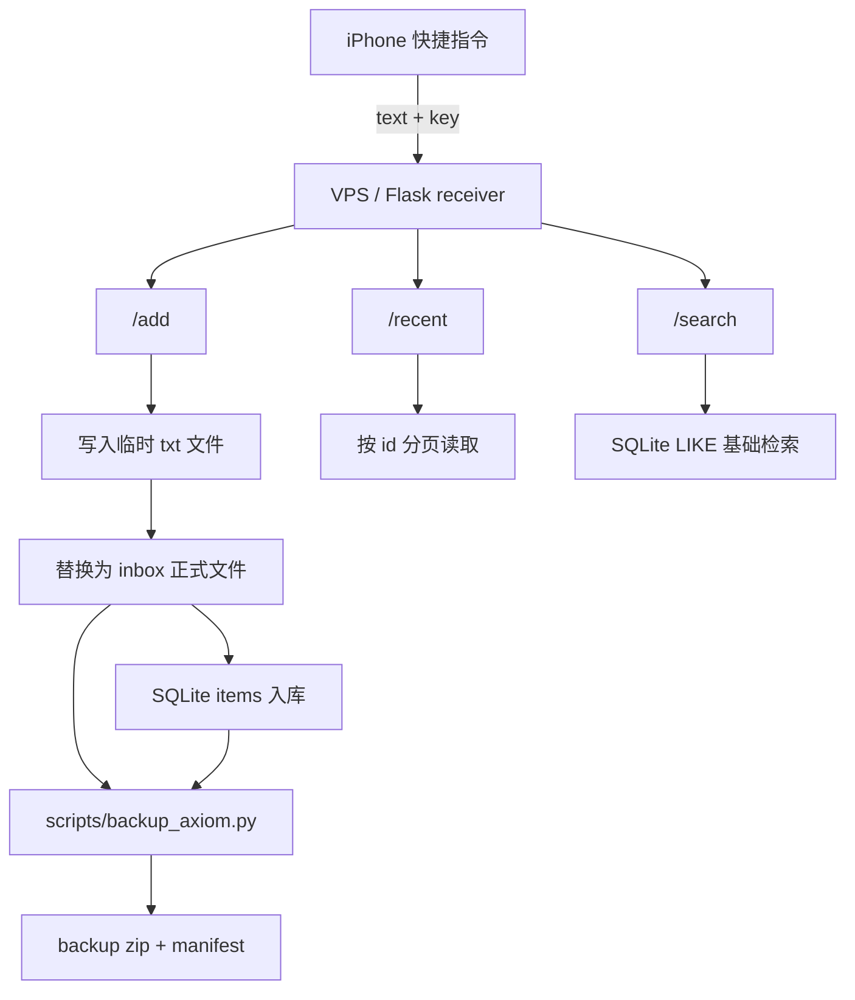

# Axiom

Axiom 是一个个人“外脑系统”的最小后端。

当前阶段围绕 `输入 -> 存储 -> 检索` 打基础，先把 VPS 单机后端做稳。

## 当前定位

当前阶段：`v0.1 alpha`

当前只做：

- 接收输入
- 持久化存储
- 基础检索
- 手动备份

当前暂缓：

- 复杂前端
- 复杂 agent
- 向量数据库
- 多服务拆分

## 当前状态图



## 当前链路

```text
iPhone
  -> iOS 快捷指令
  -> VPS
  -> Flask receiver
  -> 文件系统
  -> SQLite
```

当前原则：

- VPS 是主节点
- 文件是内容本体
- 数据库是索引
- 先把最小后端做稳，再谈 AI

## 关键代码

- `core/receiver.py`：当前主入口，负责 `/health`、`/add`、`/recent`、`/search`
- `core/init_db.py`：独立数据库初始化脚本，复用 `receiver.py` 的建表逻辑
- `scripts/backup_axiom.py`：手动备份脚本
- `scripts/check_consistency.py`：检查 inbox 文件和 SQLite 索引是否一致
- `scripts/smoke_test_receiver.py`：receiver 本地冒烟测试
- `scripts/generate_deepwiki_cache.py`：本地 DeepWiki 缓存生成脚本
- `requirements.txt`：当前 Python 运行依赖

## 本地验证

```powershell
pip install -r requirements.txt
python scripts\smoke_test_receiver.py
python scripts\check_consistency.py --root .
```

`check_consistency.py` 默认会把数据库里的 `/opt/axiom/...` 路径映射到传入的 `--root` 下，方便本地检查从 VPS 拉下来的数据。

## 文档结构

仓库里的文档只保留这几类：

- `docs/AI_CONTEXT.md`：给 AI 协作代理看的上下文
- `docs/HUMAN_CONTEXT.md`：给人看的上下文，附需要完全掌握的位置
- `deep-research-report.md`：长远目标研究报告
- `docs/SHORT_TERM.md`：短期目标和当前阶段主线
- `README.md`：项目简介
- `docs/ITERATION_LOG.md`：迭代记录
- `docs/DEEPWIKI.md`：DeepWiki 说明

## 先读哪几份

人类接手时先读：

1. `README.md`
2. `DeepWiki 主入口`
3. `docs/SHORT_TERM.md`
4. `deep-research-report.md`

AI 协作代理接手时先读：

1. `docs/AI_CONTEXT.md`
2. `docs/SHORT_TERM.md`
3. `core/receiver.py`
4. `scripts/backup_axiom.py`
