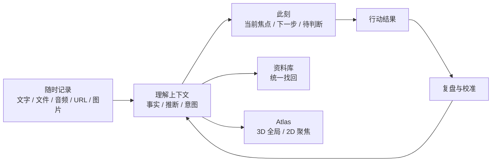

# Axiom

> 一个面向个人外脑的智能助理系统。
> 目标不是做一个更会聊天的模型，而是把采集、记忆、检索、图谱、任务、决策、回顾和安全自动化组织成长期可用的个人认知底座。

Axiom 当前处于 **v0.2+** 阶段，已经从最早的 iOS 快捷指令记录收集器，演进为部署在 VPS 上的个人外脑后端与跨端前端系统。它可以接收文本、图片、PDF、Word、音频和 URL 内容，沉淀为可检索、可回顾、可关联、可追溯的个人资料库，并逐步把这些资料连接到记忆、任务、决策、知识图谱和自动化流程中。

这个项目的长期方向来自一份系统研究报告：真正长期有用的外脑不是单一聊天入口，而是一个复合系统。它需要显式知识检索、分层长期记忆、工具与连接器、状态化编排、人工审批、审计治理，以及能够把“知道什么”转化成“今天做什么”的执行闭环。

## 为什么做

多数 AI 助手擅长即时回答，却很难长期稳定地帮助一个人积累职业资本、整合知识、减少重复输入、校准决策、推进目标和适配个体差异。

Axiom 试图解决的是更慢但更关键的问题：

- 让碎片输入不再散落在聊天、文件、网页、录音和脑子里。
- 让系统持续记住你确认过的事实、偏好、目标、关系与事件。
- 让记录不只是存档，而能被搜索、复盘、关联和转化为行动。
- 让任务、记忆、决策和知识图谱共享同一套个人上下文。
- 让自动化从低权限、可审计、可撤回的闭环开始，而不是直接走向全自动代理。

研究报告里的 MVP 判断是：系统首先应该跑通“采集 - 记忆 - 计划 - 回顾 - 微干预”闭环。Axiom 当前也沿这个方向推进。

## 核心理念

**个人外脑不是聊天框。**

聊天只是入口之一。真正的系统要有长期记忆、证据来源、结构化对象、任务推进、图谱关系和审计边界。

**先本地优先和低权限，再主动代理。**

连接器越强、写权限越高，提示注入、误操作、敏感信息泄露和自动化偏置风险越高。Axiom 默认把写操作、真实数据和自动化执行放在可验证、可回滚、可审计的链路里。

**记忆必须可见、可改、可删、可导出。**

长期记忆是高阶能力的共享底座，但不能变成黑箱。Axiom 将记忆设计为候选、确认、归档的三态系统，并保留来源记录。

**任务系统要服务启动，而不是制造压力。**

对拖延、启动困难、能量错配和注意力波动，系统不应只做提醒器，而应该把大目标拆成低摩擦的下一步，并通过回顾校准节奏。

**知识图谱要帮助理解关系。**

Atlas/Cosmos 不是为了炫技，而是为了让记录、记忆、任务、决策、主线和主题之间的关系可见，形成个人认知地图。

## 当前已具备

### 多源采集

- 文本、图片、PDF、Word、音频、URL 抓取。
- PDF/Word 正文抽取，音频转写，图片描述。
- iOS 快捷指令、Web/PWA、桌面端基础入口。
- 文件系统保存内容本体，SQLite 保存索引与元数据。

### 检索与回看

- SQLite FTS5 中文全文搜索，BM25 排序。
- 最近记录、处理积压、时间流、跨对象搜索。
- 原始文件、派生文本、转写文本与元数据统一检索。

### 记忆、任务与决策

- 五类记忆：事实、偏好、目标、人际关系、事件。
- 三态记忆流转：candidate -> confirmed -> archived。
- 任务系统：todo -> done -> cancelled，支持优先级和截止日期。
- “此刻”会根据期限、显式优先级、启动成本、近期上下文和已确认目标的显式关联选择一个主要行动，同时展示可核对的判断理由；完成后立即重排下一步，并可用一次轻反馈校准近期节奏。
- 已确认目标会成为承诺脉络；目标还没有未完成行动时，“此刻”直接提示补一个可开始的下一步，而不是增加目标工作台。
- 承诺可定义完成标准、目标日期、上层目标和复盘节奏，并在“推进中 / 暂停 / 已达成 / 已放下”之间流转；暂停或结束后保留历史，但相关行动退出“此刻”。
- 资料库可按项目或生活线汇合承诺、下一步、材料、事实、决定与近期历史；父生活线自然汇总子线，仍然读取同一份对象数据。
- 决策系统：pending -> reviewed，用于预演、实际结果和复盘。
- item -> memory 反向来源链，保留派生记忆的原始证据。

### Cosmos / Atlas 图谱

- Lifeline 主线树，用于组织长期生活、项目和主题。
- items / tasks / memories / decisions 作为统一实体挂载到图谱。
- 自动关联生成：文本相似度、时间邻接和 LLM 关系分类。
- Atlas v1 提供 3D 全局认知地图和 2D 聚焦探索形态。
- Cosmos 保留关系编辑、对象挂载和图谱调试能力。

### 自动化与治理

- 日/周回顾、inbox 处理报告、action dry-run/apply 留痕。
- automation_runs 记录手动触发与 systemd 定时任务状态。
- 数据导出、删除级联、审计日志、系统健康和指标接口。
- 自动化默认 dry-run，真实执行需要显式开启。

### 前端与跨端

- 主前端：Vite + Vue 3，入口为 `/app`。
- 默认工作面“此刻”，一级目的地为“此刻 / 资料库 / Atlas”，记录是任意位置可用的全局动作。
- Atlas 深链接：`/atlas`。
- 旧 PWA：`/app/legacy`，只保留兼容与回归价值。
- Learning Board 属于火山杯竞赛项目，只保留兼容入口，不进入 Axiom 一级产品结构。
- Tauri 桌面端基础设施已经跑通，移动端/PWA 继续作为轻量入口。

## 产品形态


```mermaid
flowchart LR
    Capture["随时记录\n文字 / 文件 / 音频 / URL / 图片"] --> Context["理解上下文\n事实 / 推断 / 意图"]
    Context --> Now["此刻\n当前焦点 / 下一步 / 待判断"]
    Context --> Library["资料库\n统一找回"]
    Context --> Atlas["Atlas\n3D 全局 / 2D 聚焦"]
    Now --> Result["行动结果"]
    Result --> Review["复盘与校准"]
    Review --> Context
```

Axiom 的理想工作流是：

1. 用户随时记录，不需要先判断对象类型。
2. Axiom 保留原始事实，并提出带依据的上下文理解。
3. “此刻”只突出当前焦点、可执行下一步和少量待判断内容。
4. 资料库负责统一找回，Atlas 负责理解关系。
5. 行动结果和日/周复盘持续校准之后的建议与记忆。
6. 外部写操作和高影响变化保持可审计、可撤回和人工确认。

## 技术架构

当前技术栈是已经验证的运行基线，而不是永久边界：

- 后端：Python / Flask / gunicorn
- 存储：SQLite + FTS5 + 文件系统
- 前端：Vite + Vue 3，另有 React Learning Board
- AI：OpenAI SDK，当前可接 DeepSeek 等模型用于解析、转写、描述、分类和聊天
- 部署：Nginx 反代 + systemd services/timers
- 桌面端：Tauri v2 基础应用
- 测试：compileall、receiver/web app/inbox smoke tests、consistency check

线上基线：

```text
iPhone / Browser / Desktop
  -> https://pengweitai.me
  -> Nginx
  -> gunicorn
  -> Flask
  -> SQLite + 文件系统
  -> 自动化任务 / 回顾 / 图谱 / 前端
```

## 当前阶段

Axiom 已经越过“能不能收集记录”的阶段，正在进入“把个人资料组织成可行动外脑”的阶段。

已建成的主线：

- 采集、存储、检索、归档、备份、审计。
- 记忆、任务、决策、自动化产物。
- Vue 主前端 `/app` 与 Atlas `/atlas`。
- Cosmos/Atlas 图谱底座。
- Learning Board 与桌面端基础设施。

仍在推进的主线：

- Atlas 交互与图谱编辑能力。
- 在现有“承诺档案 -> 下一步 -> 结果 -> 复盘”闭环上继续发展可回顾的任务拆解与周计划节奏。
- AI 主动建议与长期推理层。
- 个体差异适配：能量、注意力、启动困难和节奏反馈。
- 白板能力与图谱/对象系统的连接。

## 快速开始

```powershell
git clone <repo-url>
cd Axiom
python -m venv .venv
.\.venv\Scripts\Activate.ps1
pip install -r requirements.txt
```

初始化数据库并启动后端：

```powershell
python core\init_db.py
$env:AXIOM_KEY="dev-key"
python -m core.receiver
```

前端开发：

```powershell
cd frontend
npm install
npm run dev
```

本地常用入口：

- 主前端：`http://127.0.0.1:5000/app`
- Atlas：`http://127.0.0.1:5000/atlas`
- 旧 PWA：`http://127.0.0.1:5000/app/legacy`
- 健康检查：`http://127.0.0.1:5000/health`

## 验证

文档或轻量改动：

```powershell
git diff --check
```

后端主链路：

```powershell
python -m compileall -q core scripts
python scripts\smoke_test_receiver.py
python scripts\smoke_test_inbox_processing.py
python scripts\check_consistency.py --root .
```

前端主链路：

```powershell
cd frontend
npm install
npm run build
cd ..
python scripts\smoke_test_web_app.py
```

## 部署

部署脚本会从当前 commit 生成发布包，备份 VPS 代码，同步文件，安装 systemd unit，重启服务并验证：

```powershell
python scripts\deploy_to_vps.py
```

涉及真实 VPS 数据、调度器、Nginx 或 systemd 配置时，先检查现状并保留回滚路径。自动化默认 dry-run，真实执行需要显式 `--apply`。

## 文档入口

- `docs/AGENT_BRIEFING.md`：给 AI agent 的 5 分钟项目简报。
- `docs/PROJECT_MAINLINE.md`：当前主线、入口、前端边界和文档维护规则。
- `docs/AI_CONTEXT.md`：运行事实、协作方式和架构决策规则。
- `docs/HUMAN_CONTEXT.md`：给人类开发者的背景说明。
- `docs/ITERATION_LOG.md`：迭代记录。
- `deep-research-report.md`：长期目标与研究依据。

## 路线图

短期目标：

- 稳住 Vue 主前端，把旧 PWA 能力继续迁入主线。
- 强化 Atlas/Cosmos 图谱交互，让关系不仅可看，也可编辑。
- 把任务、记忆、决策和时间流进一步打通。
- 在项目/生活线详情基础上补上可回顾的拆解与轻量周计划节奏。
- 为白板功能准备对象详情、图谱节点和学习板之间的共享基础设施。

中期目标：

- 承诺拆解、周计划、日计划和决策日志形成更完整的执行闭环。
- AI 从“解析/转写/描述工具层”进入“建议/推理/提醒层”。
- 引入只读连接器与更稳健的权限边界。
- 让系统能证明它减少了重复输入、计划漂移和低价值劳动。

长期目标：

- 形成“记忆 - 执行 - 反馈 - 再计划”的个人复利飞轮。
- 发展个体差异适配能力，支持能量、注意力、启动困难和反馈节奏。
- 在审计、导出、删除、权限和模型安全足够成熟后，再考虑更主动的代理能力与多人使用形态。

## 项目原则

- 小改动只更新 `docs/ITERATION_LOG.md`。
- 大改动同步 README、AI_CONTEXT、HUMAN_CONTEXT 和相关设计文档。
- 涉及真实数据前先备份。
- 部署前按影响范围运行本地检查。
- 新前端功能默认进入 `frontend/src/`，旧前端只做兼容或迁移参考。
- 项目说明、任务记录和交接文档默认使用中文。
