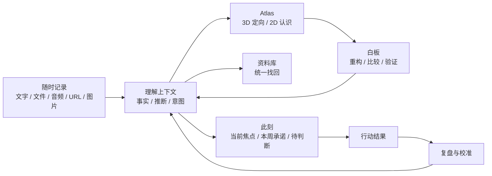

# Axiom

> 一个面向个人外脑的智能助理系统。
> 目标不是做一个更会聊天的模型，而是把采集、记忆、检索、图谱、任务、决策、回顾和安全自动化组织成长期可用的个人认知底座。

Axiom 当前处于 **v0.2+** 阶段，已经从最早的 iOS 快捷指令记录收集器，演进为部署在 VPS 上的个人外脑后端与跨端前端系统。它可以接收文本、图片、PDF、Word、音频和 URL 内容，沉淀为可检索、可回顾、可关联、可追溯的个人资料库，并逐步把这些资料连接到记忆、行动、决定、知识图谱和自动化流程中。更长期的目标是一座私人的发现中枢：它不仅理解用户，还会观察世界、主动提出问题、寻找跨领域规律、形成可证伪假说，并发现人与环境之间尚未被看见的机会。

这个项目的长期方向来自一份系统研究报告：真正长期有用的外脑不是单一聊天入口，而是一个复合系统。它需要显式知识检索、分层长期记忆、工具与连接器、状态化编排、人工审批、审计治理，以及能够把“知道什么”转化成“今天做什么”的执行闭环。

## 为什么做

多数 AI 助手擅长即时回答，却很难长期稳定地帮助一个人积累职业资本、整合知识、减少重复输入、校准决策、推进目标和适配个体差异。

Axiom 试图解决的是更慢但更关键的问题：

- 让碎片输入不再散落在聊天、文件、网页、录音和脑子里。
- 让系统持续记住你确认过的事实、偏好、目标、关系与事件。
- 让记录不只是存档，而能被搜索、复盘、关联和转化为行动。
- 让任务、记忆、决策和知识图谱共享同一套个人上下文。
- 让自动化从低权限、可审计、可撤回的闭环开始，而不是直接走向全自动代理。

研究报告里的 MVP 判断是：系统首先应该跑通“采集 - 记忆 - 计划 - 回顾 - 微干预”闭环。这个基础闭环仍然有效，但它不是终点；下一阶段的中枢方向是“观察 - 选题 - 规律 - 假说 - 验证 - 发现 - 行动 - 校准”，总纲见 [`docs/AXIOM_DISCOVERY_CORTEX_RESEARCH_V2.md`](docs/AXIOM_DISCOVERY_CORTEX_RESEARCH_V2.md)，各认知器官及 Atlas/白板专项研究见 [`docs/discovery_cortex/00_RESEARCH_MAP.md`](docs/discovery_cortex/00_RESEARCH_MAP.md)。

## 核心理念

**个人外脑不是聊天框。**

聊天只是入口之一。真正的系统要有长期记忆、证据来源、结构化对象、任务推进、图谱关系和审计边界。

**先本地优先和低权限，再主动代理。**

连接器越强、写权限越高，提示注入、误操作、敏感信息泄露和自动化偏置风险越高。Axiom 默认把写操作、真实数据和自动化执行放在可验证、可回滚、可审计的链路里。

**记忆必须可见、可改、可删、可导出。**

长期记忆是高阶能力的共享底座，但不能变成黑箱。Axiom 将记忆设计为候选、确认、归档的三态系统，并保留来源记录。

**任务系统要服务启动，而不是制造压力。**

对拖延、启动困难、能量错配和注意力波动，系统不应只做提醒器，而应该把大目标拆成低摩擦的下一步，并通过回顾校准节奏。

**Atlas 要帮助人理解自己的认识，而不是展示机器内部结构。**

Atlas 不是数据库关系的漂亮投影。3D 全局只负责长期领域、地标、桥梁、张力和未知前沿的认知定向；聚焦后连续进入适合当前问题的 2D 认识平面与证据审理。中枢的对象类型、弱关系和模型分数不直接泄漏给人。

**白板要让复杂认识被看懂，而不是把整理劳动交给人。**

Axiom 白板从此刻或 Atlas 按问题展开，由中枢主动把材料、机制、证据、反证、时间、公式与情景编排成可理解、可质疑的认知展演。人通过追问、比较、换尺度和判断参与，不从空白开始摆放节点，也不维护画布。白板布局不会直接写回 Atlas；真正改变长期地形的是经过来源、边界与竞争解释审理的认识变化。火山杯 Learning Board 是独立竞赛项目，不定义这一产品形态。

**界面是一件认知器物，不是功能仪表盘。**

Axiom 下一代前端采用原生暗色的“夜行长卷”：它不是主题皮肤，而是从此刻恢复语境、沿 Atlas 进入关系地形、再让白板展开问题的一次连续观看。中国手卷的游观与留白、关系蒙太奇、知觉之光、数据尺度和动态解释媒介被转化为注意节奏与认识论视觉语法；构图可以提出解释，但不能冒充事实。完整方向见 [`docs/FRONTEND_ART_DIRECTION.md`](docs/FRONTEND_ART_DIRECTION.md)。

界面默认追求低摩擦：打开就恢复“此刻”，记录不要求预先分类，资料库沿当前线索找回；任务、记忆和决定只在相关语境中投影，自动化、结构、日志和系统治理进入独立 Foundry，不再塞进日常索引。

## 当前已具备

### 多源采集

- 文本、图片、PDF、Word、音频、URL 抓取。
- PDF/Word 正文抽取，音频转写，图片描述。
- iOS 快捷指令、Web/PWA、桌面端基础入口。
- 文件系统保存内容本体，SQLite 保存索引与元数据。

### 检索与回看

- SQLite FTS5 中文全文搜索，BM25 排序。
- 最近记录、处理积压、时间流、跨对象搜索。
- 原始文件、派生文本、转写文本与元数据统一检索。

### 记忆、任务与决策

- 五类记忆：事实、偏好、目标、人际关系、事件。
- 三态记忆流转：candidate -> confirmed -> archived。
- 任务系统：todo -> done -> cancelled，支持优先级和截止日期。
- “此刻”会根据期限、显式优先级、启动成本、近期上下文和已确认目标的显式关联选择一个主要行动，同时展示可核对的判断理由；完成后立即重排下一步，并可用一次轻反馈校准近期节奏。
- 已确认目标会成为承诺脉络；目标还没有未完成行动时，“此刻”直接提示补一个可开始的下一步，而不是增加目标工作台。
- 承诺可定义完成标准、目标日期、上层目标和复盘节奏，并在“推进中 / 暂停 / 已达成 / 已放下”之间流转；暂停或结束后保留历史，但相关行动退出“此刻”。
- “本周承诺”嵌在“此刻”中：从现有行动里明确选择最多五项，完成后保留周内进度；它会影响当前判断，但不会覆盖行动自身的逾期和明确期限。
- 过大的行动可以在详情中拆成最多五个可执行步骤；步骤继承原目标、项目脉络和期限并接续进入“此刻”，上层行动保留来源与真实进度，不另建任务树工作台。
- DeepSeek V4 Pro 只生成可编辑、可放弃的拆解候选；确认、修改和放弃会形成不含候选正文的结果统计，用于在样本足够后保守校准下一次建议。
- 当本周行动长期未启动、步骤持续卡住或周承诺明显失速时，“待你判断”最多出现两条带依据提示；它们只打开原任务或周复盘，可以本周忽略，不自动创建行动。
- 资料库可按项目或生活线汇合承诺、下一步、材料、事实、决定与近期历史；父生活线自然汇总子线，仍然读取同一份对象数据。
- 决策系统：pending -> reviewed，用于预演、实际结果和复盘。
- item -> memory 反向来源链，保留派生记忆的原始证据。

### Cosmos / Atlas 图谱

- Lifeline 主线树，用于组织长期生活、项目和主题。
- items / tasks / memories / decisions 作为统一实体挂载到图谱。
- 自动关联生成：文本相似度、时间邻接和 LLM 关系分类。
- Atlas v1 提供 3D 全局认知地图和 2D 聚焦探索形态。
- Cosmos 保留关系编辑、对象挂载和图谱调试能力。

Atlas v1 是当前可运行基线，不是下一代目标形态。新研究已把下一代 Atlas 定义为“3D 发现地形 -> 连续下潜 -> 任务适配的 2D 认识平面 -> 证据审理”，完整约束见 [`docs/discovery_cortex/07_ATLAS_DISCOVERY_LANDSCAPE.md`](docs/discovery_cortex/07_ATLAS_DISCOVERY_LANDSCAPE.md)。

### 自动化与治理

- 日/周回顾、inbox 处理报告、action dry-run/apply 留痕。
- automation_runs 记录手动触发与 systemd 定时任务状态。
- 数据导出、删除级联、审计日志、系统健康和指标接口。
- 自动化默认 dry-run，真实执行需要显式开启。

### 前端与跨端

- 主前端：Vite + Vue 3，入口为 `/app`。
- 默认工作面“此刻”，一级目的地为“此刻 / 资料库 / Atlas”，记录是任意位置可用的全局动作。
- Atlas 深链接：`/atlas`。
- 旧 PWA：`/app/legacy`，只保留兼容与回归价值。
- Learning Board 属于火山杯独立竞赛项目；仓库中的相关实现按独立交付维护，不进入 Axiom 产品导航与主线演进。
- Axiom 白板是未来从当前问题按需展开的共同发现环境，不是 Learning Board 改名，也不是第四个一级目的地；研究见 [`docs/discovery_cortex/08_WHITEBOARD_CO_DISCOVERY_ENVIRONMENT.md`](docs/discovery_cortex/08_WHITEBOARD_CO_DISCOVERY_ENVIRONMENT.md)。
- Tauri 桌面端基础设施已经跑通，移动端/PWA 继续作为轻量入口。

## 产品形态


```mermaid
flowchart LR
    Capture["随时记录\n文字 / 文件 / 音频 / URL / 图片"] --> Context["理解上下文\n事实 / 推断 / 意图"]
    Context --> Now["此刻\n当前焦点 / 本周承诺 / 待判断"]
    Context --> Library["资料库\n统一找回"]
    Context --> Atlas["Atlas\n3D 定向 / 2D 认识"]
    Atlas --> Board["白板\n重构 / 比较 / 验证"]
    Board --> Context
    Now --> Result["行动结果"]
    Result --> Review["复盘与校准"]
    Review --> Context
```

Axiom 的理想工作流是：

1. 用户随时记录，不需要先判断对象类型。
2. Axiom 保留原始事实，并提出带依据的上下文理解。
3. “此刻”只突出当前焦点、本周明确承诺的少量行动和待判断内容。
4. 资料库负责统一找回，Atlas 负责认知定向与关系审理；需要改变表征时，从当前问题自然展开白板。
5. 行动结果和日/周复盘持续校准之后的建议与记忆。
6. 外部写操作和高影响变化保持可审计、可撤回和人工确认。

## 技术架构

当前技术栈是已经验证的运行基线，而不是永久边界：

- 后端：Python / Flask / gunicorn
- 存储：SQLite + FTS5 + 文件系统
- 前端：Vite + Vue 3；React Learning Board 作为独立竞赛项目维护
- AI：OpenAI SDK + DeepSeek V4；V4 Flash 负责日常解析与分类，V4 Pro 负责需要更强推理的可撤回建议
- 部署：Nginx 反代 + systemd services/timers
- 桌面端：Tauri v2 基础应用
- 测试：compileall、receiver/web app/inbox smoke tests、consistency check

线上基线：

```text
iPhone / Browser / Desktop
  -> https://pengweitai.me
  -> Nginx
  -> gunicorn
  -> Flask
  -> SQLite + 文件系统
  -> 自动化任务 / 回顾 / 图谱 / 前端
```

## 当前阶段

Axiom 已经越过“能不能收集记录”的阶段，正在进入“把个人资料组织成可行动外脑”的阶段。

已建成的主线：

- 采集、存储、检索、归档、备份、审计。
- 记忆、任务、决策、自动化产物。
- Vue 主前端 `/app` 与 Atlas `/atlas`。
- Cosmos/Atlas 图谱底座。
- 桌面端基础设施；Learning Board 另按独立竞赛项目交付。

仍在推进的主线：

- Atlas 交互与图谱编辑能力。
- “承诺档案 -> 本周选择 -> AI/手动拆解 -> 下一步 -> 结果 -> 周复盘”闭环已形成，并开始记录候选确认、修改、放弃与提示忽略结果；下一步用真实使用校准阈值。
- 有界站内卡点提示已经接入“此刻”；先验证它是否真正推动原行动，再决定是否发展定时推送或更长期的推理层。
- 个体差异适配：能量、注意力、启动困难和节奏反馈。
- 守住 Axiom 与独立竞赛项目之间的导航、数据和交付边界。

## 快速开始

```powershell
git clone <repo-url>
cd Axiom
python -m venv .venv
.\.venv\Scripts\Activate.ps1
pip install -r requirements.txt
```

初始化数据库并启动后端：

```powershell
python core\init_db.py
$env:AXIOM_KEY="dev-key"
python -m core.receiver
```

前端开发：

```powershell
cd frontend
npm install
npm run dev
```

本地常用入口：

- 主前端：`http://127.0.0.1:5000/app`
- Atlas：`http://127.0.0.1:5000/atlas`
- 旧 PWA：`http://127.0.0.1:5000/app/legacy`
- 健康检查：`http://127.0.0.1:5000/health`

## 验证

文档或轻量改动：

```powershell
git diff --check
```

后端主链路：

```powershell
python -m compileall -q core scripts
python scripts\smoke_test_receiver.py
python scripts\smoke_test_inbox_processing.py
python scripts\check_consistency.py --root .
```

前端主链路：

```powershell
cd frontend
npm install
npm run build
cd ..
python scripts\smoke_test_web_app.py
```

## 部署

部署脚本会从当前 commit 生成发布包，备份 VPS 代码，同步文件，安装 systemd unit，重启服务并验证：

```powershell
python scripts\deploy_to_vps.py
```

涉及真实 VPS 数据、调度器、Nginx 或 systemd 配置时，先检查现状并保留回滚路径。自动化默认 dry-run，真实执行需要显式 `--apply`。

## 文档入口

- `docs/AGENT_BRIEFING.md`：给 AI agent 的 5 分钟项目简报。
- `docs/PROJECT_MAINLINE.md`：当前主线、入口、前端边界和文档维护规则。
- `docs/AI_CONTEXT.md`：运行事实、协作方式和架构决策规则。
- `docs/HUMAN_CONTEXT.md`：给人类开发者的背景说明。
- `docs/ITERATION_LOG.md`：迭代记录。
- `docs/discovery_cortex/00_RESEARCH_MAP.md`：发现中枢各板块专题研究入口，重点包括 Atlas、白板及两者的连续契约。
- `deep-research-report.md`：长期目标与研究依据。

## 路线图

短期目标：

- 以专题研究为依据，先做下一代 Atlas 的低保真认识任务原型，验证定向、连续下潜、竞争解释和证据审理，不直接装饰现有 v1。
- 原型化 Axiom 白板的原生痕迹、候选层、渐进形式化与可逆表征转换，并保持与火山杯 Learning Board 的产品边界。
- 定义 Atlas 与白板之间的来源、版本、候选和晋升契约，防止草图与 AI 输出污染长期认识。
- 把观察、问题议程和少量发现邀请接入“此刻”，验证主动性是否值得注意成本。
- 继续保持采集、检索、行动与治理基线稳定，为发现循环提供真实结果反馈。

中期目标：

- 形成“观察 -> 问题 -> 规律/类比 -> 竞争假说 -> 验证”的认识闭环。
- 让 Atlas、白板和日常环境共享人的认识对象，但保持人类投影、中枢内部表示和候选草稿的边界。
- 建立预测台账、类比成败史和实验结果，开始评价发现质量而非生成量。
- 引入只读世界观察源与更稳健的权限、来源独立性和注意力治理。

长期目标：

- 形成“人的理论 + 世界的理论 + 交互理论 + 发现方法”的长期认知复利。
- 让中枢能够自主发现跨领域规律、原创假说和非显然机会，同时持续主动反证与校准。
- 让日常环境保持低摩擦与安静，Foundry 承载认知生产、能力竞争和受治理的系统自我进化。

## 项目原则

- 小改动只更新 `docs/ITERATION_LOG.md`。
- 大改动同步 README、AI_CONTEXT、HUMAN_CONTEXT 和相关设计文档。
- 涉及真实数据前先备份。
- 部署前按影响范围运行本地检查。
- 新前端功能默认进入 `frontend/src/`，旧前端只做兼容或迁移参考。
- 项目说明、任务记录和交接文档默认使用中文。
