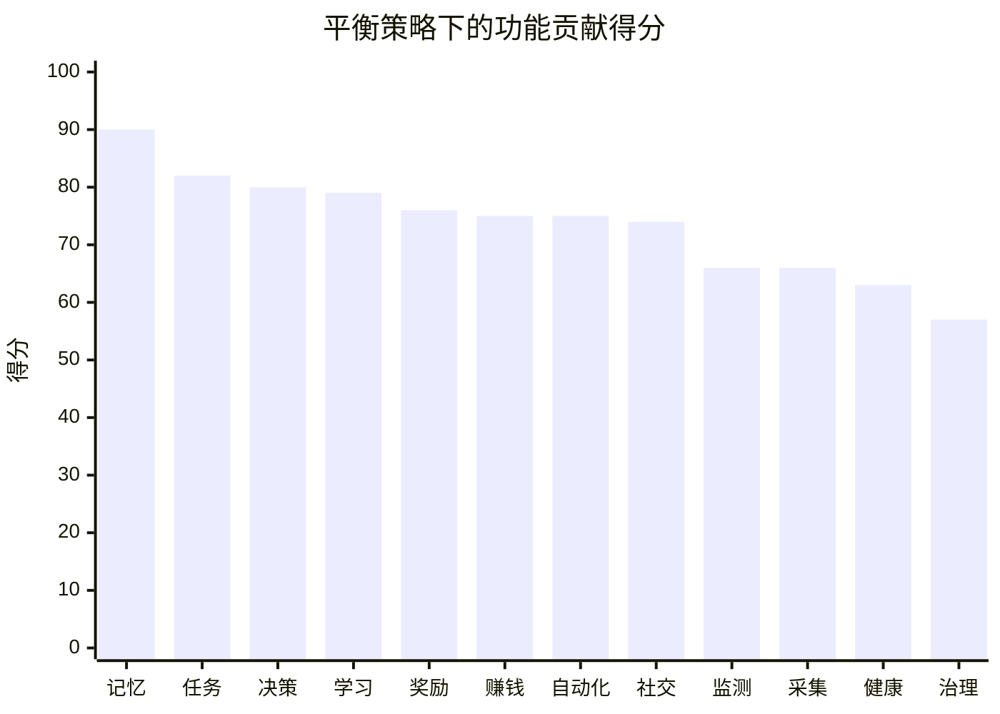
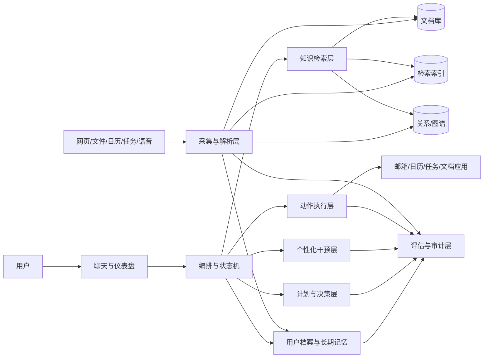
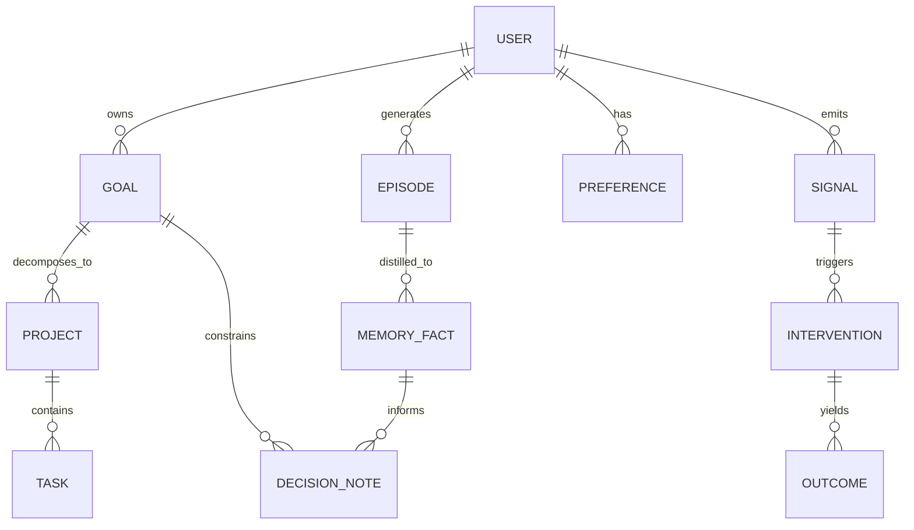
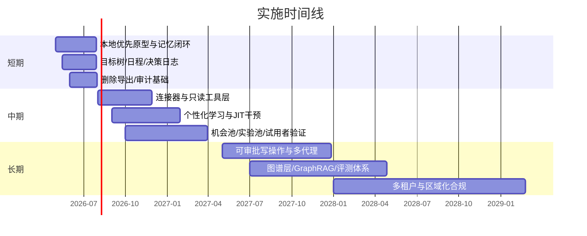

# 构建外脑式个人智能助理的系统研究报告

## 执行摘要

现有一手论文与官方文档指向同一个结构性结论：真正长期有用的“外脑”并不是一个更会聊天的模型，而是由**显式知识检索、分层长短期记忆、工具/连接器、状态化编排、人工审批**共同组成的复合系统。RAG 解决显式知识与来源可追溯，MemGPT 与 Generative Agents 说明了“记忆—反思—计划”结构的必要性，MCP/连接器则把私有数据与外部动作接到模型上，而状态化 agent 框架已经把持久执行、长期记忆和人在回路作为一等公民。citeturn9search0turn8search2turn8search1turn26view0turn29view0turn26view1turn26view2

如果你的目标是“长期帮助自己或未来用户在事业、赚钱、知识整合、决策、个人成长与个体差异适配上取得实质性进展”，最优起点不是“全自动生活操作系统”，而是**单用户、本地优先、只读为主、写操作审批**的 MVP，先跑通“采集—记忆—计划—回顾—微干预”闭环，再逐步扩展到主动代理与多租户 SaaS。原因很简单：连接器越强、代理权限越高，提示注入、不安全输出处理、敏感信息泄露与自动化偏置风险就越高；如果未来面向中国境内公众提供服务，还要同步满足个人信息保护与生成式 AI 服务要求。citeturn27view1turn27view4turn26view10turn26view11

针对 ADHD 与更广义的个体差异，系统不应只做“提醒器”，而应做成**短延迟反馈 + 小任务起步 + 状态感知干预 + 可解释自我实验**。官方精神卫生资料强调 ADHD 会长期影响注意、冲动控制、组织与工作表现；奖励通路与 delay aversion 研究又说明，等待成本与反馈时滞会显著影响任务启动和持续性，因此系统必须把“任务拆解、即时反馈、低摩擦开始、节律性复盘”做成一等能力，而不是附加插件。citeturn27view9turn6search7turn6search8turn6search1

在本文的平衡策略量化中，**长期记忆与个人档案、目标树/任务/日程管理、决策支持与反偏差、个性化学习路径、动机增强与奖励回路**是直接贡献最高的五类能力；如果切换到“赚钱导向”，机会发现/赚钱/创业建议会明显上升；如果切换到“幸福/生活质量导向”，情绪—注意力—能量监测会明显上升。这意味着：**贡献排序不是开发顺序**，但它决定系统应该先围绕什么能力形成“复利飞轮”。 

## 目标边界与假设

**用户目标矩阵**

| 用户目标 | 你真正想买到的结果 | 典型可衡量指标 | 主导模块 |
| --- | --- | --- | --- |
| 事业发展 | 形成职业资本、提高输出质量、减少低价值劳动 | 周/季度关键成果完成率、作品/项目沉淀数、深度工作时长 | 长期记忆、任务系统、学习路径、自动化执行 |
| 赚钱与机会 | 发现可变现机会、提升执行转化率、降低机会遗漏 | 机会池数量、实验转化率、收入相关行动完成率 | 机会发现、决策支持、任务系统、自动化执行 |
| 知识获取与整合 | 更快采集、更少遗忘、更强跨主题关联 | 每周有效输入量、复习命中率、知识图谱连接密度 | 知识采集、长期记忆、学习路径、GraphRAG |
| 决策质量 | 做更少后悔决策，提升判断一致性 | 决策日志回看命中率、复盘后修正率、后悔率下降 | 决策支持、记忆、证据检索、反偏差流程 |
| 个人成长 | 社交更稳、价值观更清晰、习惯更稳、兴趣更有质量 | 关系维护频率、习惯坚持率、兴趣消费满意度 | 社交教练、奖励回路、健康/内容教练 |
| 个体差异适配 | 降低拖延、启动困难、能量错配与自责成本 | 启动延迟、计划兑现差、专注块完成率、过载日比例 | 注意力/情绪监测、奖励回路、任务系统、JIT 干预 |

**关键影响领域**

| 领域 | 状态 | 作用 | 代表模块 |
| --- | --- | --- | --- |
| 计算机 | 已知 | 系统工程、数据结构、接口、自动化、检索基础 | 采集、存储、编排、执行 |
| 人工智能 | 已知 | 记忆、检索、总结、规划、个性化推断 | 长期记忆、决策、代理 |
| 金融 | 已知 | 赚钱机会、风险收益、资产与职业决策 | 机会发现、决策支持 |
| 神经科学 | 已知 | 奖励、注意、习惯、疲劳与反馈设计 | 注意力监测、奖励回路 |
| 社会学 | 已知 | 社会规范、角色关系、偏见、群体互动 | 社交教练、价值观校准 |
| 心理学 | 已知 | 动机、自我调节、认知偏差、情绪管理 | 奖励回路、决策、情绪监测 |
| 管理学 | 已知 | 目标拆解、项目推进、资源配置、复盘 | 目标树、项目系统、周回顾 |
| 教育学 | 未指定 | 学习路径设计、分层掌握、复习机制 | 个性化学习路径 |
| 人机交互 | 未指定 | 低摩擦输入、解释性、通知节律 | 交互层、干预层 |
| 法务与合规 | 未指定 | 数据最小化、权限、删除、审计 | 治理层 |
| 运动科学与营养 | 未指定 | 健身与恢复计划设计 | 健康/健身教练 |
| 内容研究与推荐 | 未指定 | 影视/书籍/信息流精选与去噪 | 内容生活教练 |

**未指定项与不同假设下的影响**

如果系统先用于**个人自用或小范围内测**，架构可优先采用本地优先、默认只读、半结构化存储与人工确认记忆；若未来要**面向中国境内公众提供服务**，则需要把权限、删除、导出、审计、敏感信息处理和模型安全前置，因为《个人信息保护法》强调合法、正当、必要、最小化原则，而《生成式人工智能服务管理暂行办法》适用于向境内公众提供生成式 AI 服务；相反，研发、应用但**未向境内公众提供服务**的情形不适用该办法。citeturn26view10turn26view11

| 假设场景 | 预算 | 团队规模 | 技术栈 | 目标用户规模 | 对系统设计的影响 |
| --- | --- | --- | --- | --- | --- |
| 自用原型 | 未指定 | 未指定 | 未指定 | 未指定 | 建议默认按“1–2 人、单用户、本地优先、低自动化权限”估算；核心是可用性而非平台化 |
| 小范围试用 | 未指定 | 未指定 | 未指定 | 未指定 | 需要开始做多账号、权限、日志与基础计费埋点，但仍应控制写权限 |
| 产品化 SaaS | 未指定 | 未指定 | 未指定 | 未指定 | 需要多租户隔离、区域化合规、客服/风控/审计、AB 实验与模型评测体系 |

## 功能版图与贡献排序

本文的功能清单不是“愿望清单”，而是从当前已经被证明可行的能力组合里抽出来的：**检索增强与图化检索、层级记忆、工具调用/连接器、会议与阅读记忆、神经多样性任务拆解、时间分块与现实容量管理**。换言之，你要做的不是发明一套完全新范式，而是把这些分散能力，围绕“个人长期复利”重新编排成一个统一系统。citeturn9search0turn26view4turn26view2turn8search3turn28view5turn28view0turn26view8turn28view3

**目标到功能的映射**

| 目标 | 需要的核心功能 |
| --- | --- |
| 事业 | 长期记忆、目标树/任务/日程、学习路径、决策支持、自动化执行 |
| 赚钱 | 机会发现、决策支持、自动化执行、任务系统、长期记忆 |
| 知识整合 | 知识采集、长期记忆、学习路径、知识图谱、检索 |
| 决策 | 决策日志、证据检索、反偏差流程、情景推演、后验复盘 |
| 个人成长 | 社交教练、奖励回路、健康/内容教练、反思档案 |
| 个体差异适配 | 注意力/情绪/能量监测、奖励回路、JIT 干预、任务拆分 |

**核心功能明细**

| 功能/模块 | 功能描述 | 实现方法 | 对用户目标的具体贡献 | 风险与限制 | 开发复杂度 | 隐私/伦理考虑 |
| --- | --- | --- | --- | --- | --- | --- |
| 多源知识采集与摘要 | 从网页、PDF、笔记、录音、邮件、日历与聊天记录中抓取内容并结构化 | 浏览器扩展、文件解析、ASR/OCR、段落切分、引用保留、增量索引 | 降低输入摩擦，避免知识散落，形成可检索证据库 | 摘要丢失细节、解析失败、上下文切碎 | 中 | 明确导入范围；保留原文与引用；支持一键删除 |
| 长期记忆与个人档案 | 保存稳定事实、偏好、价值观、长期目标、关系线索与事件时间线 | 事件日志 + 事实记忆 + 偏好记忆 + 用户确认队列 + TTL/过期策略 | 让系统真正“认识你”，形成跨会话复利 | 生成错误记忆、把一时状态误写成长期特征 | 高 | 记忆必须可见、可改、可删、可导出；敏感记忆默认不自动写入 |
| 目标树/任务/日程管理 | 把大目标分解为项目、任务、日程块与周计划 | OKR/项目树、时间估计、日历同步、依赖关系、每日/每周回顾 | 把认知支持转化为执行闭环 | 过度计划、过密排程、用户反感被管理 | 中 | 默认辅助而非强制；保留人工覆盖权 |
| 个性化学习路径与知识图谱 | 针对计算机、AI、金融等目标生成学习路线与复习节点 | 概念图谱、前置依赖、检索式回顾、间隔复习、掌握度评分 | 提高知识获取效率与长期保留率 | 路线过于单一、忽视兴趣变化、过拟合既有偏好 | 中高 | 允许手动改写方向；避免把“推荐”伪装成“正确答案” |
| 决策支持与反偏差 | 为选专业、做项目、创业、投资类选择提供证据与反向论证 | 决策日志、证据检索、预演/预殁分析、对立论证、后验复盘 | 提高判断质量，降低冲动与后悔成本 | 伪确定性、建议过度平滑、把高不确定当成可优化问题 | 中高 | 明确“不替代法律/医疗/投资专业意见”；展示证据与反例 |
| 机会发现/赚钱/创业建议 | 建立职业机会池、产品点子池、实验池与反馈池 | 市场观察、技能—机会匹配、轻量实验模板、结果追踪 | 直接服务于赚钱与职业增长 | 高风险领域事实易过时；容易诱发噪声型机会追逐 | 中高 | 高风险建议必须标注不确定性与边界 |
| 情绪—注意力—能量监测 | 识别什么时候该做深度工作、浅任务、休息或社交 | 主观打分、行为遥测、日历上下文、可选可穿戴数据 | 提高任务与状态匹配度，减少内耗 | 误判状态、把波动误当病理、形成“被监视感” | 高 | 敏感数据单独权限；默认低频采样而非持续监控 |
| 动机增强与奖励回路 | 为拖延、启动困难、低回报等待期设计微强化机制 | 任务拆小、即时进度反馈、自选微奖励、JIT 提醒、周校准 | 提高启动率、持续率与自我效能感 | 可能滑向上瘾式游戏化或羞耻驱动 | 中 | 禁止黑暗模式；强化应透明、可关、可解释 |
| 社交/沟通/关系教练 | 帮你准备会议、润色表达、维护关系、做 perspective-taking | 关系上下文、沟通意图模板、会前准备、会后跟进、语气建议 | 服务社交、合作与个人成长 | 社会规范偏置、操控感、误导第三方关系 | 中 | 不应伪装情感；涉及第三方信息必须最小化 |
| 健康/健身/内容生活教练 | 为健身、睡眠、恢复、影视、书籍与兴趣分配时间与建议 | 习惯模板、训练周期、恢复提示、内容推荐、消费记录 | 提升生活质量，减少低质量内容摄入 | 容易越界到医疗建议；推荐气泡化 | 中 | 健康模块需强边界；默认 wellness 而非 clinical |
| 主动代理与自动化执行 | 让系统代查、代整理、代建页面、代跟进、代发提醒 | 连接器/MCP、审批流、只读/写分级、失败回滚 | 把“建议”变成“完成” | 过度代理、误操作、权限滥用 | 高 | 写操作默认审批；支持撤销、日志、权限分层 |
| 安全/隐私/审计治理 | 管理权限、日志、删除、导出、数据分层、红线策略 | 密钥隔离、审计日志、红线规则、PII 脱敏、删除导出接口 | 直接价值较低，但决定能否上线与扩张 | 带来开发成本与交互摩擦 | 中高 | 这是上线前置项，不是后补项 |

**贡献量化方法**

本文用一个类似“权重 + 偏置”的简化模型来量化功能贡献：  
**C(f,s) = b(f) + Σ w(s,g) × x(f,g)**

其中，`x(f,g)` 表示功能 `f` 对目标 `g` 的影响强度，范围 0–5；`w(s,g)` 是在某一策略 `s` 下，各目标的权重，所有权重之和为 1；`b(f)` 是“复利偏置”，代表该功能是否会给其他功能提供长期复用价值，例如长期记忆的偏置高于单次型工具。本文**没有**把复杂度和风险直接并入贡献分数，因为它们更适合进入实施优先级，而非价值判断。低分并不表示可以后置，尤其是治理层，它虽然“直接收益低”，但在安全、合规和上线可行性上属于硬门槛。citeturn27view0turn27view1turn26view10turn26view11

**四种策略下的量化结果（0–100；括号内为该策略下名次）**

| 功能 | 平衡 | 赚钱导向 | 个人成长导向 | 幸福/生活质量导向 |
| --- | --- | --- | --- | --- |
| 长期记忆与个人档案 | 90.0（#1） | 90.2（#1） | 91.4（#1） | 91.8（#1） |
| 目标树/任务/日程管理 | 82.4（#2） | 86.0（#2） | 83.6（#4） | 86.0（#3） |
| 决策支持与反偏差 | 79.8（#3） | 80.4（#4） | 77.6（#6） | 78.4（#7） |
| 个性化学习路径与知识图谱 | 79.0（#4） | 72.6（#7） | 84.0（#2） | 79.0（#6） |
| 动机增强与奖励回路 | 76.4（#5） | 74.8（#6） | 84.0（#2） | 87.6（#2） |
| 机会发现/赚钱/创业建议 | 75.4（#6） | 81.2（#3） | 66.0（#10） | 65.2（#10） |
| 主动代理与自动化执行 | 75.4（#6） | 79.2（#5） | 69.8（#9） | 69.2（#9） |
| 社交/沟通/关系教练 | 74.0（#8） | 72.6（#7） | 78.4（#5） | 79.4（#5） |
| 多源知识采集与摘要 | 65.6（#9） | 62.0（#10） | 62.4（#11） | 56.8（#12） |
| 情绪—注意力—能量监测 | 65.6（#9） | 62.2（#9） | 74.8（#7） | 79.8（#4） |
| 健康/健身/内容生活教练 | 63.2（#11） | 59.4（#11） | 70.4（#8） | 75.0（#8） |
| 安全/隐私/审计治理 | 56.6（#12） | 55.0（#12） | 61.4（#12） | 65.0（#11） |

平衡策略下，**长期记忆**之所以明显领先，是因为它几乎是所有高阶功能的“共享底座”；而在“赚钱导向”下，**机会发现**会跃升，因为它更直接作用于收入和项目转化；在“个人成长”与“幸福导向”下，**奖励回路**与**状态监测**上升，说明这套系统如果真要长期有效，不能只有“知道什么”和“该做什么”，还必须能处理“现在能不能做、为什么做不动”。 

图中简称依次为：记忆、任务、决策、学习、奖励、赚钱、自动化、社交、监测、采集、健康、治理。

## 模块化架构

从工程上看，这个系统最重要的不是选哪一家模型，而是把数据做成**分层而非混堆**：当前推理用的短时工作记忆、长期稳定的用户记忆、外部知识文档、跨文档关系层、可执行动作层、以及贯穿其中的审计与评估层，应当在结构上彼此分开。分层记忆与层级检索的做法已经在原始论文、GraphRAG 与官方记忆框架里反复出现；向量检索与图检索也已经形成成熟模式。citeturn8search2turn26view2turn26view3turn26view4turn29view5turn29view6

**模块清单**

| 模块 | 核心职责 | 主要输入 | 主要输出 | MVP 形态 | 扩展形态 |
| --- | --- | --- | --- | --- | --- |
| 采集连接层 | 接入网页、文件、日历、任务、语音、聊天等 | 用户授权数据源 | 原始事件/文档 | 浏览器扩展 + 文件导入 + 日历连接 | 多连接器、录音/转写、可穿戴接入 |
| 解析与索引层 | 清洗、切分、转写、摘要、嵌入、去重 | 原始事件/文档 | 结构化片段与索引 | 文档切块 + 向量索引 | 多模态解析、实体抽取、关系抽取 |
| 用户档案与记忆层 | 维护事实、偏好、关系、价值观、长期目标 | 对话、日志、用户确认 | 个人档案、记忆条目 | 事实记忆 + 偏好记忆 | 时间线、关系记忆、记忆 TTL/冲突消解 |
| 知识检索层 | 为问答、决策、学习提供证据 | 索引、图谱、查询 | 可引用上下文 | 向量 + 关键词混合检索 | GraphRAG、局部/全局检索策略 |
| 计划与决策层 | 生成目标树、周计划、日程块、决策备忘录 | 用户目标、记忆、检索证据 | 项目、任务、建议、对立观点 | 周计划 + 决策日志 | 预演/预殁分析、机会池排序 |
| 个性化干预层 | 根据状态与个体差异进行提醒与微干预 | 遥测、主观打分、任务状态 | nudges、奖励、节律建议 | 低频 check-in + 任务拆解 | JITAI、自适应干预策略 |
| 动作执行层 | 调用外部工具进行搜索、同步、建页、发提醒 | 指令、审批结果 | 实际动作、撤销日志 | 只读 search/fetch | 可审批写操作、回滚与重试 |
| 治理与评估层 | 权限、审计、删除导出、质量监测 | 全系统日志 | 审计、告警、评估报告 | 审计日志 + 权限配置 | 多租户隔离、风险画像、离线评测集 |

**关键接口**

| 接口 | 方向 | 作用 | 最小要求 |
| --- | --- | --- | --- |
| `ingest()` | 连接层 → 索引层 | 导入文档/事件 | 支持幂等、版本号、来源保留 |
| `remember()` | 对话层 → 记忆层 | 写入候选记忆 | 支持候选/确认/撤回三态 |
| `retrieve()` | 计划/决策层 → 检索层 | 拉取证据 | 返回片段、来源、置信度 |
| `plan()` | 交互层 → 计划层 | 生成任务/计划/决策结构 | 输出结构化 JSON，而非纯文本 |
| `act()` | 计划层 → 动作层 | 外部工具调用 | 支持审批、撤销、失败重试 |
| `telemetry()` | 全系统 → 评估层 | 收集行为与质量信号 | 默认匿名/降采样，可关闭 |

MVP 阶段的外部连接器应先采用**只读 `search/fetch`**，把写操作控制在显式审批之下；这是当前 MCP/连接器文档中最稳妥、也最适合个人外脑早期阶段的路径。连接器的价值不是“让模型能做更多”，而是让模型在**边界明确**的前提下，完成少数高价值动作。citeturn29view1turn29view2turn29view0

高敏感数据——尤其是健康状态、情绪日志、第三方对话、原始音频——建议**默认本地优先**，仅在用户显式授权时才上传。现有本地优先与离线运行工具已经证明，这条路在工程上完全可行；公开服务则应采用风险框架与安全清单，把提示注入、不安全输出、敏感信息披露、过度收集、删除导出与审计日志在设计时就固化下来。如果涉及环境录音或生活记录，还必须把**notice + consent** 作为产品流程的一部分，而不是隐藏在条款里。citeturn28view1turn26view9turn29view3turn27view0turn27view1turn26view10turn26view11turn26view6

## ADHD与个体差异适配

ADHD 不是“注意力差”这么简单。官方材料将其界定为一种以持续性注意缺陷、过动和冲动为核心的发育性障碍，症状常始于儿童期，并会延续到学习、工作、关系与日常组织执行中；国际共识也强调，ADHD 的表现与结局高度异质，不能被单一刻板印象替代。对产品设计的直接含义是：系统不该把用户当成“意志力不足”，而应把问题理解为**状态、回报时滞、任务结构与环境线索不匹配**。citeturn27view9turn27view2

奖励通路和 delay aversion 相关研究进一步说明，部分 ADHD 用户对等待、延迟回报和低刺激任务更加敏感；因此，外脑系统若要对这类人真正有用，就必须主动缩短反馈延迟、降低启动成本、把“大任务”切成能立即获得进度感的“小闭环”，并根据一天中的能量波动改变推荐的任务类型。citeturn6search7turn6search8turn6search1

**个性化策略与测量指标**

| 问题形态 | 个性化策略 | 关键指标 | 系统中的反馈回路 |
| --- | --- | --- | --- |
| 启动困难 | 自动把任务拆成 5–15 分钟的“起步动作” | 启动延迟、中断前首个动作完成率 | 若 3 次以上卡住，则自动降低任务粒度 |
| 时间失真 | 对每项任务保留“预计时长—实际时长”差值 | 估时误差、延期比例 | 用历史误差修正未来排程 |
| 奖励延迟敏感 | 给长期目标插入即时可见的中间反馈 | 每日完成点数、周内掉线率 | 提前暴露里程碑与小结，而非只给最终结果 |
| 过载与情绪波动 | 每日 1–3 次低摩擦状态 check-in | 能量评分、压力量表、过载日占比 | 状态差时自动切到浅任务/恢复任务 |
| 容易遗忘与注意漂移 | 把记忆从“存档”变成“主动回放” | 回看命中率、提醒响应率 | 根据上下文触发回忆，而不是固定时间群发 |
| 社交误读与跟进断裂 | 会前摘要、会后行动项、待回复队列 | 待回复堆积、跟进完成率 | 每周关系盘点，不让社交债无上限累积 |
| 兴趣过载与信息摄入失控 | 设定兴趣预算与主题配额 | 内容消费时长、满意度、复盘命中 | 推荐围绕目标与恢复，而不是只围绕刺激性 |
| 对系统过度依赖 | 强制显示证据、反例和自我解释 | 采纳率、盲从率、自主修正率 | 高风险决策默认要求“你自己的理由”后再继续 |

奖赏回路的可行实现，不建议走“老虎机式变比强化”那条路，因为那会把产品从“助理”推向“操控器”。更可行的做法是：**任务拆小 → 即时可见进度 → 自选微奖励 → 晚间反思 → 周度调权**。心理学上，这更符合 autonomy、competence、relatedness 的激励逻辑；行为干预上，JITAI/MRT 的核心是“在对的时间给对的支持”；而人机协作研究又提醒我们，过强自动化会提高盲从和过度依赖的风险，因此系统应当在关键步骤保留自我解释与人工覆盖。citeturn27view6turn27view7turn27view4turn6search8

用于个体差异建模的测量指标，建议分成三层：**稳定层**（长期目标、偏好、ASRS 自评、睡眠型、社交偏好）、**状态层**（当日能量、压力、注意质量、是否过载）、**结果层**（启动率、完成率、决策后悔率、关系维护质量）。ASRS 六题筛查可以作为**自愿**、低频、非诊断性的基线工具；它的意义是帮助系统进行支持级别选择，而不是“自动给你下诊断”。一旦出现持续高压、显著功能受损或用户自述困扰升级，系统应该提示寻求专业评估，而不是继续用 gamification 掩盖问题。citeturn27view10turn27view11turn27view9

## 实施路线图

路线图的优先级逻辑应当是：**先做高贡献、可闭环、低权限的能力；再做高贡献、高权限的能力；最后做大规模平台化**。同时，治理能力必须“左移”到第一阶段，因为一旦前期没有做删除、导出、权限和审计，后面几乎一定返工。对于面向公众的产品，这不仅是工程问题，也是安全与合规问题。citeturn27view0turn27view1turn26view10turn26view11

| 阶段 | 可交付物 | 关键里程碑 | 资源估算 | MVP/阶段定义 |
| --- | --- | --- | --- | --- |
| 短期 | 本地优先原型；网页/PDF/笔记导入；长期记忆候选与人工确认；目标树/周计划/日计划；决策日志；低频状态 check-in；删除/导出/审计基础设施 | 跑通“采集—记忆—计划—回顾”闭环；单用户连续使用 4–6 周仍有价值 | 人力：未指定；若按原型假设，建议 1–2 人。技术：关系库存储 + 向量索引 + 单一模型后端。预算：未指定 | **MVP 定义**：系统能持续记住你、把目标拆成当日可做动作，并在一周后明显减少重复输入与计划漂移 |
| 中期 | 日历/任务/邮件连接；个性化学习路径；JIT 提醒；社交会前/会后摘要；机会池与实验池；只读 MCP 工具；基础评测集 | 形成“记忆—执行—反馈—再计划”飞轮；支持 10–100 名试用者；开始记录复盘数据 | 人力：未指定；若按产品化假设，建议 3–6 人。技术：多账号、权限、日志、观测。预算：未指定 | **阶段定义**：系统开始从“会记住”升级到“会推进事情发生” |
| 长期 | 可审批写操作；多代理协作；GraphRAG/关系层；多租户 SaaS；个体差异策略引擎；A/B 实验与离线评测；区域化合规 | 用户可把系统当成长期生活/工作副驾驶；具备稳定安全、审计与迭代机制 | 人力：未指定；若按平台假设，建议 6–12 人以上。技术：多租户、风控、客服、MLOps。预算：未指定 | **阶段定义**：从“个人工具”跨入“产品平台”，能够规模化服务不同类型用户 |

最小可行产品不应追求“像一个知道你一切的全能助手”，而应满足四件事：**第一，能持续记住且记对；第二，能把长期目标翻译成今天该做什么；第三，能在你卡住时给出真正可执行的下一步；第四，能用一周或一个月的复盘证明自己确实让你更好**。如果四点做不到，继续堆连接器和代理，只会把系统变得更复杂，而不会更有用。

## 参考生态与竞品比较

**来源优先级**方面，本文优先采用四类材料：**官方法规与官方帮助中心、原始论文、官方开发文档/官方仓库、中文桥接材料**。中文资料方面，优先采用中国网信网、《个人信息保护法》官方文本，以及世界 ADHD 联盟 208 条共识中文译文/国内公开中文共识信息；AI 架构证据则主要来自原始论文与官方开发文档。citeturn26view10turn26view11turn5search14turn25search3turn9search0turn8search2turn8search1turn26view0turn26view1

| 产品 | 当前强项 | 对你要构建系统的启发 | 主要缺口 | 来源 |
| --- | --- | --- | --- | --- |
| **entity["company","OpenAI","ai company"] 的 ChatGPT** | 跨会话记忆、连接器/MCP、对话入口强 | 证明“对话 + 记忆 + 外部工具”已成主流交互入口 | 不是以个人全域 life OS 为中心；目标树、行为改变、奖励回路不是主轴 | 官方文档 citeturn26view5turn29view0turn29view1 |
| **entity["company","Notion","workspace software"]** | 工作区知识、AI 会议笔记、Agent/Custom Agent、任务与数据库打通 | 证明知识库、项目管理、会议行动项可以在同一工作区闭环 | 对 ADHD 适配、健康与长期人格画像支持有限 | 官方产品页与帮助中心 citeturn28view5turn26view7turn21search0turn29view2 |
| **entity["company","Readwise","reading software"]** | 高质量阅读高亮、Daily Review、间隔回顾、导出到笔记系统 | 非常适合做“知识摄入 → 回放 → 写作洞察”子系统 | 更像阅读记忆层，不是全域代理 | 官方页面 citeturn28view0 |
| **entity["company","Obsidian","notes software"]** | 本地优先、开放文件格式、链接/图谱/Canvas、长期可迁移 | 很适合作为本地知识与私有档案仓库的交互前端 | 原生自动化与主动代理弱，需要外部系统补足 | 官方页面与帮助文档 citeturn28view1turn26view9 |
| **entity["company","Limitless","memory assistant"]** | 生活/会议记忆捕获、搜索、Ask AI、API/MCP、生活记录感强 | 证明“环境记忆 + 可检索生活日志”是独立价值点 | 隐私与第三方同意成本高；更偏捕获层，不是完整决策/行为系统 | 官方产品页与帮助中心 citeturn28view4turn28view2turn26view6 |
| Goblin Tools | 针对 neurodivergent 用户的小工具生态；任务拆解、单步推进、语气转换、决策辅助 | 非常适合作为 ADHD 友好交互范式样板 | 不是持久记忆系统，也不是统一 agent 平台 | 官方说明 citeturn26view8turn14search0turn14search6turn14search12 |
| Sunsama | 现实工作量、日计划与时间分块、保护专注时间 | 说明“平静、可持续”的执行系统比“做更多”更重要 | 不是长期记忆系统，也缺少深层个体差异建模 | 官方页面 citeturn28view3 |

| 组件/协议 | 适合承担的层 | 为什么适合 | 不足与注意 | 来源 |
| --- | --- | --- | --- | --- |
| **entity["company","Anthropic","ai company"] 的 MCP 标准** | 连接层 | 用统一协议连接数据、工具和工作流，适合做你的工具总线 | 协议不是产品；权限、认证和审计仍要你自己做 | 官方文档 citeturn26view0 |
| **entity["company","LangChain","agent framework"] LangGraph** | 编排层 | 持久执行、short/long memory、human-in-the-loop 都是一等能力 | 需要自己定义状态与治理边界 | 官方文档 citeturn26view1 |
| **entity["company","LlamaIndex","rag framework"]** | 记忆与检索层 | 自带 static/fact/vector memory blocks，很适合做个人记忆分层 | 仍需自己完成产品级数据治理 | 官方文档 citeturn26view2 |
| **entity["company","Microsoft","software company"] GraphRAG** | 关系层/全局检索 | 适合跨文档、跨时间线的关系推理与主题总结 | 建索引成本较高，早期不必默认开启 | 官方项目页 citeturn26view4turn19search4 |
| **entity["company","Neo4j","graph database"] GraphRAG 包** | 图谱实现层 | 提供实体抽取、图构建、图检索与向量检索组合能力 | 适合较复杂知识域，单用户早期可能偏重 | 官方文档 citeturn26view3 |
| pgvector | 早期存储层 | 把向量放进关系库，最适合 MVP 阶段降低系统复杂度 | 规模上来后需评估单库压力与检索特性 | 官方仓库 citeturn29view4 |
| **entity["company","Qdrant","vector database"]** | 检索层 | 原生支持 dense+sparse 混合检索与 RRF 融合 | 需要额外维护向量服务 | 官方文档 citeturn29view5 |
| **entity["company","Weaviate","vector database"]** | 检索层 | 混合检索语义清晰，适合需要 keyword + vector 的内容库 | 一样需要单独服务治理 | 官方文档 citeturn29view6 |
| **entity["company","Ollama","local model runner"]** | 本地模型层 | 支持本地/离线运行，利于高敏感数据与个人原型 | 模型能力、吞吐与设备条件直接影响体验 | 官方页面 citeturn29view3 |

综合现有产品与组件可以得到一个很明确的判断：**今天的公开生态已经分别证明了“会记、会搜、会整理、会拆任务、会连接工具、会本地运行”这些子能力，但还没有哪个成熟产品真正把“个人身份记忆、决策校准、状态感知激励、安全动作网关”整合成一个长期复利系统。** 这正是你要构建的差异化空间，也是最值得谨慎而连续推进的地方。citeturn26view5turn28view5turn28view0turn28view1turn28view4turn26view8turn28view3turn8search2turn8search1turn9search0