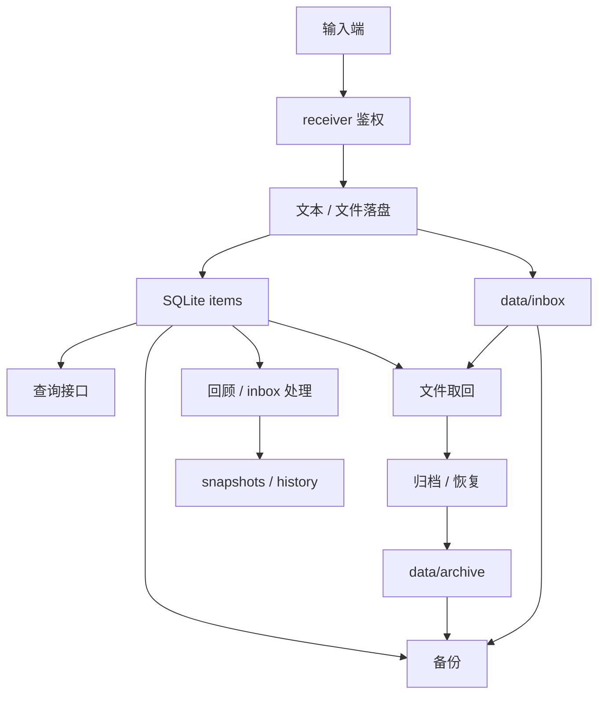

# AI Context

这份文档给 AI 协作代理使用。它记录当前运行事实、协作方式和架构决策规则。

## 核心目标

Axiom 是个人“外脑系统”的后端工程。当前已经从最小接收链路推进到 VPS 线上基线：能接收文本、图片、文档和音频，能落盘，能入库，能检索，能归档恢复，能备份，也能生成回顾和 inbox action 留痕。

长期方向来自 `deep-research-report.md`，短期执行看 `docs/SHORT_TERM.md`。

## 当前运行事实

- 项目名：`Axiom`
- 当前阶段：`v0.1 alpha`
- 线上目录：`/opt/axiom`
- 公网入口：`https://pengweitai.me`
- 部署链路：`Nginx -> gunicorn -> core.receiver:app`
- receiver 监听：`127.0.0.1:5000`
- 当前输入端：`iPhone + iOS 快捷指令`
- 当前读取 / 操作端：`/app` 移动优先 Web App
- 当前数据策略：文件系统保存内容本体，SQLite 保存索引
- 当前自动化：systemd timers 负责备份、回顾、inbox 处理、action 快照和 action history；这些自动化运行已开始统一写入 `automation_runs`

当前技术栈是已验证基线：

- Python
- Flask
- SQLite
- 文件系统
- Nginx
- gunicorn
- systemd

这些技术选择可以在后续阶段调整。不要把早期“保持当前技术栈”的说明当成永久禁令。

## 架构决策规则

以后允许调整架构，但大改前必须先完成下面的判断：

1. 当前痛点是什么，有什么证据。
2. 方案改动范围是什么。
3. 对真实数据、部署、脚本、文档的影响是什么。
4. 迁移路径是什么。
5. 回滚路径是什么。
6. 本地如何验证，VPS 如何验证。
7. 是否需要先备份或先 dry-run。

默认策略：

- 小变动直接实现、测试、记录迭代。
- 影响数据结构、部署方式、持久化方式的大变动，先写清决策再动。
- 涉及真实 VPS 数据前先备份。
- 不为了工程观感替换已经可用的基线。
- 不因为旧约束继续阻止合理升级。

在没有时间约束时，优先把单个功能一次做得更完整，减少“先暂时能用”的临时妥协。
默认目标是减少返工和无意义迭代次数，而不是为了更快交付压缩验证、回滚和文档同步。

## 当前目录

```text
core/
  receiver.py
  init_db.py
  templates/
    app.html
  static/
    app.css
    app.js
    manifest.webmanifest
    sw.js
    icons/
      axiom-mark.svg
scripts/
  backup_axiom.py
  check_consistency.py
  backfill_document_text.py
  backfill_audio_transcript.py
  smoke_test_receiver.py
  install_playwright_chromium.py
  smoke_test_web_app.py
  deploy_to_vps.py
  run_logged_automation.py
  smoke_test_inbox_processing.py
  export_items_markdown.py
  build_review_markdown.py
  save_review_snapshot.py
  build_inbox_processing_report.py
  save_inbox_processing_snapshot.py
  apply_inbox_actions.py
  save_inbox_action_snapshot.py
  list_inbox_action_snapshots.py
  build_inbox_action_history_markdown.py
  save_inbox_action_history_snapshot.py
  generate_deepwiki_cache.py
deploy/
  axiom-receiver.service
  axiom-backup.service / .timer
  axiom-daily-review.service / .timer
  axiom-weekly-review.service / .timer
  axiom-inbox-processing.service / .timer
  axiom-daily-inbox-action.service / .timer
  axiom-daily-inbox-action-history.service / .timer
  axiom-weekly-inbox-action-history.service / .timer
docs/
  AI_CONTEXT.md
  HUMAN_CONTEXT.md
  SHORT_TERM.md
  ITERATION_LOG.md
  DEEPWIKI.md
deep-research-report.md
README.md
requirements.txt
requirements-dev.txt
.env.example
```

部署运行时还会存在：

```text
db/
  axiom.db
data/
  inbox/
  archive/
  reviews/
backup/
logs/
```

这些运行期数据不提交到 GitHub。

## 当前 receiver 能力

`core/receiver.py` 是当前主入口。

接口：

- `/health`
- `/stats`
- `/add`
- `/upload`
- `/item/<id>`
- `/item/<id>/update`
- `/file/<id>`
- `/archive/<id>`
- `/restore/<id>`
- `/recent`
- `/search`
- `/overview`
- `/overview/text`
- `/app`
- `/automation/jobs`
- `/automation/runs`
- `/automation/run`
- `/artifacts`
- `/artifacts/summary`
- `/artifacts/file/<path>`
- `/sw.js`

重要行为：

- 默认根路径是 `/opt/axiom`
- 可用 `AXIOM_ROOT`、`AXIOM_INBOX_PATH`、`AXIOM_ARCHIVE_PATH`、`AXIOM_DB_PATH`、`AXIOM_SECRET_KEY`、`AXIOM_LOG_PATH` 覆盖配置
- 可用 `AXIOM_AUDIO_TRANSCRIBE_MODEL`、`AXIOM_AUDIO_TRANSCRIBE_LANGUAGE`、`AXIOM_AUDIO_TRANSCRIBE_TIMEOUT_SECONDS` 调整音频自动转写；真实运行依赖 `AXIOM_OPENAI_API_KEY` 或 `OPENAI_API_KEY`
- `/add` 支持 query、form、JSON 读取 `text`
- `/upload` 支持 `file`、`image`、`document` 或 `audio` 表单字段
- `/upload` 当前支持图片、PDF、Word 和常见音频格式；入库时会补 `original_name`、`mime_type`、`size_bytes`，其中 `.pdf` 与 `.docx` 会自动抽取正文写入 `derived_text`，音频既可直接接收 `transcript_text`，也可同时上传 `transcript_file`
- `transcript_file` 当前支持 `txt / md / srt / vtt`；`.srt` 与 `.vtt` 会自动清洗时间轴、cue 序号和基础标签后写入 `transcript_text`
- `scripts/backfill_document_text.py` 可为旧 PDF / DOCX 记录补跑正文抽取，把历史文档也补齐到 `derived_text` 检索层
- `scripts/backfill_audio_transcript.py` 可为旧 audio 记录从同名 sidecar 转写文件回填 `transcript_text`，支持 `--transcript-dir`、`--item-id`、`--limit`、`--force` 和 `--dry-run`
- `scripts/transcribe_audio_items.py` 可为当日 audio item 批量补全 `transcript_text`，并把执行结果保存到 `data/reviews/audio-transcripts/<year>/<date>.md`
- `scripts/transcribe_audio_items.py` 支持 `--item-id`、`--source`、`--limit`、`--force`、`--dry-run`、`--model`、`--language` 和 `--prompt`；本地冒烟可通过 `AXIOM_AUDIO_TRANSCRIBE_MOCK_TEMPLATE` 走 mock
- 文本和二进制文件写入都先落临时文件，再替换为正式文件
- 数据库写入失败时会清理本次已写入文件
- `/file/<id>` 会限制路径只能在 `AXIOM_ROOT` 下
- `/item/<id>/update` 支持更新 `content`、`source`，以及 audio item 的 `transcript_text`；文本 item 会同步改写 txt 文件，数据库失败时会尝试回滚文本文件
- `/recent` 和 `/search` 支持分页、类型、存储区、来源、时间范围过滤；`/search` 还会匹配 `original_name`、文档 `derived_text` 和音频 `transcript_text`
- `/overview` 聚合返回 stats、最近 item 和最新 artifact 摘要，适合作为手机端或轻前端总览入口
- `/overview/text` 返回中文纯文本总览，适合 iPhone 快捷指令直接显示
- `/app` 提供移动优先 Web App，覆盖写入、上传、总览、最近记录、搜索、记录编辑、手动触发安全自动化、运行历史回看和自动化产物浏览；当前已补 PDF 预览与正文预览、音频播放器与转写预览，以及 Word `.docx` 的正文预览
- `/automation/jobs` 返回当前允许手动触发的任务清单，当前开放 review、inbox report、dry-run 和 `audio_transcribe_day`
- `/automation/runs` 返回自动化运行历史，覆盖手动任务与 systemd 定时任务，包含状态、产物、stdout/stderr 尾部和耗时
- `/automation/run` 会在 receiver 进程里串行触发白名单脚本，默认不开放 destructive apply；`audio_transcribe_day` 会把音频自动转写写回 `transcript_text`，并产出 `audio-transcripts` 报告
- 前端请求统一通过 `X-Axiom-Key` header 访问后端接口，不在页面里到处拼 query key
- `/sw.js` 和 `manifest.webmanifest` 组成当前 PWA 壳，目标是把浏览器入口稳定成手机主屏入口
- `scripts/smoke_test_web_app.py` 会启动本地临时 receiver，并用 Playwright 真跑 `/app` 的关键交互
- `scripts/run_logged_automation.py` 复用 receiver 的锁与运行记录逻辑，供 systemd timer 在不经过 HTTP 的情况下写入 `automation_runs`
- `scripts/deploy_to_vps.py` 负责把本地当前 commit 打包、备份 VPS 代码、同步到 `/opt/axiom`、安装最新 systemd unit、重启服务并做基础验证
- `/artifacts` 支持按 group、window、mode、日期范围分页读取自动化产物
- `/artifacts/summary` 返回最新 review、inbox report、action snapshot、action history、audio transcript report 及其文本预览
- `/artifacts/file/<path>` 只允许读取 `data/reviews` 下的 markdown 文件
- API 错误统一返回 JSON

## 当前数据流



## 当前优先级

第一优先级：

- 继续保证线上 receiver 稳定
- 保证文件和 SQLite 索引一致
- 保证备份、恢复、日志和定时任务可验证
- 保证自动处理链路默认 dry-run、有留痕、可回看

第二优先级：

- 改善读取层和人类阅读体验
- 让回顾、inbox 处理、action history 更容易浏览
- 为后续 AI 摘要、分类、图片描述 / 语音处理补全准备稳定数据入口

第三优先级：

- 在有明确收益时评估架构升级
- 评估前先写清影响范围和迁移方案

## AI 默认行为

- 先读本文件、`docs/SHORT_TERM.md` 和当前代码，再动手。
- 小步实现，及时验证。
- 小功能只更新 `docs/ITERATION_LOG.md`。
- 大功能或会影响他人接手的变动，同步 README、DeepWiki 和上下文文档。
- 自动提交和推送已被允许，但提交前要先看 `git diff` 和验证结果。
- 所有项目说明默认用中文。
