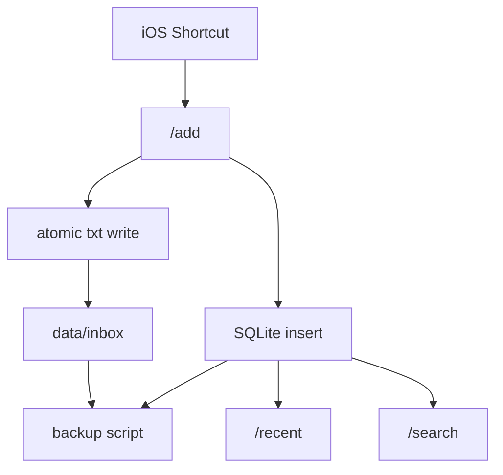

# AI Context

这份文档给 AI 协作代理使用。

目标是快速给出当前阶段的稳定事实、边界和默认行为。

## 稳定事实

- 项目名：`Axiom`
- 当前阶段：`v0.1 alpha`
- 当前主链路：`输入 -> 存储 -> 检索`
- 当前主节点：`VPS`
- 当前输入端：`iPhone + iOS 快捷指令`
- 当前技术栈：`Python + Flask + SQLite + 文件系统`
- 当前运行目录思路：`/opt/axiom`

## 当前目录

```text
core/
  receiver.py
  init_db.py
scripts/
  backup_axiom.py
  check_consistency.py
  generate_deepwiki_cache.py
  smoke_test_receiver.py
deploy/
  axiom-receiver.service
docs/
  AI_CONTEXT.md
  HUMAN_CONTEXT.md
  SHORT_TERM.md
  ITERATION_LOG.md
  DEEPWIKI.md
deep-research-report.md
README.md
requirements.txt
.env.example
```

部署运行时还会存在：

```text
db/
  axiom.db
data/
  inbox/
  archive/
backup/
```

## 当前代码事实

- `core/receiver.py` 是当前主入口
- 已有接口：`/health`、`/add`、`/recent`、`/search`
- `core/init_db.py` 复用 `receiver.py` 的 `init_db()`
- `scripts/backup_axiom.py` 已经存在
- `scripts/check_consistency.py` 用于检查 inbox 文件和 SQLite 索引是否一致
- `scripts/check_consistency.py` 默认把 DB 中 `/opt/axiom/...` 映射到传入的 `--root`
- `scripts/smoke_test_receiver.py` 可做本地冒烟测试
- `scripts/generate_deepwiki_cache.py` 用于生成本地中文 DeepWiki 缓存
- `deploy/axiom-receiver.service` 是 VPS systemd 服务模板
- `.env.example` 是环境变量示例，真实 `.env` 不进仓库

## 当前 receiver 行为

- 默认根路径是 `/opt/axiom`
- 可用 `AXIOM_ROOT`、`AXIOM_INBOX_PATH`、`AXIOM_DB_PATH`、`AXIOM_SECRET_KEY` 覆盖配置
- `/add` 支持 query/form/JSON 读取 `text`
- `/add` 使用临时文件写入，再替换为正式 txt
- SQLite 入库失败时会删除本次已写入的 txt
- `/recent` 和 `/search` 使用统一分页边界
- API 错误统一返回 JSON

## 当前状态图



## 当前设计原则

- 文件是内容本体
- 数据库是索引
- 先保证“能收、能存、能查”
- 避免过早复杂化
- 每次改动尽量小步、清晰、可验证

## 当前优先级

第一优先级：

- receiver 在 VPS 上稳定运行
- 备份脚本在 VPS 上可执行
- 文件和数据库一致性可检查
- 正式启动方式可复现
- systemd 服务模板在 VPS 上验证通过

第二优先级：

- 最小日志落盘
- 部署与重启命令文档化
- 一致性检查脚本在 VPS 上跑通

第三优先级：

- 图片上传
- 图片路径入库
- 多类型 item 支持

## 当前非目标

- 切换 FastAPI
- 切换 PostgreSQL
- 引入 Redis
- 引入向量数据库
- 复杂 agent
- 多服务拆分
- 把研究报告里的长期能力一次性塞进 v0.1

## AI 默认行为

- 默认在现有架构上增量修改
- 默认保持 Flask + SQLite + 文件系统
- 默认优先修可靠性问题，再加新功能
- 继续开发前先读 `docs/SHORT_TERM.md`
