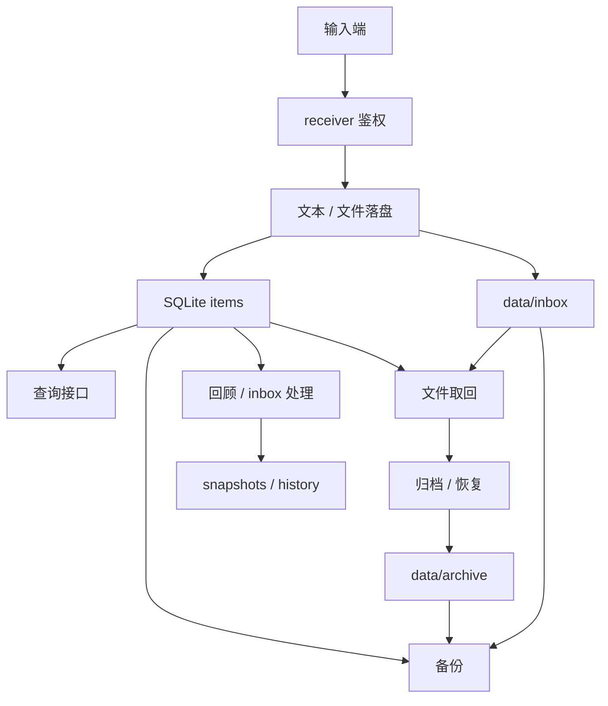

# AI Context

这份文档给 AI 协作代理使用。它记录当前运行事实、协作方式和架构决策规则。

## 核心目标

Axiom 是个人“外脑系统”的后端工程。当前已经从最小接收链路推进到 VPS 线上基线：能接收文本、图片、文档和音频，能落盘，能入库，能检索，能归档恢复，能备份，也能生成回顾和 inbox action 留痕。

当前产品形态以 `docs/PRODUCT_MODEL.md` 为最高事实源：默认工作面是“此刻”，一级目的地只有“此刻 / 资料库 / Atlas”，记录是全局动作。任务、记忆、决策、时间线、处理和系统治理不得重新扩张为平级一级工作台。

长期方向来自 `deep-research-report.md`，短期执行看 `docs/SHORT_TERM.md`。

## 当前运行事实

- 项目名：`Axiom`
- 当前阶段：`v0.2+`（历史标签：`v0.1 alpha`；本文件其余字段未必完全同步，以 `docs/axiom_current_status_2026-05-27.md` 为准）
- 线上目录：`/opt/axiom`
- 公网入口：`https://pengweitai.me`
- 部署链路：`Nginx -> gunicorn -> core.receiver:app`
- receiver 监听：`127.0.0.1:5000`
- 当前输入端：`iPhone + iOS 快捷指令`
- 当前读取 / 操作端：`/app` 主前端（Vite + Vue 3）；`/app/legacy` 仅保留旧移动 Web App
- 当前数据策略：文件系统保存内容本体，SQLite 保存索引
- 当前自动化：systemd timers 负责备份、回顾、inbox 处理、action 快照和 action history；这些自动化运行已开始统一写入 `automation_runs`

当前技术栈是已验证基线：

- Python
- Flask
- SQLite
- 文件系统
- Nginx
- gunicorn
- systemd

这些技术选择可以在后续阶段调整。不要把早期“保持当前技术栈”的说明当成永久禁令。

## 架构决策规则

以后允许调整架构，但大改前必须先完成下面的判断：

1. 当前痛点是什么，有什么证据。
2. 方案改动范围是什么。
3. 对真实数据、部署、脚本、文档的影响是什么。
4. 迁移路径是什么。
5. 回滚路径是什么。
6. 本地如何验证，VPS 如何验证。
7. 是否需要先备份或先 dry-run。

默认策略：

- 小变动直接实现、测试、记录迭代。
- 影响数据结构、部署方式、持久化方式的大变动，先写清决策再动。
- 涉及真实 VPS 数据前先备份。
- 不为了工程观感替换已经可用的基线。
- 不因为旧约束继续阻止合理升级。

在没有时间约束时，优先把单个功能一次做得更完整，减少“先暂时能用”的临时妥协。
默认目标是减少返工和无意义迭代次数，而不是为了更快交付压缩验证、回滚和文档同步。

协作节流规则：
- 小改动默认只更新 `docs/ITERATION_LOG.md`，不同时改 README、Human Context、Short Term 和 DeepWiki。
- 只有阶段性大改动、架构变化、会影响新成员接手时，才批量同步 README、上下文文档和 DeepWiki。
- 连续推进时不要每一轮都输出完整长汇报；日常只保留短进度，阶段节点再统一汇总。
- 测试按改动分层执行，不默认每次都跑全套。文档改动跑 `git diff --check`；前端小改动优先跑 `node --check` 和 `smoke_test_web_app.py`；后端接口改动优先跑 `compileall` 和 `smoke_test_receiver.py`；只有影响主链路、部署或自动化时再跑全套。
- 部署按功能批次进行，避免每个小改动都单独发 VPS。
- DeepWiki 在阶段节点刷新，不为每个中小改动单独维护。

## 当前目录

```text
frontend/
  src/                 # 当前主前端：此刻 / 资料库 / Atlas + 全局记录
core/
  receiver.py
  goals.py             # 承诺档案、生命周期和目标层级规则
  weekly_plan.py       # 本周承诺引用、容量、完成保留和可撤销历史
  task_decomposition.py # 一层行动拆解、父行动快照和步骤继承规则
  task_decomposition_ai.py # DeepSeek V4 Pro 可撤回拆解候选与证据上下文
  lifeline_context.py  # 项目/生活线的层级汇总与统一上下文读取
  context_engine.py    # 此刻的确定性、可解释行动判断
  context_commitments.py # 承诺状态、待判断原因和目标行动摘要
  context_outcomes.py  # 推荐完成证据、适配反馈与审计
  init_db.py
  templates/
    app.html
  static/
    v2/                # Vite 构建产物，当前 /app 与 /atlas 使用
    app.css
    app.js
    manifest.webmanifest
    sw.js
    icons/
      axiom-mark.svg
scripts/
  backup_axiom.py
  check_consistency.py
  backfill_document_text.py
  backfill_audio_transcript.py
  smoke_test_receiver.py
  install_playwright_chromium.py
  smoke_test_web_app.py
  deploy_to_vps.py
  run_logged_automation.py
  smoke_test_inbox_processing.py
  export_items_markdown.py
  build_review_markdown.py
  save_review_snapshot.py
  build_inbox_processing_report.py
  save_inbox_processing_snapshot.py
  apply_inbox_actions.py
  save_inbox_action_snapshot.py
  list_inbox_action_snapshots.py
  build_inbox_action_history_markdown.py
  save_inbox_action_history_snapshot.py
  generate_deepwiki_cache.py
deploy/
  axiom-receiver.service
  axiom-backup.service / .timer
  axiom-daily-review.service / .timer
  axiom-weekly-review.service / .timer
  axiom-inbox-processing.service / .timer
  axiom-daily-inbox-action.service / .timer
  axiom-daily-inbox-action-history.service / .timer
  axiom-weekly-inbox-action-history.service / .timer
modules/
  __init__.py
  base.py               # AxiomModule 基类
  registry.py           # 自动发现
  prompt_loader.py      # Prompt 模板加载
  jianzhi/              # 减脂模块
    routes.py            # /m/jianzhi/*
    models.py            # module_jianzhi_entries 表
    prompts/             # AI 教练 prompt
    static/jianzhi.js    # 前端面板
docs/
  AI_CONTEXT.md
  PROJECT_MAINLINE.md
  HUMAN_CONTEXT.md
  SHORT_TERM.md
  ITERATION_LOG.md
  DEEPWIKI.md
deep-research-report.md
README.md
requirements.txt
requirements-dev.txt
.env.example
```

部署运行时还会存在：

```text
db/
  axiom.db
data/
  inbox/
  archive/
  reviews/
backup/
logs/
```

这些运行期数据不提交到 GitHub。

## 当前 receiver 能力

`core/receiver.py` 是当前主入口。

接口：

- `/health`
- `/stats`
- `/add`
- `/upload`
- `/item/<id>`
- `/item/<id>/update`
- `/file/<id>`
- `/archive/<id>`
- `/restore/<id>`
- `/recent`
- `/search`
- `/overview`
- `/overview/text`
- `/app`
- `/app/legacy`
- `/atlas`
- `/automation/jobs`
- `/automation/runs`
- `/automation/run`
- `/artifacts`
- `/artifacts/summary`
- `/artifacts/file/<path>`
- `/sw.js`
- `/memories` / `/memories/<id>` — 记忆 CRUD + confirm/archive
- `/memories/stats` — 分类统计
- `/tasks` / `/tasks/<id>` — 任务 CRUD + done/todo/cancel
- `POST /tasks/<id>/breakdown/suggestion` — 使用 DeepSeek V4 Pro 生成临时拆解候选；只返回可编辑预览，不写入 task 或拆解关系
- `POST /tasks/<id>/breakdown` — 用户确认后创建最多五个执行步骤，保留父行动关系、标题快照和 `manual_breakdown / ai_suggestion_confirmed` 来源
- `/tasks/today` — 今日任务
- `/api/context/now` — 此刻的主要行动、备选行动、判断理由、任务信号与承诺断点
- `GET /api/planning/week` — 当前周承诺、步骤与结果汇总、用户周复盘以及从当前脉络产生的候选行动
- `POST /api/planning/week/tasks/<task_id>` / `DELETE /api/planning/week/selections/<id>` — 明确加入或移出本周
- `PUT /api/planning/week/review` — 保存用户对本周拆解粒度的判断和可选短说明；复盘继续嵌在“此刻”中
- `GET /api/lifelines` — 项目/生活线层级、直接计数与子树汇总
- `GET /api/lifelines/<id>/context` — 承诺、行动、材料、记忆、决定与近期历史的统一脉络详情
- `POST /api/context/actions/<task_id>/complete` — 原子完成当前推荐并保存当时的推荐证据
- `POST /api/context/outcomes/<outcome_id>/feedback` — 保存“正合适 / 比预期费力 / 时机不对”的可选反馈并重新判断
- `DELETE /item/<id>` — 删除条目
- `POST /export` — 数据导出 ZIP
- `GET /audit-log` — 审计日志
- `/modules` — 模块元数据
- `/m/jianzhi/*` — 减脂模块 API

重要行为：

- 默认根路径是 `/opt/axiom`
- 可用 `AXIOM_ROOT`、`AXIOM_INBOX_PATH`、`AXIOM_ARCHIVE_PATH`、`AXIOM_DB_PATH`、`AXIOM_SECRET_KEY`、`AXIOM_LOG_PATH` 覆盖配置
- 可用 `AXIOM_AUDIO_TRANSCRIBE_MODEL`、`AXIOM_AUDIO_TRANSCRIBE_LANGUAGE`、`AXIOM_AUDIO_TRANSCRIBE_TIMEOUT_SECONDS` 调整音频自动转写；可用 `AXIOM_IMAGE_DESCRIBE_MODEL`、`AXIOM_IMAGE_DESCRIBE_PROMPT`、`AXIOM_IMAGE_DESCRIBE_TIMEOUT_SECONDS` 调整图片自动描述；真实运行依赖 `AXIOM_OPENAI_API_KEY` 或 `OPENAI_API_KEY`
- `/add` 支持 query、form、JSON 读取 `text`
- `/upload` 支持 `file`、`image`、`document` 或 `audio` 表单字段
- `/upload` 当前支持图片、PDF、Word 和常见音频格式；入库时会补 `original_name`、`mime_type`、`size_bytes`，其中 `.pdf` 与 `.docx` 会自动抽取正文写入 `derived_text`，音频既可直接接收 `transcript_text`，也可同时上传 `transcript_file`
- `transcript_file` 当前支持 `txt / md / srt / vtt`；`.srt` 与 `.vtt` 会自动清洗时间轴、cue 序号和基础标签后写入 `transcript_text`
- `scripts/backfill_document_text.py` 可为旧 PDF / DOCX 记录补跑正文抽取，把历史文档也补齐到 `derived_text` 检索层
- `scripts/backfill_audio_transcript.py` 可为旧 audio 记录从同名 sidecar 转写文件回填 `transcript_text`，支持 `--transcript-dir`、`--item-id`、`--limit`、`--force` 和 `--dry-run`
- `scripts/transcribe_audio_items.py` 可为当日 audio item 批量补全 `transcript_text`，并把执行结果保存到 `data/reviews/audio-transcripts/<year>/<date>.md`
- `scripts/transcribe_audio_items.py` 支持 `--item-id`、`--source`、`--limit`、`--force`、`--dry-run`、`--model`、`--language` 和 `--prompt`；本地冒烟可通过 `AXIOM_AUDIO_TRANSCRIBE_MOCK_TEMPLATE` 走 mock
- `scripts/describe_image_items.py` 可为当日 image item 批量补全中文描述，并把执行结果保存到 `data/reviews/image-descriptions/<year>/<date>.md`
- `scripts/describe_image_items.py` 支持 `--item-id`、`--source`、`--limit`、`--force`、`--dry-run`、`--model` 和 `--prompt`；本地冒烟可通过 `AXIOM_IMAGE_DESCRIBE_MOCK_TEMPLATE` 走 mock
- 文本和二进制文件写入都先落临时文件，再替换为正式文件
- 数据库写入失败时会清理本次已写入文件
- `/file/<id>` 会限制路径只能在 `AXIOM_ROOT` 下
- `/item/<id>/update` 支持更新 `content`、`source`，document item 的 `derived_text`，以及 audio item 的 `transcript_text`；文本 item 会同步改写 txt 文件，数据库失败时会尝试回滚文本文件
- item payload 现在会额外返回 `text_source`、`text_source_label`、`processing_state`、`processing_label` 和 `processing_note`，用于区分“正文 / 转写已就绪”与“还待补处理”
- `/recent` 和 `/search` 支持分页、类型、存储区、来源、`processing_state`、时间范围过滤；`/search` 还会匹配 `original_name`、文档 `derived_text` 和音频 `transcript_text`
- `/overview` 聚合返回 stats、最近 item 和最新 artifact 摘要，适合作为手机端或轻前端总览入口
- `/overview/text` 返回中文纯文本总览，适合 iPhone 快捷指令直接显示
- `/processing/backlog` 会把待补正文、待补转写、待补说明的条目按类型聚合起来，并返回每组的最近样本、快速过滤参数，以及可直接打开的 `next_item`
- `/processing/next` 会返回当前“下一条待处理记录”，可选按 `type` 过滤，适合作为 Web 端和后续快捷入口的统一直达接口
- `/api/context/now` 使用 `context.now.v6` 契约，根据行动期限、显式优先级、预估启动成本、生活线近期活动、搁置时长、近期显式反馈、本周明确选择、承诺关联和可选目标日期给出稳定排序，同时返回判断理由、因子、承诺摘要、父行动来源与待判断原因
- 只有 `category=goal AND status=confirmed` 的记忆可以成为承诺；`goal_commitments` 保存完成定义、目标日期、父目标、复盘节奏和 `active / paused / achieved / released` 生命周期。candidate / archived 目标不参与排序，非 active 承诺的 todo 行动保留但退出“此刻”
- 推进中目标没有 `todo` 行动时进入 `commitments.gaps`；缺行动、临近/逾期、缺完成定义或复盘到期会按优先级进入 `commitments.attention`。前端从“此刻”或目标详情补下一步时，新任务通过 `memory_id` 关联目标并继承目标 `lifeline_id`
- 推荐完成会写入 `context_action_outcomes`，保留推荐快照与任务结果；显式反馈只在 7 天窗口内衰减生效，紧迫期限优先，没有时长或生活线依据时不得跨任务外推
- `weekly_plan_items` 只引用现有 task，并保存选择时标题、顺序和移出历史；每周最多五项，完成项保留到周末，本周选择只能作为有界辅助信号，不能覆盖行动自身期限。`weekly_reviews` 保存用户对 `right / too_coarse / too_fine` 的判断和短说明，周计划契约为 `planning.week.v2`
- `task_decomposition_links` 把子行动绑定到一层父行动并保存父标题快照与来源；子行动继承父行动的 `memory_id / lifeline_id / priority / due_date`，父行动有开放步骤时不进入“此刻”且不能提前完成。周承诺选择父行动后，其执行步骤继承周意图信号并在周计划中汇总真实进度
- AI 常规调用默认 `deepseek-v4-flash` 并显式关闭思考模式，任务拆解推理默认 `deepseek-v4-pro` 且使用 `high` 思考强度；旧环境值 `deepseek-chat / deepseek-reasoner` 会迁移到对应 V4 模型。拆解候选使用目标、完成定义、已有步骤、近期结果和最近一次用户周复盘，候选本身不持久化
- `/export` 会包含 `context_action_outcomes.json`、`goal_commitments.json`、`weekly_plan_items.json`、`weekly_reviews.json` 与 `task_decomposition_links.json`；行动结果、反馈、承诺档案、周意图、用户复盘、拆解关系、目标记忆和关联行动可一起恢复，并保留 `lifeline_id`
- `/app` 提供当前主前端入口，一级目的地为“此刻 / 资料库 / Atlas”，记录是全局动作；`/atlas` 是同一套前端的 Atlas 深链接
- 资料库内部有“查找 / 项目脉络”两种查看方式；项目脉络读取现有 lifeline、goal、task、item、memory 和 decision，不创建平行数据。父生活线汇总子线，明确关联承诺但尚未挂载 lifeline 的行动也会跟随承诺出现
- `/app/legacy` 提供旧移动 Web App，覆盖写入、上传、总览、最近记录、搜索、记录编辑、手动触发安全自动化、运行历史回看和自动化产物浏览；它保留处理工作台与旧 PWA 链路，但不再作为新功能主入口
- `/automation/jobs` 返回当前允许手动触发的任务清单，当前开放 review、inbox report、dry-run、`audio_transcribe_day` 和 `image_describe_day`
- `/automation/runs` 返回自动化运行历史，覆盖手动任务与 systemd 定时任务，包含状态、产物、stdout/stderr 尾部和耗时；当前状态除了 `success / failed / timeout / running`，还包含 `skipped`
- `/automation/run` 会在 receiver 进程里串行触发白名单脚本，默认不开放 destructive apply；`audio_transcribe_day` 会把音频自动转写写回 `transcript_text`，`image_describe_day` 会把图片描述写回 `content`，并分别产出 `audio-transcripts` 与 `image-descriptions` 报告
- 前端请求统一通过 `X-Axiom-Key` header 访问后端接口，不在页面里到处拼 query key
- `/sw.js` 和 `manifest.webmanifest` 组成当前 PWA 壳，目标是把浏览器入口稳定成手机主屏入口
- `scripts/smoke_test_web_app.py` 会启动本地临时 receiver，并用 Playwright 真跑 `/app/legacy` 的旧移动 Web App 关键交互；新前端优先用 frontend type-check / build 和 Atlas smoke 覆盖
- `scripts/run_logged_automation.py` 复用 receiver 的锁与运行记录逻辑，供 systemd timer 在不经过 HTTP 的情况下写入 `automation_runs`
- `scripts/run_logged_automation.py` 现在支持 `--skip-when-unavailable`；当 job 依赖 OpenAI key 但环境未就绪时，会写一条 `skipped` 运行记录并退出 0，适合给 systemd timer 直接调用
- `scripts/deploy_to_vps.py` 负责把本地当前 commit 打包、备份 VPS 代码、同步到 `/opt/axiom`、安装最新 systemd unit、重启服务并做基础验证
- `/artifacts` 支持按 group、window、mode、日期范围分页读取自动化产物
- `/artifacts/summary` 返回最新 review、inbox report、action snapshot、action history、audio transcript report、image description report 及其文本预览
- `/artifacts/file/<path>` 只允许读取 `data/reviews` 下的 markdown 文件
- API 错误统一返回 JSON

## 当前数据流


```mermaid
flowchart TD
    A["输入端"] --> B["receiver 鉴权"]
    B --> C["文本 / 文件落盘"]
    C --> D["data/inbox"]
    C --> E["SQLite items"]
    E --> F["查询接口"]
    D --> G["文件取回"]
    E --> G
    G --> H["归档 / 恢复"]
    H --> I["data/archive"]
    D --> J["备份"]
    I --> J
    E --> J
    E --> K["回顾 / inbox 处理"]
    K --> L["snapshots / history"]
```

## 当前优先级

第一优先级：

- 继续保证线上 receiver 稳定
- 保证文件和 SQLite 索引一致
- 保证备份、恢复、日志和定时任务可验证
- 保证自动处理链路默认 dry-run、有留痕、可回看

第二优先级：

- 改善读取层和人类阅读体验
- 让回顾、inbox 处理、action history 更容易浏览
- 为后续 AI 摘要、分类、图片描述 / 语音处理补全准备稳定数据入口

第三优先级：

- 在有明确收益时评估架构升级
- 评估前先写清影响范围和迁移方案

## AI 默认行为

- 先读本文件、`docs/SHORT_TERM.md` 和当前代码，再动手。
- 小步实现，及时验证。
- 小功能只更新 `docs/ITERATION_LOG.md`。
- 大功能或会影响他人接手的变动，同步 README、DeepWiki 和上下文文档。
- 自动提交和推送已被允许，但提交前要先看 `git diff` 和验证结果。
- 默认持续推进，不因为阶段性汇报而停下；除非遇到必要的人为干预点，否则继续完成下一步实现、验证、提交、推送和部署。
- 所有项目说明默认用中文。

## item ↔ memory 反向链

Axiom 把"原始记录 (item)"和"长期记忆 (memory)"按显式反向链组织。打通这条链是
从"输入/存储/检索系统"向"知识—任务—记忆—决策系统"过渡的第一段。

### 写入路径

- `POST /item/<id>/promote-to-memory`
  - body: `{category, content?, detail?}`
  - 自动写入 `memories.source_item_id`、`memories.source_text`（item 文本前 200 字）
  - 新 memory 默认 status = candidate
  - 审计动作：`memory_promote_from_item`
- `POST /memories/suggest` 让 LLM 输出 `item_id|category|content`，响应里每条建议带 `source_item_id`（无法回溯到具体 item 时为 `null`）
- 前端采纳建议路径：当 `source_item_id != null` 走 `POST /item/<id>/promote-to-memory`，
  否则走 `POST /memories`——保证 LLM 已经定位的来源不会丢失

### 读取路径

- `GET /memories/<id>` 返回的 memory 含 `source_item: {id, type, type_label, snippet,
  created_at}`（无来源时为 `null`）
- `GET /item/<id>` 返回的 item 含 `derived_memories: [{id, category, content, status, ...}]`，
  按 `created_at desc`，最多 10 条

### 删除语义

- 删除 item → `memories.source_item_id` 由 FK `ON DELETE SET NULL` 自动置空；
  memory 本身保留，前端不再展示来源链
- 删除 memory → 不影响 item

### 下一段

memory → task / decision 的反向链尚未打通（goal 类 memory 可关联 task，但 task 来源
不显式回指 memory）。这是后续任务，参见 `docs/backend-tasks/`。
