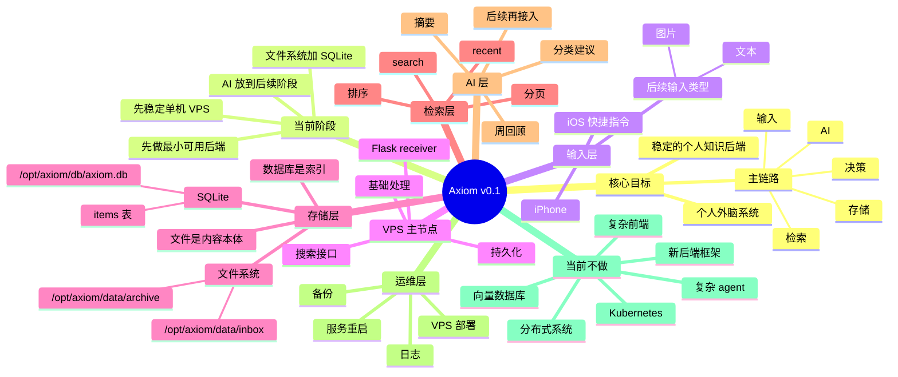
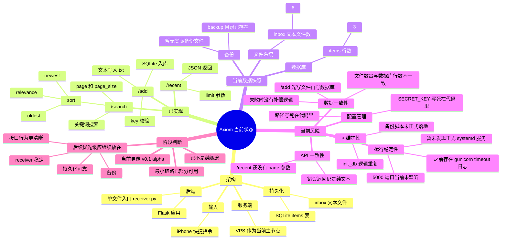

# Axiom 架构思维导图

最后更新：2026-04-23

这份文件用于持续记录 Axiom 的架构目标和当前状态。
后续每次功能增加、行为修改、阶段推进时，都应同步更新这份图。

## v0.1 目标架构图



## v0.1 可视化总览图

```mermaid
flowchart LR
    I1[iPhone]
    I2[iOS 快捷指令]

    subgraph VPS[VPS 主节点]
        R[Flask Receiver]
        P[基础处理]
        API[API 接口<br/>/add /recent /search]
    end

    subgraph STORAGE[存储层]
        F1[/data/inbox]
        F2[/data/archive]
        DB[(SQLite<br/>axiom.db)]
    end

    subgraph RETRIEVAL[检索层]
        RECENT[Recent]
        SEARCH[Search]
        PAGE[分页 / 排序]
    end

    subgraph AI[后续 AI 层]
        SUM[摘要]
        CLASSIFY[分类建议]
        REVIEW[周回顾]
    end

    subgraph OPS[运维层]
        LOG[日志]
        BACKUP[备份]
        RESTART[服务重启]
    end

    I1 --> I2 --> R
    R --> P --> API
    API --> F1
    API --> DB
    F1 --> F2
    DB --> RECENT
    DB --> SEARCH
    SEARCH --> PAGE
    DB -. 后续接入 .-> SUM
    DB -. 后续接入 .-> CLASSIFY
    DB -. 后续接入 .-> REVIEW
    R -. 运行保障 .-> LOG
    R -. 运行保障 .-> BACKUP
    R -. 运行保障 .-> RESTART

    classDef input fill:#dbeafe,stroke:#2563eb,color:#0f172a,stroke-width:1px;
    classDef app fill:#dcfce7,stroke:#16a34a,color:#0f172a,stroke-width:1px;
    classDef storage fill:#fef3c7,stroke:#d97706,color:#0f172a,stroke-width:1px;
    classDef retrieval fill:#e9d5ff,stroke:#7c3aed,color:#0f172a,stroke-width:1px;
    classDef ai fill:#fee2e2,stroke:#dc2626,color:#0f172a,stroke-width:1px,stroke-dasharray: 5 5;
    classDef ops fill:#e5e7eb,stroke:#475569,color:#0f172a,stroke-width:1px;

    class I1,I2 input;
    class R,P,API app;
    class F1,F2,DB storage;
    class RECENT,SEARCH,PAGE retrieval;
    class SUM,CLASSIFY,REVIEW ai;
    class LOG,BACKUP,RESTART ops;
```

## 当前状态图

状态依据：2026-04-21 从 VPS 的 `/opt/axiom` 拉取快照后整理。



## 当前状态可视化图

```mermaid
flowchart TD
    INPUT[iPhone / 快捷指令]

    subgraph APP[当前应用状态]
        ADD[/add<br/>已实现]
        RECENT[/recent<br/>已实现]
        SEARCH[/search<br/>已实现]
        RECEIVER[receiver.py<br/>单文件入口]
    end

    subgraph DATA[当前数据状态]
        FILES[inbox 文件数: 6]
        ROWS[items 行数: 3]
        BACKUP_STATE[backup 目录已存在<br/>暂无备份文件]
    end

    subgraph RUNTIME[当前运行状态]
        PORT[5000 端口未监听]
        GUNI[历史 gunicorn timeout]
        SERVICE[未发现正式 systemd 服务]
    end

    subgraph RISK[当前主要风险]
        CONSISTENCY[文件和数据库数量不一致]
        ORDER[/add 先写文件再写数据库]
        CONFIG[密钥与路径写死]
        API_RISK[错误返回不统一]
    end

    subgraph NEXT[下一步优先级]
        N1[先稳 receiver]
        N2[补持久化可靠性]
        N3[补备份]
        N4[再整理 recent/search]
    end

    INPUT --> ADD
    INPUT --> RECENT
    INPUT --> SEARCH
    ADD --> RECEIVER
    RECENT --> RECEIVER
    SEARCH --> RECEIVER
    RECEIVER --> FILES
    RECEIVER --> ROWS
    RECEIVER --> PORT
    FILES --> CONSISTENCY
    ROWS --> CONSISTENCY
    PORT --> N1
    GUNI --> N1
    SERVICE --> N1
    CONSISTENCY --> N2
    ORDER --> N2
    BACKUP_STATE --> N3
    CONFIG --> N4
    API_RISK --> N4

    classDef ok fill:#dcfce7,stroke:#16a34a,color:#0f172a,stroke-width:1px;
    classDef data fill:#fef3c7,stroke:#d97706,color:#0f172a,stroke-width:1px;
    classDef warn fill:#fee2e2,stroke:#dc2626,color:#0f172a,stroke-width:1px;
    classDef next fill:#dbeafe,stroke:#2563eb,color:#0f172a,stroke-width:1px;
    classDef neutral fill:#e5e7eb,stroke:#475569,color:#0f172a,stroke-width:1px;

    class ADD,RECENT,SEARCH,RECEIVER ok;
    class FILES,ROWS,BACKUP_STATE data;
    class PORT,GUNI,SERVICE,CONSISTENCY,ORDER,CONFIG,API_RISK warn;
    class N1,N2,N3,N4 next;
    class INPUT neutral;
```

## 当前阶段推进图

```mermaid
flowchart LR
    S1[输入接收] --> S2[文件落盘]
    S2 --> S3[SQLite 入库]
    S3 --> S4[基础检索]
    S4 --> S5[服务稳定化]
    S5 --> S6[备份闭环]
    S6 --> S7[图片支持]
    S7 --> S8[AI 摘要 / 分类 / 周回顾]

    classDef done fill:#dcfce7,stroke:#16a34a,color:#0f172a,stroke-width:1px;
    classDef doing fill:#dbeafe,stroke:#2563eb,color:#0f172a,stroke-width:1px;
    classDef todo fill:#e5e7eb,stroke:#64748b,color:#0f172a,stroke-width:1px;

    class S1,S2,S3,S4 done;
    class S5,S6 doing;
    class S7,S8 todo;
```



## 更新规则

- 每次 receiver 行为变化时，同步更新“当前状态图”。
- 每次当前阶段目标变化时，同步更新“v0.1 目标架构图”。
- 这份文件只记录架构和状态，不展开成长篇设计文档。
