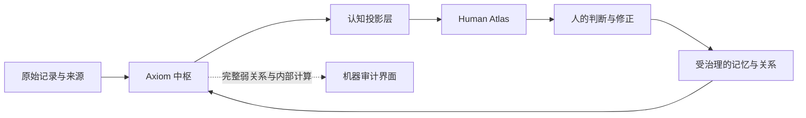

# Axiom Atlas 人类认知界面研究底稿 v2

> 状态：研究基线，不是实现规格。
>
> 本文有意不参考当前 Atlas 页面、组件和数据结构。它从认知科学、人机协作、信息可视化、个人信息学、记忆研究与艺术案例出发，定义后续产品设计不可轻易违背的原则。

## 0. 研究问题

Atlas 需要回答的并不是“如何把 Axiom 的图数据库画出来”，而是以下问题：

1. 一个外脑应该替人承担哪些认知劳动，又必须把哪些判断留给人？
2. 中枢拥有比人能同时处理多得多的信息，怎样把它压缩成不扭曲人的认知投影？
3. 如何让空间、关系和证据帮助人形成理解，而不是让算法生成的结构冒充事实？
4. 如何在长期使用中保护人的自主性、可变性、遗忘权和心理安全？
5. 3D 全局、2D 聚焦和关系证据分别适合承担什么认知任务？
6. 怎样让 Atlas 具有艺术性，但不靠宇宙隐喻、粒子、光球和装饰动效制造廉价的“AI 感”？

## 1. 总体结论

### 1.1 Atlas 不是图谱本身

Atlas 是 **Axiom 中枢对人的认知投影**。中枢可以是高维、稠密、不断变化、充满概率与相互矛盾假设的；人的界面必须是稀疏、可追溯、相对稳定、与当前问题有关的。

因此：

```text
Axiom 中枢负责发现、计算、保留和比较
认知投影层负责选择、翻译、节制和标注不确定性
Human Atlas 负责定向、理解、质疑、重组和决定
```

Engelbart 将增强系统视为人、工具、语言和方法的共同系统；Licklider 则明确把目标、假设、标准和评价留给人，把可程序化准备工作交给机器。这比“AI 替用户整理好一切”更适合作为 Axiom 的根基。

### 1.2 Atlas 是注意力与认识论装置

Atlas 每让一个对象变亮、靠近中心或获得更大字号，都在告诉用户“它更重要”。因此视觉权重不是装饰，而是一种认识论主张。

这带来三项责任：

- **显著性责任**：为什么此刻让它进入用户意识？
- **真实性责任**：它是记录、用户判断，还是模型猜测？
- **权力责任**：用户能否立刻质疑、改写、降级或让它消失？

### 1.3 3D、2D、证据不是三个模块

它们是同一次思考的三个尺度：

```text
3D 全局：我身处怎样的整体？          定向
2D 聚焦：这个问题由哪些因素构成？      操作与重组
关系证据：我为什么应当相信这条联系？   求证与修正
```

三者之间必须连续过渡。用户不是“切换视图”，而是从远处看结构、沿某条关系走近、再触碰证据。

## 2. 研究基础

### 2.1 认知增强：机器准备，人形成判断

增强智能的目标不是让机器替人得出越来越多结论，而是让人更容易理解复杂情境、识别重要因素、形成假设并检验它们。

产品推论：

- 中枢可以生成候选关系，但不能替用户确立人生叙事。
- 中枢可以推荐注意方向，但不能把推荐伪装成客观重要性。
- Atlas 的成功指标不是“AI 自动连了多少边”，而是用户是否更快形成了自己的可靠理解。

来源：[Engelbart, Augmenting Human Intellect](https://web.stanford.edu/class/history34q/readings/Engelbart/Engelbart_AugmentIntellect.html)、[Licklider, Man-Computer Symbiosis](https://man.computer/)

### 2.2 延展与分布式认知：稳定性本身就是能力

外部工具只有在可靠、可随时访问、与行动紧密耦合时，才可能真正成为认知过程的一部分。认知卸载研究也表明，人会通过写下、排列、提醒和移动对象来降低内部计算负担。

产品推论：

- 空间位置不能每次打开都完全重排，否则 Atlas 无法成为认知地形。
- 用户移动节点不是“修改布局”，而是在外部世界执行思考动作。
- 关键路径必须可撤销、可回退、可恢复，工具才值得被纳入人的思考习惯。

来源：[Clark & Chalmers, The Extended Mind](https://web.ics.purdue.edu/~drkelly/ClarkChalmersTheExtendedMind1998.pdf)、[Risko & Gilbert, Cognitive Offloading](https://discovery.ucl.ac.uk/id/eprint/1508770/)、[Hutchins, How a Cockpit Remembers Its Speeds](https://onlinelibrary.wiley.com/doi/10.1207/s15516709cog1903_1)

### 2.3 自传记忆：记忆不是数据库中的永恒事实

自传记忆会在当前目标和自我模型的作用下被重新构造。数字媒介如何编码、筛选和重现过去，会反过来改变人如何记住自己。

产品推论：

- Axiom 必须分别保存原始事件、当时解释、后来解释和当前解释。
- “过去的我这样判断”不能自动变成“现在的我仍然如此”。
- AI 归纳出的性格、偏好和关系模式必须保持为可撤回假设，不能沉淀成不可见的人格标签。
- Atlas 应允许用户看到“理解如何变化”，而不只显示当前结论。

来源：[Conway & Pleydell-Pearce, Self-Memory System](https://www.researchgate.net/publication/12528554_The_Construction_of_Autobiographical_Memories_in_the_Self-Memory_System)、[AMEDIA Model](https://www.tandfonline.com/doi/pdf/10.1080/1047840X.2024.2384125)

### 2.4 记住不是保存全部，遗忘也有价值

“全量捕获”并不等于有效记忆。研究指出，记忆工具应围绕检索、理解、反思和计划等实际目的设计；数字遗物也可能造成持续情绪伤害，用户需要主动隐藏、封存和删除的能力。

产品推论：

- 中枢可以保留大量资料，但 Atlas 不应把“保存过”理解为“值得再次出现”。
- 用户需要四种不同操作：暂时隐藏、降低重现、封存、彻底删除。
- 敏感记忆不得因“高关联”而未经许可突然进入全局视野。

来源：[Sellen & Whittaker, Beyond Total Capture](https://www.researchgate.net/publication/220427487_Beyond_Total_Capture_A_Constructive_Critique_of_Lifelogging)、[Sas & Whittaker, Design for Forgetting](https://eprints.lancs.ac.uk/id/eprint/60831/)

### 2.5 Sensemaking：理解是循环，不是一次聚类

人在复杂问题中会往返于寻找资料、建立框架、形成假设、发现异常、改写框架和产生行动之间。一个好的认知工具不仅保存结论，也保存结论如何形成。

产品推论：

- Atlas 需要容纳暂时结构，而不是强迫每个对象立刻进入正式分类。
- 用户的浏览路径、比较和自建关系属于“分析脉络”，应与机器点击日志区分。
- 新证据可以让局部结构重新组织，但应保留旧视角供回看。

来源：[Pirolli & Card, Sensemaking Process](https://www.researchgate.net/profile/Peter-Pirolli/publication/215439203_The_sensemaking_process_and_leverage_points_for_analyst_technology_as_identified_through_cognitive_task_analysis/links/02bfe50f09ca94efc0000000/The-sensemaking-process-and-leverage-points-for-analyst-technology-as-identified-through-cognitive-task-analysis.pdf)、[Klein et al., Data/Frame Theory](https://www.researchgate.net/publication/3454376_Making_Sense_of_Sensemaking_2_A_Macrocognitive_Model)、[Analytic Provenance Research Agenda](https://repository.mdx.ac.uk/download/988f332bc3a2e20bb57c44445c24acc53ff338e94c210876183a75ed169530fc/958005/main.pdf)

### 2.6 低摩擦不是更少按钮，而是更少不必要决策

Calm Technology 强调信息在注意中心与感知边缘之间自然移动。JITAI 研究进一步指出，“此刻不提供任何干预”本身必须是一种有效选项。

产品推论：

- Atlas 默认应该安静；没有真正值得注意的变化时，不制造提醒和活动感。
- 搜索、筛选和视图选择不应成为进入内容前的手续。
- 系统应根据当前上下文预先完成大部分信息取舍，交互只用于改变问题、检查证据和表达人的判断。
- 低摩擦不意味着自动同意。高影响判断仍需短促但明确的人工确认。

来源：[Weiser & Brown, Calm Technology](https://calmtech.com/papers/coming-age-calm-technology)、[Nahum-Shani et al., JITAI framework](https://pmc.ncbi.nlm.nih.gov/articles/PMC4732268/)、[Bret Victor, Magic Ink](https://worrydream.com/MagicInk/)

### 2.7 空间有用，是因为它减少计算

空间排列能够让选择更简单、让关系可直接感知，并把内部记忆负担转移到外部环境。空间超文本研究还表明，人会用邻近、分组、重叠和空白表达尚未正式化的结构。

产品推论：

- 距离必须表达当前任务中的关系，不应只是算法相似度。
- 用户自由摆放形成的隐式结构不能立即被 AI “纠正”。
- 留白也是结构，不能为了填满画面而自动增加节点。
- Atlas 应先允许结构涌现，再建议命名和固化。

来源：[Kirsh, The Intelligent Use of Space](https://interactivity.ucsd.edu/articles/Space/AIJ.html)、[Marshall & Shipman, Spatial Hypertext](https://people.engr.tamu.edu/shipman/viki/papers/ht93/ht93.html)

### 2.8 图只在适合图的问题上有效

图、矩阵、时间线、并置和文字叙述在不同任务上的表现不同。三维图只有在运动、交互和深度线索真正帮助用户理解时才可能优于二维图；单纯增加透视会带来遮挡和心理配准成本。

产品推论：

- 3D 负责宏观结构与方向感，不承担精确读边。
- 2D 负责局部关系、比较和直接操作。
- 因果问题优先转为事件路径或时间线。
- 冲突问题优先转为支持/反对并置。
- 稠密网络分析必要时转为矩阵、分组或摘要，而不是继续加线。

来源：[Ware & Franck, Stereo and Motion Cues](https://vislab-ccom.unh.edu/pdfs/TOGGraph_Net.pdf)、[Ghoniem et al., Node-Link and Matrix](https://datavis2020.github.io/pdfs/ghoniem2004.pdf)、[Bederson & Hollan, Pad++](https://hci.ucsd.edu/hollan/Pubs/JH1995-1.pdf)

### 2.9 AI 的解释也可能造成误导

人机研究表明，流畅解释可能同时提高对正确和错误建议的依赖；来源和明显的不一致更有助于减少错误依赖。生成式对话还可能诱发或强化错误记忆。

产品推论：

- 关系证据应先展示原始片段、时间和冲突，再展示 AI 的总结。
- “为什么 Axiom 这样想”不能只是一段语言流畅的解释。
- 任何 AI 推测都必须具有不同于用户确认和原始记录的稳定视觉语法。
- 涉及个人经历时，禁止以确定语气补全用户没有表达过的情节。

来源：[Microsoft, Explanations, Sources and Inconsistencies](https://www.microsoft.com/en-us/research/publication/fostering-appropriate-reliance-on-large-language-models-the-role-of-explanations-sources-and-inconsistencies/)、[Conversational AI and False Memories](https://arxiv.org/abs/2408.04681)、[Amershi et al., Human-AI Guidelines](https://doi.org/10.1145/3290605.3300233)

### 2.10 自主性比“高采纳率”更重要

自我决定理论把自主、胜任和联结视为健康动机的重要条件。个人信息系统也可能从反思滑向反刍、自责和被管理感。

产品推论：

- Axiom 的目标不是让用户更经常接受 AI 建议。
- Atlas 应帮助用户形成理由，而不是用分数、连续提醒或游戏化奖励逼迫行动。
- 系统要允许用户说“这对我不重要”“我暂时不想面对”“不要再据此推断”。
- 负面模式不应自动获得更强视觉显著性。

来源：[Ryan & Deci, Self-Determination Theory](https://www.selfdeterminationtheory.org/SDT/documents/2000_RyanDeci_SDT.pdf)、[Beyond Self-Reflection: Rumination](https://link.springer.com/article/10.1007/s00779-021-01573-w)

## 3. 三层产品系统



### 3.1 Axiom 中枢

中枢是机器工作空间，允许复杂、稠密和不稳定。它至少同时维护以下不同对象，而不是把它们压成一张“真相图”：

1. **事件账本**：发生过什么、何时发生、来源是什么。
2. **语义模型**：对象内容上可能相似或相关。
3. **关系假设**：支持、矛盾、派生、因果候选、共同出现。
4. **记忆候选**：可能值得长期保留的事实、偏好、目标或经历。
5. **用户确认层**：用户明确认可、修改或否定的解释。
6. **时间模型**：关系在何时成立、何时改变、是否已经过时。
7. **行动模型**：哪些结论可能产生任务、提醒或外部动作。
8. **审计模型**：每项提取、推断和改写从何而来。

机器可以看到：嵌入向量、排序分、模型置信、社区聚类、全部弱边、重复候选、内部类型、数据块 ID、模型版本和评估结果。

这些内容默认不进入 Human Atlas。

### 3.2 认知投影层

投影层不是简单过滤器，而是一位克制的“认知编辑”。它执行七项判断：

1. **当前问题**：用户此刻是在找方向、理解关系、做决定，还是回忆？
2. **知识身份**：内容来自记录、用户判断还是模型推断？
3. **时间适用性**：它描述过去、现在，还是一种未来可能？
4. **显著性价值**：现在看见它是否真正有帮助？
5. **认知成本**：它会不会淹没更重要的结构？
6. **心理与隐私边界**：此刻重现是否可能造成伤害或泄露？
7. **表示选择**：图、时间线、并置、路径、文本还是暂不显示？

投影层必须遵守三个预算：

- **显著性预算**：同一时刻只有极少对象可以强烈进入注意中心。
- **关系预算**：每个对象只显示足够解释当前问题的主要关系。
- **变化预算**：后台重算不等于前台布局必须变化。

### 3.3 Human Atlas

Human Atlas 只提供六类能力：

1. 看见整体方向。
2. 进入当前问题。
3. 操作和重组想法。
4. 检查关系依据。
5. 表达自己的判断。
6. 带着理解离开并采取行动。

它不承担数据库管理、模型调参、分类维护和批量审核。那些能力可以存在于独立的机器审计界面，但不能伪装成日常思维体验。

## 4. 权力与知识边界

| 对象 | 中枢权限 | 用户权限 | Atlas 默认表达 |
| --- | --- | --- | --- |
| 原始事件 | 解析、索引、关联 | 查看、纠正、删除 | 记录于某时某处 |
| AI 关系假设 | 生成、降权、更新 | 接受、改写、否定、忽略 | Axiom 发现一条线索 |
| 个人事实 | 提议候选 | 只有用户可确认 | 你曾确认 |
| 偏好与价值观 | 观察变化，不得静默固化 | 定义、修订、撤回 | 你目前这样看 |
| 目标 | 提醒冲突、建议拆解 | 创建、排序、放弃 | 你正在选择的方向 |
| 因果关系 | 只能提出假设 | 判断是否成立 | 可能影响，证据有限 |
| 外部动作 | 准备和预演 | 批准、撤销 | 离开 Atlas 后执行 |

**硬边界：AI 可以更新“它对用户的模型”，但不能静默更新“用户对自己的定义”。**

## 5. 完整产品形态

### 5.1 进入 Atlas：不是仪表盘，而是定向

打开 Atlas 时不出现功能菜单墙、统计卡片或模式选择。第一眼只回答：

- 最近什么正在形成？
- 哪些长期方向仍然稳定？
- 哪里出现了值得注意的变化或矛盾？

如果没有值得注意的变化，画面可以保持安静。系统不为了证明自己工作过而展示活动。

### 5.2 3D 全局：认知地形

3D 全局不是球壳节点，也不是星座技能树。它更接近一片可移动的信息景观：

- 长期领域是稳定地标，而不是巨大中心球。
- 主题通过位置、文字尺度、密度和景深形成区域。
- 当前牵引力表现为有限的清晰度和接近感，而不是不断闪烁。
- 未解决问题可以表现为空隙、断裂或两股结构之间的张力。
- 用户移动时，视差证明深度；用户停止后，整个空间也停止。

全局层不负责读清每一条线，只负责让用户形成“我在哪里、哪里正在变化”的空间判断。

### 5.3 连续下潜：保持对象恒常性

选中主题后，镜头沿关系进入局部：

- 被选对象尽量保持原有屏幕位置。
- 远处地标逐渐退入背景，但保留两三个方向锚点。
- 文字、对象和关系随着尺度改变语义，而不只是等比放大。
- 动画用于解释状态变化，不用于展示技术能力。

动画研究强调对象恒常性与可理解的阶段变化；这意味着从 3D 到 2D 不应像换页面，而应像走近同一对象。

来源：[Heer & Robertson, Animated Transitions](https://sites.stat.columbia.edu/gelman/communication/HeerRobertson2007.pdf)、[Eames, Powers of Ten](https://www.eamesoffice.com/the-work/powers-of-ten/)

### 5.4 2D 聚焦：思维表面，而非固定局部图

局部空间根据问题选择表示方式：

| 用户问题 | 首选表示 | 不应默认使用 |
| --- | --- | --- |
| 它与什么有关？ | 稀疏局部关系图 | 完整关系网 |
| 事情如何发展？ | 时间线或事件路径 | 环形节点图 |
| 为什么会这样？ | 因果候选链 + 反例 | 单条粗箭头 |
| 两种理解哪里冲突？ | 并置证据场 | 混在一团的关系线 |
| 哪个方向更适合？ | 方案、标准和代价对照 | AI 总分排名 |
| 我遗漏了什么？ | 空白、孤立证据和替代框架 | 更多相似节点 |
| 这是谁的判断？ | 来源与推理脉络 | 模型置信百分比 |

局部空间允许用户：移动、并置、临时分组、写下自己的关系、保留一个视角、撤销 AI 建议。人的临时布局优先于算法自动排布。

### 5.5 关系证据：一条可审理的主张

关系不再只是 `source -> target + strength`。每条重要关系都应被视为一个可以审理的主张：

```text
主张：A 可能推动了 B
来源身份：Axiom 推测 / 用户确认 / 原始记录直接表明
支持材料：最关键的 1-3 条记录
反对材料：与主张不一致的记录
缺口：仍缺少什么信息
时间：何时成立，是否仍然成立
用户判断：确认 / 改写 / 暂不判断 / 否定
```

证据从关系线上或主张本身展开，不常驻占据画面。默认先看具体材料，再看 AI 摘要。

### 5.6 思考轨迹：保存理解如何形成

Atlas 记录的不是所有鼠标轨迹，而是具有语义的思考动作：

- 我从哪个问题开始？
- 我比较过哪些对象？
- 哪条证据改变了理解？
- 我放弃了哪个框架？
- 我最终确认或保留了什么？

用户可以回到旧视角，看见“当时我如何理解”，并与现在的结构比较。系统不能用当前结论覆盖历史判断。

### 5.7 时间是第四维，不是一个筛选标签

同一主题在不同时间可能属于不同区域、拥有不同关系。Atlas 应允许用户沿时间观察结构生长、分裂、沉寂和重新出现。

时间表达需要区分：

- 事件发生时间。
- 用户形成判断的时间。
- AI 提出关系的时间。
- 用户最后确认该关系仍成立的时间。

### 5.8 搜索不是模式

用户在任何层级直接输入即可寻找对象、问题、人物或过去判断。结果不是跳到一张列表，而是让当前空间转向目标并解释它位于何处。

列表可以作为无障碍和高密度检索的替代表示，但不是 Atlas 的默认世界。

### 5.9 行动不在 Atlas 内自动发生

Atlas 可以把理解凝结为一个问题、决定或下一步，但真正执行应进入独立行动表面，并显示影响、权限和撤销方式。

Atlas 负责“为什么值得做”；执行系统负责“准备怎样做”；用户负责“是否做”。

## 6. 人应看到什么

### 6.1 默认可见

- 用自然语言表达的关系。
- 关系的知识身份：记录、我的判断、Axiom 线索、存在争议、尚未厘清。
- 一到三个决定性来源及时间。
- 对当前问题的意义。
- 明显的反证或信息空缺。
- 立即可用的确认、改写、隐藏操作。

### 6.2 按需展开

- 更多原文和上下文。
- 关系的历史版本。
- 谁或什么改变过这条判断。
- 来源覆盖范围和数据缺口。
- 模型版本、提取时间和审计编号。

### 6.3 只给机器与审计人员

- 原始 embedding 相似度。
- logits、内部置信分和排序特征。
- 全量弱边与候选聚类。
- chunk ID、系统内部关系枚举。
- 提示词、隐藏推理过程和模型中间轨迹。
- 为性能和召回服务的重复结构。

## 7. 认识论视觉语法

Atlas 不能把来源、可信程度、时间和个人权威压成一个“关系强度”。至少需要四个独立维度：

| 维度 | 可选状态 | 人为什么需要知道 |
| --- | --- | --- |
| 来源 | 原始记录 / 用户表达 / AI 推测 | 谁提出了它 |
| 证据状态 | 直接观察 / 有支持 / 有争议 / 空白 | 它站得多稳 |
| 时间状态 | 当前 / 历史 / 已变化 / 未知 | 它何时成立 |
| 权威状态 | 用户确认 / 待判断 / 用户否定 | 谁拥有最终解释权 |

建议的人类语言不是“置信度 0.83”，而是：

- **有直接记录**
- **你曾确认**
- **Axiom 发现迹象**
- **存在相反证据**
- **目前无法判断**
- **这条理解可能已经过时**

## 8. 显著性与干预伦理

投影层可以内部计算显著性，但不得把计算分数直接冒充人的重要性。显著性应综合：

```text
当前问题相关性
+ 用户明确目标
+ 新证据或结构变化
+ 未解决矛盾
+ 可采取行动的价值
- 重复出现造成的疲劳
- 不确定性
- 打断成本
- 心理与隐私敏感性
```

重要限制：

- 情绪强烈不等于应该高亮。
- 经常出现不等于真正重要。
- 容易完成不等于值得优先。
- 模型高置信不等于用户应该相信。
- 能提高使用时长不等于有助于用户。

Atlas 不优化点击率、停留时间、连续使用天数或 AI 建议采纳率。它优化方向感、理解质量、证据可追溯、纠错能力和行动后的复盘价值。

## 9. 艺术与视觉研究

### 9.1 借鉴对象及其真正价值

| 参考 | 应吸收 | 不应照搬 |
| --- | --- | --- |
| Warburg《Mnemosyne Atlas》 | 并置产生意义、结构可重排、关系保持开放 | 黑板拼贴外观 |
| Muriel Cooper Information Landscapes | 文字、尺度、运动共同构成信息空间 | 早期 3D 技术风格 |
| James Turrell | 用光塑造注意和空间、隐藏装置 | 大面积炫光和沉浸噱头 |
| Eames《Powers of Ten》 | 连续尺度与稳定方向 | 科学影片视觉复刻 |
| Obsidian Graph | 点线直接性、悬停和局部图 | 工程参数面板和全图毛线团 |
| TheBrain Plex | 活跃思想周围的有限邻域 | 永恒中心放射结构 |
| Outer Wilds Ship Log | 好奇心网络、只提醒玩家已经知道的内容 | 游戏星图风格 |
| LiquidText | 每个判断都能回到原始材料 | 文档工具的双栏布局 |

来源：[Warburg Institute](https://warburg.sas.ac.uk/library-collections/warburg-institute-archive/archive-collections/verknupfungszwang/mnemosyne-atlas)、[MIT Muriel Cooper](https://www.media.mit.edu/posts/muriel-cooper-lasting-imprint/)、[Guggenheim James Turrell](https://web.guggenheim.org/exhibitions/turrell/)、[Outer Wilds 访谈](https://www.listennotes.com/podcasts/the-fourth-curtain/outer-wilds-alex-beachums-SI6GdyaUxkm/)、[LiquidText](https://www.liquidtext.net/liquidtextadeeperdive)

### 9.2 视觉基调

- 深色，但不是“太空背景”。背景像无反光的炭黑、墨面或暗室，而不是蓝紫渐变宇宙。
- 艺术感来自比例、留白、文字、运动和视线控制，不来自粒子数量。
- 节点是标点、坐标和注意锚点，不是球体、星球或宝石。
- 文字是主要信息载体，字号和清晰度表达语义层级；不使用细弱字体制造“高级感”。
- 光只出现在焦点、关系被验证或新理解形成的瞬间。
- 画面静止时应当真正静止。

### 9.3 节点与标签

- 普通节点视觉体量保持接近 2-4px，但拥有更大的隐形点击区域。
- 稳定领域可以略大，但仍是点或短标记，不成为球。
- 默认只显示少量地标标签；其余文字随接近、悬停或关系需要出现。
- 标签不随镜头任意旋转，必须始终保持可读。
- 节点大小不直接等同于数据量，避免“记录多就是人生更重要”的错误暗示。

### 9.4 关系线

- 普通结构线接近消失，只维持空间连续感。
- 当前主关系清晰，干扰关系大幅退后；研究显示，提高干扰边透明度会明显妨碍路径查找。
- 因果候选用方向与时间表达，不能只用“更粗”。
- 支持关系表现为汇聚，冲突关系表现为相互抵抗或分裂，AI 推测保持未闭合或间断。
- 动态流动只在用户正在检查该关系时发生，其余时间停止。

### 9.5 色彩不承担全部含义

颜色只辅助区分知识身份和注意状态，并同时使用线型、形状或文字：

- 原始记录：中性明亮。
- 用户确认：温暖但克制。
- AI 推测：偏冷、轻、未闭合。
- 冲突：低饱和对立色与分裂结构。
- 未知：空心、断点或留白。

### 9.6 动态

动态只服务四件事：

1. 保持对象恒常性。
2. 显示层级与空间深度。
3. 说明关系方向或状态变化。
4. 对用户操作提供即时、可逆反馈。

禁止以持续漂浮、呼吸、旋转、粒子喷发证明“系统活着”。生命感来自内容和关系随理解发生变化，而不是所有像素都在动。

## 10. 低摩擦交互原则

日常操作应收敛到几种直觉动作：

```text
看：获得方向
靠近：获得更多语义
点：进入一个问题
拖：表达临时结构
连：写下自己的关系
展开：检查证据
改：修正 Axiom 的理解
退：沿原思路返回
输入：在任何位置搜索或提问
```

不要求用户先：选择图谱模式、选择对象类型、理解关系枚举、设定力导向参数、打开筛选抽屉、填写完整表单。

直接操控必须快速、增量、可逆；AI 自动化则负责提前准备、减少噪声和提出候选。两者不是二选一，而是明确分工。

来源：[Shneiderman & Maes, Direct Manipulation vs Agents](https://www.cs.umd.edu/users/ben/papers/Shn-Maes-v4n6-1997.pdf)

## 11. 长期稳定契约

### 11.1 空间稳定

- 用户确认的长期领域位置保持稳定。
- 机器重算只在局部缓慢调整，不随刷新随机重排。
- 新关系先以轻量变化出现，用户理解后再成为稳定结构。
- 重大重组必须可比较前后版本。

### 11.2 记忆稳定

- 原始记录不被后续摘要覆盖。
- 用户判断有版本和时间。
- AI 推测有模型、时间和来源覆盖信息。
- 用户否定的推测不会换一种措辞反复出现，除非有新证据。

### 11.3 心理安全

- 敏感主题可设置禁止主动重现。
- 第三方隐私默认不进入全局地图。
- 不用失败、拖延、情绪波动制造持续红色警报。
- 允许用户暂时关闭分析，不把沉默解释为问题。
- 避免把自我观察推向持续反刍。

### 11.4 可访问性

- 所有颜色编码都有形状、线型或文字替代。
- 提供减少动态模式，并保证内容不会未经用户请求改变位置。
- 3D 空间拥有键盘可操作的层级大纲和屏幕阅读器替代表示。
- 小节点使用扩大的命中区域；移动端不强行缩小桌面 3D 场景。
- 用户失去焦点后，思考轨迹和明确返回路径帮助重新定向。

来源：[W3C Help Users Focus](https://www.w3.org/WAI/WCAG2/supplemental/objectives/o5-user-focus/)、[W3C Control Motion](https://www.w3.org/WAI/WCAG2/supplemental/patterns/o8p01-motion/)

## 12. 主要失败模式

| 失败模式 | 表面症状 | 深层伤害 |
| --- | --- | --- |
| 机器结构直出 | 类型、分数、cluster 成为主界面 | 用户被迫按数据库思考 |
| 视觉确定性 | AI 关系与事实同样明亮 | 推测被内化为记忆 |
| 身份固化 | 旧偏好长期占据中心 | 系统限制人的变化 |
| 图谱崇拜 | 所有问题都画成节点和边 | 表示不适合任务，增加认知成本 |
| 显著性劫持 | 新、负面、高频内容总是更亮 | 系统塑造焦虑和优先级 |
| 空间失忆 | 每次打开位置不同 | 无法形成长期认知地形 |
| 伪生命感 | 全图持续运动和发光 | 注意疲劳，艺术沦为效果 |
| 解释诱导 | AI 给出流畅完整理由 | 用户过度依赖、忽略反证 |
| 全量捕获 | 所有记录都可能被重现 | 隐私、创伤和反刍风险 |
| 自动行动越界 | 理解直接触发任务或外部动作 | 人失去因果控制和责任边界 |

## 13. 明确拒绝的产品形态

- 十几个平级工作台。
- “总览 / 语义 / 标签 / 结构 / 关系”作为人的一级导航。
- 完整图数据库的可视化镜像。
- 永久中心节点与均匀放射布局。
- 以星球、星座、技能树或宇宙作为强制隐喻。
- 通过大球、巨大 halo 和粒子表达重要性。
- 把所有关系压成一个 strength 数字。
- 让 AI 的聚类名称直接成为用户的人生分类。
- 用通知数量、连续打卡和奖励点数驱动使用。
- 把技术审计字段包装成“高级用户功能”常驻日常界面。

## 14. 验证命题

后续原型不应只验证“好不好看”，而要验证以下命题：

### 14.1 定向

- 新用户能否在 10 秒内说出画面中最重要的三个方向？
- 一周后返回，能否凭空间位置找到熟悉主题？
- 从全局进入局部后，能否说出自己仍位于哪个整体领域？

### 14.2 认识论清晰度

- 用户能否准确区分原始记录、自己的判断和 AI 推测？
- 能否在两次交互内追溯一条关系的关键来源？
- 有反证时，是否会注意到反证，而不只接受 AI 总结？

### 14.3 自主性

- 用户能否在两次交互内改写或否定一条关系？
- 系统是否会尊重“暂时不看”和“不要继续推断”？
- 用户离开 Atlas 后，能否用自己的语言描述理解，而不是复述 AI 文案？

### 14.4 低摩擦

- 从打开 Atlas 到第一次有意义操作需要几步？
- 用户是否必须理解任何内部分类才能开始？
- 系统没有重要内容时，是否能克制地保持安静？

### 14.5 长期价值

- 4-6 周后，是否减少重复搜索和重复向 AI 解释背景？
- 用户是否更容易回忆判断依据，而不只是记住结论？
- Atlas 是否帮助发现观点变化，而不是把旧数据固化成身份？
- 重要决策复盘时，能否还原当时的证据、假设和遗漏？

## 15. 当前研究形成的产品决策

1. 保留 3D，但把它严格限定为宏观定向与连续尺度体验。
2. 2D 聚焦不再等同于局部节点图，而是随问题变化的思维表面。
3. 关系证据成为一等对象，结构为主张、支持、反证、缺口和人的判断。
4. 人的 Atlas 与机器中枢彻底分离，中间新增认知投影契约。
5. 日常 Atlas 去除机器查询模式和内部分类导航。
6. 人的临时结构、判断和否定拥有高于 AI 自动排布的权威。
7. 保存全部不等于展示全部；遗忘、封存和不主动重现是基本能力。
8. 艺术性由信息构图、尺度、文字、光与静止构成，不由装饰特效构成。
9. 低摩擦与人工控制同时成立：普通浏览无门槛，高影响判断有短确认。
10. Atlas 的最终目标不是展示 Axiom 有多聪明，而是让用户更有方向、更能质疑、更能形成自己的理解。

## 16. 后续仍需通过原型回答的问题

这些问题不能仅凭论文决定，需要在视觉原型和真实使用中验证：

1. 3D 全局应展示多少稳定地标，才能兼顾方向感与复杂度？
2. 用户自由布局与机器自动布局的边界在哪里最自然？
3. 哪些关系值得主动进入注意边缘，哪些只应在搜索时出现？
4. 认识论状态采用怎样的中文措辞最不打断思考？
5. 如何让“空白”和“未知”可见，又不制造焦虑？
6. 时间变化更适合通过连续移动、历史叠影还是视角版本表达？
7. 桌面和移动端是否应共享同一视觉形态，还是只共享认知模型？
8. 如何测量 Atlas 带来的理解质量，而不把用户再次量化成一组分数？

## 17. 研究来源索引

- Axiom 原始研究：[构建外脑式个人智能助理的系统研究报告](../构建外脑式个人智能助理的系统研究报告.pdf)
- [Engelbart - Augmenting Human Intellect](https://web.stanford.edu/class/history34q/readings/Engelbart/Engelbart_AugmentIntellect.html)
- [Licklider - Man-Computer Symbiosis](https://man.computer/)
- [Clark & Chalmers - The Extended Mind](https://web.ics.purdue.edu/~drkelly/ClarkChalmersTheExtendedMind1998.pdf)
- [Risko & Gilbert - Cognitive Offloading](https://discovery.ucl.ac.uk/id/eprint/1508770/)
- [Conway & Pleydell-Pearce - Self-Memory System](https://www.researchgate.net/publication/12528554_The_Construction_of_Autobiographical_Memories_in_the_Self-Memory_System)
- [Sellen & Whittaker - Beyond Total Capture](https://www.researchgate.net/publication/220427487_Beyond_Total_Capture_A_Constructive_Critique_of_Lifelogging)
- [Pirolli & Card - Sensemaking Process](https://www.researchgate.net/profile/Peter-Pirolli/publication/215439203_The_sensemaking_process_and_leverage_points_for_analyst_technology_as_identified_through_cognitive_task_analysis/links/02bfe50f09ca94efc0000000/The-sensemaking-process-and-leverage-points-for-analyst-technology-as-identified-through-cognitive-task-analysis.pdf)
- [Kirsh - The Intelligent Use of Space](https://interactivity.ucsd.edu/articles/Space/AIJ.html)
- [Marshall & Shipman - Spatial Hypertext](https://people.engr.tamu.edu/shipman/viki/papers/ht93/ht93.html)
- [Shneiderman - The Eyes Have It](https://hci.stanford.edu/courses/cs448b/papers/shneiderman96eyes.pdf)
- [Ware & Franck - 3D Information Nets](https://vislab-ccom.unh.edu/pdfs/TOGGraph_Net.pdf)
- [Heer & Robertson - Animated Transitions](https://sites.stat.columbia.edu/gelman/communication/HeerRobertson2007.pdf)
- [Hullman - Why Authors Do Not Visualize Uncertainty](https://users.eecs.northwestern.edu/~jhullman/Value_of_Uncertainty_Vis_CR.pdf)
- [Amershi et al. - Human-AI Interaction Guidelines](https://doi.org/10.1145/3290605.3300233)
- [Buçinca et al. - Cognitive Forcing Functions](https://www.eecs.harvard.edu/~kgajos/papers/2021/bucinca21trust.pdf)
- [Microsoft - Appropriate Reliance](https://www.microsoft.com/en-us/research/publication/fostering-appropriate-reliance-on-large-language-models-the-role-of-explanations-sources-and-inconsistencies/)
- [NIST AI RMF - Human Roles and Oversight](https://airc.nist.gov/airmf-resources/airmf/5-sec-core/)
- [GraphRAG - Query Modes](https://microsoft.github.io/graphrag/query/overview/)
- [Personal Informatics Stage Model](https://www.ianli.com/publications/2010-ianli-chi-stage-based-model.pdf)
- [W3C - Cognitive Accessibility](https://www.w3.org/WAI/cognitive/)
- [Warburg Institute - Mnemosyne Atlas](https://warburg.sas.ac.uk/library-collections/warburg-institute-archive/archive-collections/verknupfungszwang/mnemosyne-atlas)
- [MIT - Muriel Cooper](https://www.media.mit.edu/posts/muriel-cooper-lasting-imprint/)
- [Guggenheim - James Turrell](https://web.guggenheim.org/exhibitions/turrell/)
- [Eames Office - Powers of Ten](https://www.eamesoffice.com/the-work/powers-of-ten/)
- [Obsidian - Graph View](https://obsidian.md/help/plugins/graph)
- [TheBrain User Guide](https://assets.thebrain.com/documents/TheBrain13/TheBrain13-User-Guide_v04.pdf)
- [Outer Wilds - Alex Beachum Interview](https://www.listennotes.com/podcasts/the-fourth-curtain/outer-wilds-alex-beachums-SI6GdyaUxkm/)
- [LiquidText - Source-Connected Workspace](https://www.liquidtext.net/liquidtextadeeperdive)
