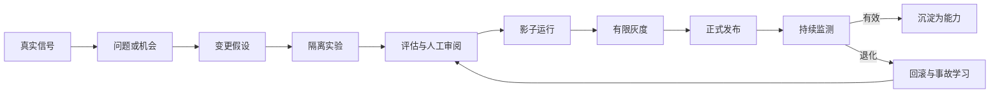

# Axiom 中枢自主性、可迭代性与复利系统研究 v1

> 研究对象：Axiom 作为长期个人外脑时，中枢应当自主到什么程度、怎样持续演化、怎样让积累形成正向复利，以及日常使用环境与工程维护环境应如何彻底分离。
>
> 本文是产品与系统研究底稿，不是对当前代码的复述，也不以现有界面或架构为前提。

---

## 0. 研究问题

这一轮研究不把“更自主”默认视为“更先进”。真正需要回答的是：

1. Axiom 可以替人决定什么，不能替人决定什么？
2. 中枢怎样从长期使用中变得更有用，却不静默重写用户的身份、价值观和目标？
3. 哪些积累会形成真正的能力复利，哪些只是数据堆积，哪些甚至会形成错误复利？
4. Axiom 怎样允许模型、策略、记忆结构和产品形态持续替换，而不丢失人的历史？
5. 为什么日常使用与工程维护不能继续混在同一种界面和权限里？
6. 两个环境之间交换什么，不交换什么，谁有权把改变带入真实生活？

本文延续两条已有前提：

- 原始研究报告提出的“采集 - 记忆 - 计划 - 回顾 - 微干预”闭环，以及本地优先、只读优先、写操作受审批的方向。
- Atlas 研究提出的“机器中枢 - 认知投影层 - Human Atlas”分工，以及“AI 可以更新它对用户的模型，但不能静默更新用户对自己的定义”的硬边界。

---

## 1. 总体结论

### 1.1 Axiom 中枢不是第二个主人

Axiom 中枢应被定义为：

> **一个受治理、可撤销、可审计、会积累能力的个人认知基础设施。**

它不是一个拥有独立人生目的的角色，也不是替用户管理一切的“数字管家”。

最稳定的分工是：

```text
人决定：为什么、什么值得、愿意承担什么后果、自己是谁
Axiom 决定：在授权范围内怎样理解、准备、比较、安排与执行
工程治理决定：Axiom 的能力、规则和权限怎样改变并进入真实环境
```

IBM 的自主计算研究把自管理系统限定为服从人给出的高层目标；现代 Agent 实践同样强调，模型可以自主决定“如何完成”，但目标、边界和高风险动作仍需由人控制。对 Axiom 而言，自主性的价值不在于减少人的存在，而在于减少人不值得承担的协调劳动。

### 1.2 自主性不是一根滑杆

“全自动 / 半自动 / 手动”过于粗糙。Axiom 至少有六种彼此独立的自主性：

| 自主维度 | 中枢可做什么 | 主要风险 |
| --- | --- | --- |
| 理解自主 | 提取、检索、归纳、发现候选关系 | 把推断伪装成事实 |
| 注意力自主 | 决定何时把什么带入意识 | 操纵显著性、制造焦虑 |
| 计划自主 | 拆解目标、比较路径、生成预案 | 误读真正意图 |
| 行动自主 | 调用工具并改变外部世界 | 越权、不可逆损失、泄露 |
| 学习自主 | 从反馈形成记忆、技能和校准 | 错误沉淀、身份固化 |
| 自我修改自主 | 改变自身策略、模型、权限和结构 | 目标漂移、绕过治理 |

一个能力可以在理解上高度自主，在行动上仍严格受限。例如，Axiom 可以自动研究旅行方案并生成完整预案，但不能据此自动付款；它可以自动发现用户长期拖延的模式，但不能把“拖延者”写成用户身份。

### 1.3 真正的迭代不是让生产中的 Agent 自己改自己

Axiom 应当持续学习，但不能把“持续学习”等同于：

```text
模型发现问题 -> 模型改提示词或权限 -> 立即作用于真实用户
```

可靠的演化是分层的：

```text
当次适应：调整当前上下文，不留下永久结论
记忆演化：形成带来源、可撤回的候选记忆
策略演化：在工程环境中版本化、评估、灰度、回滚
结构演化：由人审查后改变数据、能力、权限或模型边界
```

日常中枢可以学习“怎样更好地帮助”，但没有权自行改变“允许自己做什么”。

### 1.4 复利来自可复用的校正，不来自保存一切

Axiom 的复利资产不是聊天字数、节点数量或调用次数，而是：

- 经核验、带来源、仍然适用的记忆。
- 稳定的对象身份、个人词汇和时间语境。
- 经过结果检验的关系与干预规律。
- 可以重用、组合、测试和撤销的能力。
- 从失败与用户纠正中沉淀出的评估样例和护栏。
- 对“什么时候不该打扰、不该推断、不该行动”的校准。

真正的复利闭环是：

```text
经历 -> 解释 -> 核验 -> 使用 -> 真实结果 -> 复盘 -> 校准 -> 更好的再次使用
```

如果缺少核验、结果和淘汰机制，长期记忆只会把偶然误判变成长期偏见。

### 1.5 两个环境不是两套主题，而是两种权力制度

Axiom 应明确分成两个产品环境：

1. **Axiom 日常域**：人用来生活、思考、记忆和行动的环境。
2. **Axiom Foundry 工程域**：人和工程 Agent 用来观察、诊断、实验、证明、发布与回滚 Axiom 的环境。

二者可以共享受治理的底层服务，但不能共享同一种界面语言、默认权限和注意力逻辑。

日常域回答：“我此刻需要理解和推进什么？”

工程域回答：“Axiom 为什么这样工作，这次改变是否有证据进入真实生活？”

---

## 2. 人、中枢与工程治理的三方宪法

### 2.1 人拥有目的权

只有人拥有以下最终权力：

- 定义、修改和放弃人生目标。
- 确认自己的价值观、身份与关系判断。
- 决定哪些损失、风险和代价值得承担。
- 对高影响、不可逆或涉及他人的行动作最终授权。
- 删除、封存、纠正或撤回关于自己的长期表示。
- 决定 Axiom 能进入哪些生活领域以及何时退出。

Axiom 可以指出冲突，例如“你当前的日程与自己确认的长期目标不一致”，但不能把目标冲突自动解决为一个新的价值排序。

### 2.2 中枢拥有方法自主

在目标、数据、时间、费用和权限边界明确后，中枢可以自主：

- 选择检索路径和信息来源。
- 对材料去重、归类、比较和形成假设。
- 发现需要用户注意的矛盾、缺口与机会。
- 生成多个可比较的计划和行动草案。
- 执行已明确委托的、低风险、可逆动作。
- 监测结果并在失败时停止、降级或请求介入。

这种自主性类似“受委托的方法自由”，而不是“代替用户拥有目的”。

### 2.3 工程治理拥有变更权

工程治理负责：

- 定义和发布中枢可使用的能力。
- 决定模型、策略、提示、工具、连接器和权限边界。
- 维护评估、事故、版本、迁移和回滚机制。
- 判断一项候选改进是否足以进入日常域。
- 隔离工程实验与真实个人数据。

生产中的中枢不能自行提升权限、修改审计规则、替换安全策略或发布自己的新版本。工程 Agent 可以提出并实现候选改变，但不能同时充当唯一评审者和发布者。

### 2.4 三种“自我”必须分开

Axiom 至少同时维护三种不同对象：

| 对象 | 含义 | 权威 |
| --- | --- | --- |
| 用户声明的自我 | 用户明确确认的目标、偏好、价值与身份表述 | 用户最高权威 |
| Axiom 的用户模型 | 根据证据形成的概率性理解 | 可错、可质疑、可过期 |
| 观察到的事件 | 某时某处发生或被记录的内容 | 以来源与修正历史为准 |

禁止把第二项静默提升为第一项。系统看到“连续三周没有运动”只能形成状态判断或关怀线索，不能把“你不重视健康”写进用户定义。

---

## 3. 自主性的六个控制回路

### 3.1 理解回路：从材料到可质疑的认识

```text
来源 -> 解析 -> 对象识别 -> 候选关系 -> 证据合并 -> 不确定性 -> 可用解释
```

中枢可高度自动化完成这条链，但必须保留：

- 原始来源与时间。
- 哪一步是抽取，哪一步是模型推断。
- 反证、冲突和未知。
- 生成该解释时使用的模型与策略版本。
- 用户确认、否定和修改的历史。

结果不是一条不可变“真相”，而是一项可以被重新计算的认识产品。

### 3.2 注意力回路：决定何时保持沉默

注意力自主比检索自主更接近人的意识，因此风险更高。Axiom 的主动出现应满足：

```text
预期帮助价值
× 时间适配度
× 证据充分度
× 可处理性
>
打断成本
+ 焦虑成本
+ 误导风险
```

日常域应有四种强度，而不是“通知 / 不通知”二分法：

1. **静默积累**：后台准备，不进入前台。
2. **环境提示**：在相关对象边缘轻微出现，不打断。
3. **会话建议**：在自然转换点提出一个可忽略建议。
4. **明确中断**：仅限紧迫、重要、可行动且用户允许的情形。

能主动保持沉默，是成熟自主性的组成部分。

### 3.3 计划回路：从目的到多条可比较路径

```text
用户目的 -> 当前约束 -> 计划候选 -> 依赖与风险 -> 预演 -> 用户选择 -> 执行准备
```

计划自主应遵守：

- 不把模糊愿望自动转成长期承诺。
- 不隐藏计划依赖的假设。
- 对关键目标提供替代路径，而非单一路线。
- 将“建议路径”和“用户已经决定”分开。
- 遇到价值冲突时把问题还给人，而不是替人优化。

### 3.4 行动回路：把执行与理解分开

```text
意图 -> 行动草案 -> 影响预览 -> 权限判断 -> 执行 -> 回执 -> 撤销或补救
```

理解正确不代表有权行动。任何工具调用都必须独立经过行动治理，不能因为模型“很确定”就绕过权限。

行动至少按五个维度判断：

- 影响范围：只影响本地草稿，还是影响他人或外部系统？
- 可逆性：能否立即撤销，代价多大？
- 信息敏感度：是否携带私人、第三方或凭证信息？
- 新颖性：是否超出过去明确授权的模式？
- 认识不确定性：目标、对象和后果是否清楚？

### 3.5 学习回路：把反馈变成候选资产

```text
动作或建议 -> 结果 -> 用户反应 -> 反思 -> 候选记忆/技能/评估 -> 晋升或淘汰
```

学习必须产生候选，而不是直接产生永久规则。一次忽略不等于“不喜欢”，一次接受也不等于“永久偏好”。只有在来源、重复性、稳定性和作用范围足够清楚时，候选才进入长期层。

### 3.6 自我维护回路：只在工程域完成

```text
运行信号 -> 异常识别 -> 根因假设 -> 变更草案 -> 隔离验证 -> 发布判断 -> 监测/回滚
```

中枢可以发现自己表现下降，也可以生成修复建议；但策略、权限、模型、数据结构和发布状态的改变必须经过 Foundry。这样才能避免同一个系统既制造问题、又定义评价标准、再批准自己的修复。

---

## 4. 自主契约：每项能力的最小治理单元

### 4.1 为什么不能只做全局权限

“允许访问日历”无法说明：

- 只能读还是可以写？
- 可以读哪些日历？
- 能否将内容发给外部模型？
- 可以创建草稿还是直接邀请他人？
- 允许在什么时间、为哪个目标使用？
- 出错后怎样撤销？

因此每项能力都应有自己的 **自主契约**。

### 4.2 自主契约的内容

| 契约项 | 要回答的问题 |
| --- | --- |
| 目的 | 这项能力服务于哪个用户目标？ |
| 作用域 | 可以读取、推断、写入和联系哪些对象？ |
| 知识门槛 | 需要哪些证据，哪些不确定性必须停止？ |
| 行动等级 | 建议、准备、可逆执行还是高影响执行？ |
| 权限 | 每次确认、阶段授权、长期委托还是禁止？ |
| 预算 | 最多多少步骤、时间、费用、频率和外部影响？ |
| 可逆性 | 如何撤销、补偿和恢复原状态？ |
| 停止条件 | 何时自动暂停并交还给人？ |
| 可观察性 | 用户和工程人员各自看到什么回执？ |
| 有效期 | 授权和策略何时自动过期或重新确认？ |
| 证明 | 哪套评估说明它足以被允许？ |

### 4.3 能力的操作级别

级别不是给整个 Axiom 的称号，而是逐项能力的运行模式：

| 级别 | 形态 | 典型例子 |
| --- | --- | --- |
| A0 观察 | 只读、记录和检索 | 建立索引、查找来源 |
| A1 建议 | 给出候选，不改变状态 | 提议一条记忆或关系 |
| A2 准备 | 形成可审阅草稿或预演 | 草拟邮件、模拟日程 |
| A3 有界执行 | 在明确范围内执行可逆低风险动作 | 整理授权文件夹、刷新索引 |
| A4 检查点执行 | 计划可自主推进，高影响节点需确认 | 批量调整日程前统一审阅 |
| A5 独立高影响 | 长期、外部、不可逆或自修改 | 日常域默认禁止 |

### 4.4 默认行动政策

**可自动：**

- 解析、索引、去重和缓存刷新。
- 只读检索与候选关系生成。
- 草稿、预案、模拟和风险检查。
- 已授权范围内的健康监测与失败停止。

**可在长期委托下自动：**

- 可撤销的本地整理。
- 用户明确设定规则的例行汇总。
- 低风险、范围稳定、结果可见的重复动作。

**默认需要短确认：**

- 把推断晋升为长期个人记忆。
- 修改目标、任务状态或重要时间承诺。
- 向外部系统写入数据。
- 主动通知他人或代表用户表达。

**每次都需显式确认：**

- 付款、购买、金融、医疗、法律等高影响行为。
- 删除原始记录或不可恢复内容。
- 涉及第三方隐私的公开或转发。
- 改变生产权限、凭证、安全策略和数据出口。

**禁止在日常域发生：**

- 中枢自行扩大权限。
- 检索内容、网页或邮件改变系统指令。
- Agent 修改自己的审计、停止条件或发布规则。
- 未经工程治理切换模型、连接器或核心策略。

### 4.5 停止比继续更重要

出现以下任一情况，中枢应停止、降级为草稿或交还给人：

- 目标存在多种价值含义，而非单纯信息缺口。
- 行动跨越新的信任边界。
- 关键对象、收件人、金额或后果不明确。
- 证据相互矛盾且无法消解。
- 连续失败、重复被护栏拒绝或预算耗尽。
- 请求需要改变系统自己的权限和治理。
- 外部内容疑似在指挥中枢而非提供数据。

高质量的自主系统不仅会继续工作，也会识别“这已经不是方法问题，而是人的决定”。

---

## 5. 可迭代性：四种速度、四种证据义务

### 5.1 秒到小时：会话适应

会话中可以快速改变：

- 当前检索范围。
- 表达方式和信息密度。
- 任务拆解粒度。
- 当前计划的顺序。
- 临时假设与工作记忆。

这些改变默认随会话结束而消退，不应自动成为人格或长期偏好。

### 5.2 天到周：个人记忆与语义演化

可逐步演化：

- 人物、项目和概念的稳定身份。
- 用户确认的目标与偏好。
- 经多次结果支持的工作方式。
- 关系的时间范围、强度和反证。
- 用户对 Axiom 推断的纠正。

这层必须有来源、适用范围、确认状态、版本、过期和撤回机制。

### 5.3 周到月：策略与能力演化

需要在 Foundry 中完成：

- 提示与工作流。
- 检索、排序和投影策略。
- 记忆晋升与遗忘规则。
- 主动干预和通知规则。
- 模型路由、工具组合与连接器行为。
- 评价标准和安全分类器。

这些改变必须能与旧版本比较，并通过离线评估、影子运行或小范围灰度证明没有破坏既有能力。

### 5.4 月到版本：结构演化

最高证明义务适用于：

- 数据模型和事件语义。
- 权限与信任边界。
- 核心能力注册方式。
- 隐私、保留、删除与导出规则。
- 生产模型与基础设施替换。
- 日常域和工程域的契约变化。

结构改变必须支持历史数据重放、迁移验证和回滚。否则“升级”可能把长期复利直接变成历史断裂。

### 5.5 改变进入真实生活的完整路径



关键原则：

- 生产反馈可以提出改变，但不能直接发布改变。
- 同一个 Agent 不应同时生成、评分并批准自己的方案。
- 评估不仅看结果，也看路径、权限、失败恢复和用户影响。
- 每次事故必须增加新的防复发证据，而不是只修当次症状。

### 5.6 模型必须是可替换的推理器

长期复利不能锁在某个模型的隐式状态中。Axiom 的连续性应由以下内容承担：

- 可导出的原始记录与事件。
- 带来源的长期记忆。
- 版本化关系与用户确认。
- 明确的能力和策略契约。
- 可重放的评估与历史结果。

模型升级时，应重新验证这些资产如何被解释，而不是把旧模型的结论原样当作事实继承。这样 Axiom 可以不断换“思考器”，但不会换掉用户的人生历史。

---

## 6. 复利系统：什么会越用越好

### 6.1 七类正向复利资产

#### 1. 记忆复利

一次被核验的关键背景，未来不必反复解释；但必须保留时间与适用范围，避免旧事实永久支配新处境。

#### 2. 语义复利

人物、项目、概念和用户自己的命名逐渐稳定，使新记录更快落到正确语境中，而不是每次重新聚类。

#### 3. 关系复利

支持、冲突、派生和因果候选在后续证据中被加强、削弱或限定，使 Atlas 越来越能提供方向，而不是只增加连线。

#### 4. 能力复利

重复成功的过程沉淀为可复用技能：有输入、输出、权限、失败条件和评价，而不是只保存一段成功对话。

#### 5. 校准复利

系统逐渐学会：什么建议值得出现、何时出现、以多大强度出现，以及什么情况下应保持沉默。

#### 6. 治理复利

每次越权、误解、失败和用户纠正都变成测试、规则、反例或观察信号，使同类问题更难再次发生。

#### 7. 信任复利

信任不来自拟人化或“相信我”，而来自长期可预测：能说明来源、愿意承认未知、会停下、可撤销、不会偷偷改变规则。

### 6.2 一个资产何时有资格参与复利

一项记录、记忆、关系或技能只有满足以下大部分条件，才应进入活跃复利层：

- 有清楚来源或形成过程。
- 有明确作用域和有效时间。
- 能在未来任务中被复用。
- 能被结果或用户判断校验。
- 能被版本化、撤回或过期。
- 不会把外部内容误当作系统指令。
- 有可理解的所有者和权限。

不满足这些条件的内容仍可作为档案保留，但不应主动影响未来决策。

### 6.3 净复利不是数据规模

可以把 Axiom 的长期价值理解为：

```text
净复利价值
= 可核验知识
+ 可复用能力
+ 更好的判断校准
+ 失败护栏
+ 可预测信任
- 错误债务
- 认知债务
- 维护债务
```

其中：

- **错误债务**：错误记忆、过时关系和未经验证的推断继续影响未来。
- **认知债务**：系统积累太多分类、提醒和界面结构，迫使人管理机器。
- **维护债务**：能力、数据与策略无法重放、评估、迁移或替换。

### 6.4 不能算作复利的东西

- 原样保存的全部聊天历史。
- 没有来源的漂亮总结。
- 重复、弱相关、无人使用的图谱边。
- 点击率、停留时长和“多用 Axiom”本身。
- 藏在代码和提示词里的个人规则。
- 只对当前模型有效、无法验证的技巧。
- 无法撤回的自动人格画像。

这些内容可能增加体量，却未必增加能力。

---

## 7. 负复利：长期外脑最危险的失败

### 7.1 错误记忆的自我强化

```text
一次误判
-> 被写入长期记忆
-> 未来频繁检索
-> 以熟悉感获得更高可信度
-> 影响建议与行动
-> 新行为看似验证旧判断
-> 错误更加牢固
```

这比一次幻觉更危险，因为错误跨会话存活，并可能逐渐失去原始来源。

防线包括：

- 不可信输入只能进入隔离候选层。
- 记忆是数据，永远不能成为系统指令。
- 长期个人事实与偏好需要确认、重复证据或明确规则。
- 每次使用记忆都保留来源、时间和适用范围。
- 反证不会被覆盖，而是与原判断并存。
- 用户否定应形成“不要再次这样推断”的约束。

### 7.2 注意力反馈环

如果 Axiom 因为某个主题被点击而不断展示它，展示本身又会让该主题更常被思考和记录，系统最终会把自己制造的显著性误认为用户的真实重要性。

这与推荐系统中的反馈回路和 performative prediction 问题相似：系统的预测会改变它未来想预测的对象。

因此：

- 曝光不等于偏好。
- 点击不等于价值认同。
- 没有回应不等于拒绝。
- Axiom 引发的行为必须与自然发生的行为分开记录。
- 重要性模型应定期保留探索、反证与用户校正空间。

### 7.3 自动化依赖

如果系统总是在用户思考前给出完整结论，长期可能提高便利性，却削弱用户自己的目标形成、证据判断和记忆检索。

目标不是让用户“信任 Axiom”，而是形成 **适当依赖**：

- Axiom 正确时，用户能有效利用。
- Axiom 错误或越界时，用户能发现并拒绝。
- 用户仍能在关键问题上先形成自己的判断。

解释越多不一定越好。真正有用的是可核验来源、反证、关键假设和可操作的质疑入口。

### 7.4 目标漂移与身份固化

中枢可能把短期高频活动当作长期目标，把一段低谷当作稳定人格，把过去的价值选择持续投射到现在。防线是：

- 目标与身份必须有“用户声明”和“系统推断”两种身份。
- 所有长期表示都有时间与复审。
- 允许用户声明“这已经不是我”而不必删除历史。
- 允许多个时期、多个冲突中的自我同时存在。

### 7.5 治理退化

频繁审批会造成点击疲劳，无审批会造成越权。解决方案不是在两者之间随意折中，而是：

- 先缩小工具和权限范围。
- 对可逆低风险动作使用有界自动化。
- 对一组动作审阅整体计划，而非机械逐步确认。
- 对异常、跨边界和高影响节点再请求人介入。
- 通过隔离环境限制最大损害，而不把安全完全交给注意力。

---

## 8. Axiom 日常域：生活中的认知环境

### 8.1 日常域的目的

日常域不是功能后台，也不是十三个平级工作台。它是一处连续的个人认知环境，让用户低摩擦完成六件事：

1. 把生活中的材料交给 Axiom。
2. 恢复“我现在在哪里”的方向感。
3. 与中枢共同澄清问题。
4. 检查证据并形成自己的判断。
5. 把判断凝结为行动。
6. 在之后看到结果并重新校准。

### 8.2 日常域的产品形态

它不以“记忆 / 任务 / 决策 / Atlas / 白板 / 搜索”作为六个入口。那些是同一生活对象在不同时刻需要的表现方式。

日常域应是一块可连续变形的表面：

```text
到来与定向
-> 捕捉或交谈
-> 当前问题浮现
-> 需要整体方向时展开 Atlas
-> 需要操作思路时转为白板/聚焦面
-> 需要求证时展开关系证据
-> 需要承诺时进入行动预览
-> 之后在自然节点回顾结果
```

用户不是在模块之间搬运信息，而是在同一对象上改变思考尺度。

### 8.3 日常域默认可见什么

- 当前真正有意义的一到三个方向。
- 可以立即捕捉、提问或继续的单一入口。
- 与当前问题有关的来源、矛盾和未完成承诺。
- Axiom 的建议及其知识身份：记录、用户确认、模型线索或未知。
- 即将影响现实的动作、影响范围和撤销方式。
- 轻量的隐私、记忆和主动性控制。

### 8.4 日常域默认隐藏什么

- 模型供应商、提示版本和内部路由。
- embedding、置信分、队列、任务 ID 和图算法。
- 全量弱关系与重复候选。
- 工程日志、运行指标和评估分数。
- Schema、迁移、部署和连接器调试。
- 批量审核式的机器工作台。

只有当用户追问“为什么”时，系统才逐层给出证据；工程细节仍进入 Foundry，而不是压到日常思考里。

### 8.5 日常域的自主体验

用户感受到的不是一个不断请求权限的 Agent，而是：

- 低风险准备工作已经安静完成。
- 重要建议出现在合适的时刻，且容易忽略。
- 系统清楚标注自己是在回忆、推测还是建议。
- 高影响动作先给整体计划与影响预览。
- 自动执行后有简洁回执和就地撤销。
- 中枢遇到价值问题会停下来，把决定还给人。

### 8.6 日常域不是行为控制系统

它不优化：

- 每日打开次数。
- 连续签到。
- 通知点击率。
- 在 Axiom 内停留的时间。
- 用户对建议的服从率。

它优化的是：更少重复解释、更快恢复语境、更高质量判断、更少重复错误、适当依赖，以及用户离开 Axiom 后真实生活是否更顺畅。

---

## 9. Axiom Foundry 工程域：维护中枢的环境

### 9.1 Foundry 的目的

Foundry 不是“高级设置”，而是另一套面向开发者、维护者和工程 Agent 的产品。它负责让 Axiom 的每次演化都可观察、可证明、可发布、可撤销。

如果日常域像一处安静的认知空间，Foundry 更像精密仪器与控制室：信息密度高、结构稳定、直接展示差异与风险，不需要把工程工作艺术化。

### 9.2 Foundry 的四条主流程

#### 1. 观察

回答“系统现在怎样”：

- 运行健康、失败、延迟、费用和数据新鲜度。
- 哪些能力正在被使用，哪些频繁停止或被撤销。
- 哪类建议被纠正，哪类问题重复发生。
- 当前生产版本、实验和灰度状态。
- 隐私、安全和权限异常。

这里展示的是系统信号，不是把用户生活做成运营仪表盘。

#### 2. 检查

回答“为什么会这样”：

- 一条记忆、关系、建议或动作的来源链。
- 当时使用的策略、模型、能力与权限。
- 事件、候选、确认和派生视图如何相互作用。
- 失败发生在理解、计划、行动还是反馈环。
- 是否存在过期、污染、漂移或反馈回路。

#### 3. 改变

回答“可以怎样改”：

- 创建版本化的策略、提示、工作流、模型路由和能力候选。
- 在隔离分支中调整数据解释和投影规则。
- 生成迁移、兼容与回滚方案。
- 明确改变影响哪些用户目标、数据和权限。

#### 4. 证明与发布

回答“凭什么进入真实生活”：

- 在固定案例、历史反例和对抗输入上运行评估。
- 对比旧版与候选版的结果、路径、费用和副作用。
- 进行影子运行，不先改变用户体验。
- 进行受限灰度，并监测真实结果。
- 审批、发布、暂停或一键回滚。

这四条流程比堆出十几个平级运维模块更符合人的工程认知：先看见，再追因，再改变，最后证明。

### 9.3 Foundry 中的对象

Foundry 的核心对象不是页面，而是：

- **事件**：真实发生了什么。
- **Trace**：中枢怎样理解、计划和行动。
- **候选改变**：希望修改什么以及为什么。
- **能力**：可被授权、组合和评估的行为单元。
- **策略**：记忆、检索、投影、干预和权限规则。
- **评估集**：重要成功案例、失败案例和对抗案例。
- **版本**：一组可复现、可发布的认知与行动配置。
- **事故**：用户受影响或系统越界的完整记录。

### 9.4 Foundry 也不能成为第二个毛线团

Foundry 不应把所有日志、模型和配置平铺出来。默认入口应围绕当前需要处置的变化：

```text
当前生产状态
最近需要理解的异常
正在验证的改变
等待发布或回滚的版本
```

只有进入具体对象后才展开完整技术细节。

### 9.5 工程 Agent 的权限

工程 Agent 可以：

- 读取代码、文档、指标、脱敏 Trace 与评估。
- 复现问题并提出根因假设。
- 在隔离环境中修改代码、策略和测试。
- 运行评估、生成差异和候选发布说明。

工程 Agent 不可以：

- 默认读取完整个人私密内容。
- 直接修改用户确认的记忆、身份和目标。
- 自己提升自己的生产权限。
- 同时成为唯一实现者、评价者和发布者。
- 绕过评估把改变直接推入日常域。

---

## 10. 两个环境之间的边界协议

### 10.1 不是简单的开发环境与生产环境

日常域 / 工程域是产品与权力分层；开发 / 测试 / 生产是工程域内部的发布阶段。两者不能混为一谈。

```text
Axiom 日常域
  真实生活、真实记忆、真实授权、真实后果

Axiom Foundry 工程域
  观察、诊断、实验、评估、发布、回滚
  ├─ 开发隔离
  ├─ 测试与重放
  ├─ 影子运行
  └─ 生产发布控制
```

### 10.2 日常域向 Foundry 发送什么

默认发送经过最小化的 **语义反馈事件**：

- 用户确认、修改或否定了一项推断。
- 用户撤销了某个自动动作。
- 建议是否在合适时刻出现。
- 任务或计划产生了什么结果。
- 某项能力失败、停止或超出预算。
- 用户主动报告的问题。

不应把全部原始内容、点击流和私人对话默认复制到工程域。能用结构化结果说明问题时，就不暴露原文。

### 10.3 Foundry 向日常域发布什么

日常域只接收经过批准、带版本的发布物：

- 能力定义与权限契约。
- 记忆、检索和投影策略。
- 主动性与停止规则。
- 模型和工具路由。
- 数据迁移与兼容规则。
- 对应评估版本、发布说明和回滚点。

中枢不能从工程草稿目录、实验提示或未发布配置中动态读取行为规则。

### 10.4 真实数据的边界

Foundry 的默认验证材料依次应为：

1. 合成案例。
2. 手工构造的关键情景。
3. 脱敏、最小化的历史 Trace。
4. 经明确授权的真实片段。
5. 受审计的临时生产诊断访问。

访问真实个人数据应是 break-glass 行为：有理由、有时间限制、有最小范围、有记录，并在结束后撤销。

### 10.5 统一身份不等于统一权限

同一个维护者进入两个环境时，也必须以不同角色和会话授权行动。处于本机、同一账号或同一网络，不构成自动信任。权限应跟随具体身份、能力和资源，而不是“进入后台就什么都能做”。

---

## 11. 中枢的数据与知识权威模型

### 11.1 七类必须分离的存储语义

| 层 | 内容 | 可否重算 | 对日常判断的权威 |
| --- | --- | --- | --- |
| 原始事件账本 | 记录、导入、用户动作、外部结果 | 不应被派生结果覆盖 | 来源权威 |
| 用户确认层 | 用户明确确认的目标、偏好、事实和判断 | 只能通过新事件修订 | 个人语义最高 |
| 假设层 | AI 关系、模式、意图和因果候选 | 可以 | 低，必须标注 |
| 派生视图层 | 搜索索引、图、摘要、聚类、排序 | 可以 | 无独立权威 |
| 能力与策略层 | 中枢如何工作 | 版本化发布 | 工程治理权威 |
| 行动账本 | 准备、批准、执行、结果、撤销 | 追加式记录 | 后果权威 |
| 评估与事故层 | 质量证据、失败、回归和护栏 | 追加并版本化 | 发布权威 |

### 11.2 事实、解释和指令不能混合

- 外部网页、邮件和文档是 **不可信内容**。
- 记忆和关系是 **关于世界或用户的数据**。
- 提示、策略和权限是 **系统指令**。
- 工具结果是 **待验证观察**。

这些对象即使都用自然语言表示，也不能进入同一信任等级。尤其不能让检索到的文字升级为系统命令。

### 11.3 原始历史不可静默改写

用户或系统发现过去记录错误时，应增加修正、撤回或替代事件，而不是把原始历史悄悄改掉。这样才能：

- 回答“当时为什么这样判断”。
- 用新模型重建派生视图。
- 分析错误怎样影响后续行为。
- 在迁移失败时恢复。
- 保持用户对长期外脑的可追溯控制。

---

## 12. 中枢的自主性预算

### 12.1 为什么需要预算

权限只说明“能不能”，预算说明“在一次任务中能做多少”。长时间 Agent 即使每一步都合法，也可能通过数量和组合造成超出预期的影响。

每个任务需要同时限制：

- 动作次数。
- 时间和模型费用。
- 外部系统写入量。
- 处理的数据敏感度与规模。
- 主动打扰次数。
- 重试和自我纠错次数。
- 子任务和委托深度。

### 12.2 预算是动态但不可自扩张的

中枢可以在预算内重新分配步骤，例如减少搜索、增加验证；但不能自行扩大总预算或升级权限。扩张必须来自：

- 用户本次明确授权。
- 已存在的长期自主契约。
- Foundry 发布的新策略。

### 12.3 注意力预算独立于行动预算

一个完全只读的系统仍可能通过高频提醒控制用户注意。因此注意力必须单独治理：

- 同时有多少主题能进入前景。
- 一天中有多少主动中断。
- 哪些敏感内容允许主动重现。
- 被忽略后多久才能再次出现。
- 哪些时段和状态必须保持安静。

---

## 13. 评估：不能只测任务完成率

### 13.1 自主性指标

- 未授权高影响动作必须为零。
- 意图理解错误导致的动作率。
- 正确停止和正确求助的比例。
- 低风险动作的自动完成率。
- 撤销成功率和恢复时间。
- 重试、预算耗尽与循环失控率。
- 用户覆盖是否真正改变了后续行为。

### 13.2 可迭代性指标

- 从真实问题到可验证候选改进的时间。
- 重要能力的评估覆盖与历史反例覆盖。
- 候选版本在影子运行中的回归数。
- 发布后发现退化到完成回滚的时间。
- 换模型后保持核心行为契约的比例。
- 历史事件在新版本中的可重放与可解释程度。
- 同类事故是否重复发生。

### 13.3 复利指标

- 用户重复解释背景的次数是否下降。
- 经核验记忆在未来任务中的有效复用率。
- 可复用技能替代一次性临时过程的比例。
- 关系与建议经真实结果支持、削弱或撤回的比例。
- 用户修正负担是否随时间下降。
- 过期、冲突和来源缺失的活跃记忆占比。
- 旧错误再次出现的频率。
- 系统保持沉默却仍完成后台准备的价值。

### 13.4 人的认知指标

- 用户是否能区分记录、自己的判断和 AI 推断。
- 用户是否能说明一个关键建议为何值得采纳或拒绝。
- 使用后是更有方向，还是更依赖系统给答案。
- 关键决定中，用户是否保留自己的初步判断。
- 系统是否减少无意义选择，却没有减少必要判断。
- Axiom 引发的焦虑、内疚和被管理感是否下降。

### 13.5 评估必须是纵向的

复利无法通过一次可用性测试证明。至少需要跨数周观察：

- 同一背景是否不必反复解释。
- 旧判断是否会在新证据下正确更新。
- 主动建议是否随结果变得更克制。
- 用户是否更容易离开系统并采取现实行动。
- 错误是否被记住并防止复发，而不是被遗忘后重新出现。

---

## 14. 主要失败模式与防线

| 失败模式 | 表面现象 | 根因 | 核心防线 |
| --- | --- | --- | --- |
| 过度代理 | “省事”但经常越权 | 工具、权限、动作范围过宽 | 自主契约、最小权限、可逆执行 |
| 审批疲劳 | 用户机械点同意 | 每步都请求同级确认 | 整体计划审阅、异常检查点、隔离 |
| 记忆污染 | 错误跨会话复现 | 不可信内容直接晋升 | 候选隔离、来源、确认、过期 |
| 人格固化 | 系统总用旧标签解释用户 | 推断与自我定义混合 | 三种自我分离、时间版本、撤回 |
| 目标漂移 | 系统优化高频行为而非真实目的 | 把行为信号当价值 | 用户目的权、结果复盘、非参与度指标 |
| 自证循环 | 系统展示什么就更常观察到什么 | 忽略 performative effect | 曝光标记、反证、探索、对照 |
| 静默退化 | 模型或提示更新后行为变差 | 没有可重放评估 | 版本、Evals、影子、灰度、回滚 |
| 工程泄露 | 日常界面充满模型与队列 | 两环境未分离 | 日常投影契约、Foundry 独立产品 |
| 生活泄露 | 工程调试暴露全部私人内容 | 以便利替代数据最小化 | 合成优先、脱敏、break-glass |
| Agent 自治失控 | 自改规则、自增权限 | 运行与治理同权 | 自我维护仅在 Foundry，分离审批 |
| 负担反转 | 用户开始维护大量分类和规则 | 把机器内部结构交给人 | 中枢维护复杂性，日常域只给语义结果 |
| 规模幻觉 | 节点、记忆越多越像“成长” | 以体量代替可复用价值 | 净复利指标、淘汰和封存 |

---

## 15. 两个环境的产品原则

### 15.1 日常域原则

1. 一个连续入口，不用模块目录组织人的生活。
2. 中枢复杂性通过投影层转译，不直接倾倒给人。
3. 默认安静，主动出现必须支付注意力成本。
4. 记录、用户判断和 AI 推断始终可区分。
5. 低风险准备自动完成，高影响节点集中确认。
6. 每个现实动作都能看见影响和撤销方式。
7. 用户能随时纠正 Axiom，却不需要日常维护模型。
8. 成功意味着用户更快回到生活，而不是更久停留。

### 15.2 Foundry 原则

1. 围绕观察、检查、改变、证明与发布组织工作。
2. 所有改变版本化，所有发布可复现，所有高风险操作可审计。
3. 先用合成和脱敏材料，真实内容访问是例外。
4. 评估覆盖结果、过程、权限和人的影响。
5. Agent 可以起草和执行实验，不能自行批准生产变更。
6. 生产反馈形成候选，而不是直接改写策略。
7. 模型、工具和连接器可替换，人的历史与确认不随之丢失。
8. 每个事故都必须变成长期护栏或评估资产。

### 15.3 共同原则

1. 人拥有目的权。
2. Axiom 拥有受委托的方法自主。
3. 工程治理拥有生产变更权。
4. 数据、记忆、指令、权限和模型输出具有不同知识身份。
5. 自主性随影响、不可逆性、敏感度、新颖性和不确定性收缩。
6. 不可见的内部复杂性可以存在，不可见的权力变化不可以存在。

---

## 16. 形成的产品决策

1. Axiom 中枢正式定义为“受治理的认知基础设施”，不是拟人化第二主体。
2. 人、中枢、工程治理分别拥有目的权、方法自主和生产变更权。
3. 自主性按理解、注意、计划、行动、学习、自我修改六个维度治理。
4. 每项能力都有独立自主契约，不使用一个全局“自动模式”概括全部风险。
5. 日常域允许高理解自主和高准备自主，但高影响行动与自我修改严格受限。
6. 生产中的学习先形成候选；策略与结构改变只能由 Foundry 评估发布。
7. 复利以核验知识、可复用能力、校准和护栏衡量，不以数据量与使用时长衡量。
8. 原始事件、用户确认、AI 假设、派生视图、策略、行动与评估必须保持语义分离。
9. Axiom 分为日常域与 Axiom Foundry；二者是不同产品权力面，不是换皮后台。
10. 日常域不再由多个平级功能工作台构成，而是一块随思考尺度连续变形的环境。
11. Foundry 以观察、检查、改变、证明与发布为主流程，承接所有机器内部结构。
12. 日常反馈只以最小化语义事件进入 Foundry，真实私密内容不默认成为工程数据。
13. Foundry 只向日常域发布带版本、带评估、可回滚的能力与策略。
14. 模型是可替换的推理器，不能成为个人历史、权限或治理规则的唯一载体。
15. Axiom 的最高成熟度不是“从不询问”，而是知道哪些事可以安静完成、哪些事必须交还给人。

---

## 17. 下一轮原型必须回答的问题

这些问题需要通过产品原型和纵向使用验证，不能只靠概念文档决定：

1. 日常域的单一入口怎样同时容纳快速捕捉、对话与继续上次思考，而不重新变成导航中心？
2. Atlas、白板、关系证据和行动预览怎样在同一对象上连续变形？
3. 自主契约怎样让用户理解授权，却不变成一张工程表单？
4. 哪些低风险动作适合自动执行后撤销，哪些适合执行前整体预览？
5. Axiom 应怎样用自然语言表达停止原因，而不让用户感到被阻挡？
6. 哪些用户反馈有资格形成长期记忆，哪些只能成为会话状态？
7. 如何识别 Axiom 自己造成的注意力反馈环？
8. 复利指标怎样证明生活收益，而不把人变成被持续评分的对象？
9. Foundry 的生产 Trace 应如何脱敏，仍足以重现真实问题？
10. 工程 Agent、独立评估器与人类发布者之间怎样形成最小但真实的职责分离？
11. 更换模型后，哪些行为差异属于改进，哪些属于人格与关系的不连续？
12. 长期记忆冲突时，应该并存、降权、询问还是封存？
13. 日常域在桌面与移动端应共享哪些认知契约，而不是强行共享布局？
14. 当用户长期不纠正 Axiom 时，怎样区分“系统很准”与“用户已经放弃监督”？

---

## 18. 研究依据与来源

### 18.1 Axiom 内部研究

- 构建外脑式个人智能助理的系统研究报告（本地研究资料：`C:\Users\p3381\OneDrive\Desktop\文档\构建外脑式个人智能助理的系统研究报告.pdf`；本文沿用其长期记忆、人工审批、分层架构与复利闭环结论）
- [Axiom Atlas 人类认知界面研究底稿 v2](./ATLAS_HUMAN_COGNITION_RESEARCH_V2.md)

### 18.2 自主系统与 Agent

- IBM Research, [Autonomic computing: Architectural approach and prototype](https://research.ibm.com/publications/autonomic-computing-architectural-approach-and-prototype)
- OpenAI, [A practical guide to building AI agents](https://openai.com/business/guides-and-resources/a-practical-guide-to-building-ai-agents/)
- Anthropic, [Building effective agents](https://www.anthropic.com/engineering/building-effective-agents)
- Anthropic, [Trustworthy agents in practice](https://www.anthropic.com/research/trustworthy-agents)
- Anthropic, [Measuring AI agent autonomy in practice](https://www.anthropic.com/research/measuring-agent-autonomy)
- Google Research, [An introduction to Google's approach for secure AI agents](https://research.google/pubs/an-introduction-to-googles-approach-for-secure-ai-agents/)
- OWASP, [LLM06:2025 Excessive Agency](https://owasp.org/www-project-top-10-for-large-language-model-applications/2_0_vulns/LLM06_ExcessiveAgency.html)
- OWASP, [Top 10 for Agentic Applications](https://genai.owasp.org/2025/12/09/owasp-top-10-for-agentic-applications-the-benchmark-for-agentic-security-in-the-age-of-autonomous-ai/)

### 18.3 长期记忆、反思与能力积累

- Shinn et al., [Reflexion: Language Agents with Verbal Reinforcement Learning](https://arxiv.org/abs/2303.11366)
- Wang et al., [Voyager: An Open-Ended Embodied Agent with Large Language Models](https://arxiv.org/abs/2305.16291)
- Packer et al., [MemGPT: Towards LLMs as Operating Systems](https://arxiv.org/abs/2310.08560)
- Park et al., [Generative Agents: Interactive Simulacra of Human Behavior](https://arxiv.org/abs/2304.03442)
- OpenAI, [Inside OpenAI's in-house data agent](https://openai.com/index/inside-our-in-house-data-agent/)
- Anthropic, [Effective context engineering for AI agents](https://www.anthropic.com/engineering/effective-context-engineering-for-ai-agents)
- van de Ven et al., [Continual Learning and Catastrophic Forgetting](https://arxiv.org/abs/2403.05175)

### 18.4 人机协作与反馈回路

- Amershi et al., [Guidelines for Human-AI Interaction](https://www.microsoft.com/en-us/research/publication/guidelines-for-human-ai-interaction/)
- Horvitz, [Uncertainty, action, and interaction: in pursuit of mixed-initiative computing](https://www.microsoft.com/en-us/research/wp-content/uploads/2016/11/mixedinit.pdf)
- Perdomo et al., [Performative Prediction](https://proceedings.mlr.press/v119/perdomo20a.html)
- Chaney et al., [How Algorithmic Confounding in Recommendation Systems Increases Homogeneity and Decreases Utility](https://oar.princeton.edu/bitstream/88435/pr1zc2c/1/RecSystemsUtility.pdf)
- Cao et al., [Designing for Appropriate Reliance](https://arxiv.org/abs/2401.05612)

### 18.5 工程演化、安全与发布

- NIST, [AI Risk Management Framework](https://www.nist.gov/itl/ai-risk-management-framework)
- NIST, [Secure Software Development Framework](https://csrc.nist.gov/projects/ssdf)
- NIST, [Zero Trust Architecture](https://csrc.nist.gov/pubs/sp/800/207/final)
- NIST, [Privacy Framework](https://www.nist.gov/privacy-framework)
- Google SRE, [Canarying Releases](https://sre.google/workbook/canarying-releases/)
- Martin Fowler, [Event Sourcing](https://www.martinfowler.com/eaaDev/EventSourcing.html)
- Martin Fowler, [Foreword to Building Evolutionary Architectures](https://martinfowler.com/articles/evo-arch-forward.html)
- Anthropic, [Demystifying evals for AI agents](https://www.anthropic.com/engineering/demystifying-evals-for-ai-agents)
- Anthropic, [How we built Claude Code auto mode](https://www.anthropic.com/engineering/claude-code-auto-mode)

---

## 19. 核心判断

Axiom 的长期价值不来自一个越来越会替用户做决定的“大脑”，而来自一个越来越懂得边界的中枢：

```text
它能自动完成更多准备，
却更少擅自定义人的目的；

它能从经历中积累能力，
却不把每次猜测都写成永久记忆；

它能持续改变，
却让每次进入真实生活的改变都经过证明；

它把复杂性留给 Foundry，
把方向、证据、选择和行动还给日常中的人。
```

因此，Axiom 最应追求的不是“最大自主”，而是：

> **最大化受约束的有效自主，最大化可验证的正向复利，同时最小化错误、权力和认知负担的长期复利。**
