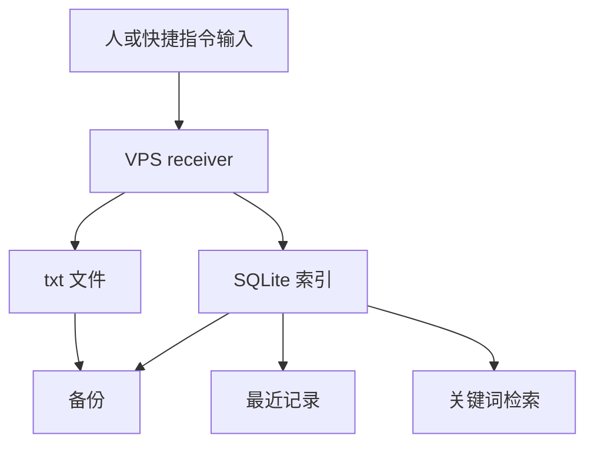

# Human Context

这份文档给人看。

主要内容已经并入 DeepWiki 主入口；这份文件现在更接近 wiki 的底稿来源。

目标是让你快速知道：

- 项目现在处在哪一步
- 你应该先掌握什么
- 哪些地方可以先略读

## 一句话判断

Axiom 当前是已经打通最小链路、正在补可靠性的 `v0.1 alpha` 后端。

## 你先要理解的四件事

- 现在的主节点是 `VPS`
- 当前主线只有 `输入 -> 存储 -> 检索`
- 文件是内容本体，SQLite 是索引
- 研究报告是长远方向，短期开发看 `docs/SHORT_TERM.md`

## 当前状态图

## 需要完全掌握的位置

1. `core/receiver.py`
   需要掌握：
   `AXIOM_ROOT`、`INBOX_PATH`、`DB_PATH`、`SECRET_KEY`、`init_db()`、`write_text_file_atomic()`、`insert_text_item()`、`add_note()`、`recent_items()`、`search_items()`
2. `core/init_db.py`
   需要掌握：
   它如何复用 `receiver.py` 中的 `init_db()`
3. `scripts/backup_axiom.py`
   需要掌握：
   备份范围、SQLite backup API、zip 输出、`--keep`、`--dry-run`
4. `scripts/check_consistency.py`
   需要掌握：
   如何检查 DB 记录缺文件、inbox 孤立 txt、缺失 file_path 的记录，以及 `/opt/axiom/...` 到本地 `--root` 的映射
5. `scripts/smoke_test_receiver.py`
   需要掌握：
   如何用临时目录验证 receiver 的主链路
6. `deploy/axiom-receiver.service` 和 `.env.example`
   需要掌握：
   receiver 在 VPS 上如何启动，环境变量从哪里来，日志写到哪里
7. `docs/SHORT_TERM.md`
   需要掌握：
   当前阶段边界、近期优先级、下一步顺序

## 可以先略读的位置

- `deep-research-report.md`
  先知道它是长远目标来源即可，第一次不用逐字读完
- `docs/ITERATION_LOG.md`
  用来回看我们已经做了什么
- `docs/DEEPWIKI.md`
  需要用 DeepWiki 时再看

## 推荐阅读顺序

1. `README.md`
2. `docs/SHORT_TERM.md`
3. `core/receiver.py`
4. `scripts/smoke_test_receiver.py`
5. `scripts/check_consistency.py`
6. `scripts/backup_axiom.py`
7. `deploy/axiom-receiver.service`
8. `deep-research-report.md`

## 当前真正的核心问题

当前最需要持续盯住的是：

- 服务如何在 VPS 上稳定启动
- 文件和数据库如何检查一致性
- 备份如何在 VPS 上形成固定流程
- 日志如何同时通过 `journalctl` 和 `logs/receiver.log` 查看
