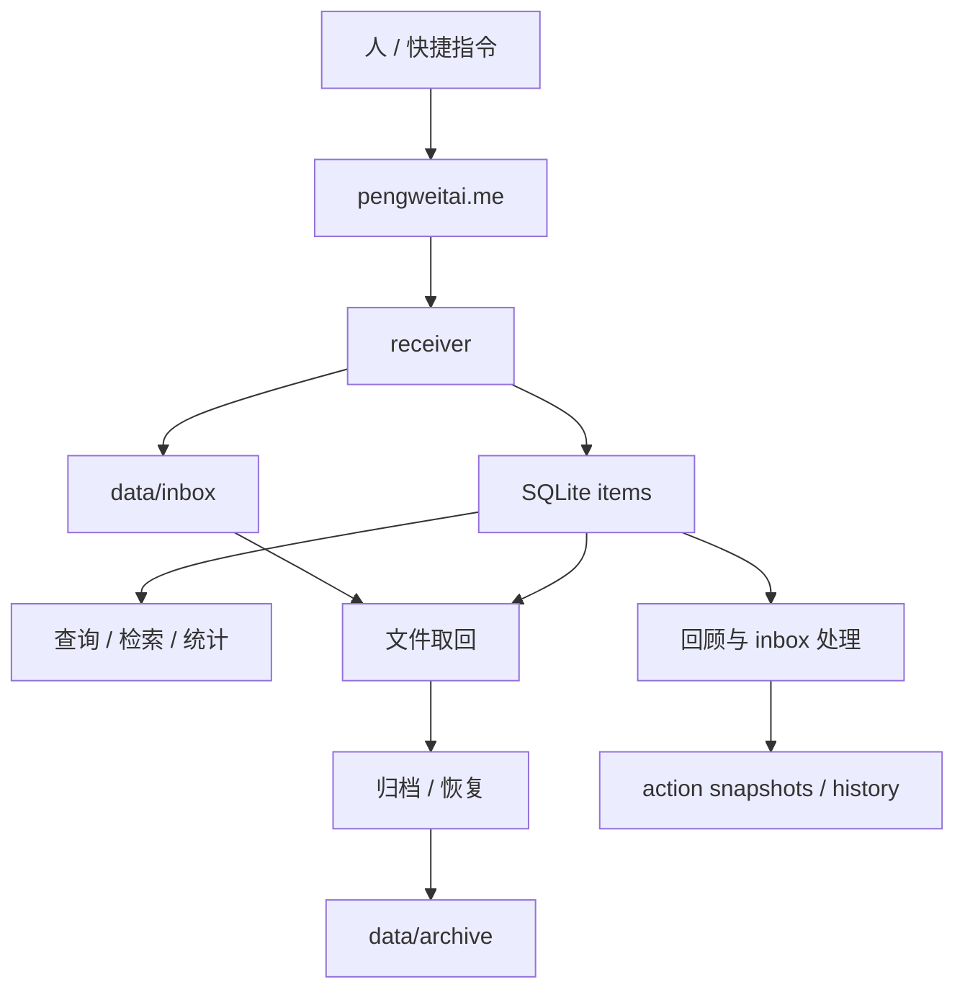

# Human Context

这份文档给人看。DeepWiki 是主要阅读入口，这里保留一份更短的接手清单。

## 一句话判断

Axiom 当前已经有可运行的 VPS 后端基线，重点正在从“能收、能存、能查”推进到“能稳定运行、能回顾、能安全处理 inbox、能为后续 AI 做准备”。

当前默认协作原则是：如果一个功能没有时间约束，就尽量先做完整，少做“先临时能用”的妥协，优先减少返工和来回迭代。

## 先理解的四件事

- VPS 是当前线上运行节点，路径是 `/opt/axiom`。
- 文件系统保存内容本体，SQLite 保存索引。
- receiver 已支持文本、图片、文档、音频、检索、文件取回、归档、恢复、统计、自动化产物读取，以及 `/app` 移动优先 Web App。
- 早期技术边界已经松绑，以后可以改架构，但大改必须先做决策说明、备份、迁移和回滚设计。

## 当前状态图

## 需要完全掌握的位置

1. `core/receiver.py`
   需要掌握：配置区、`init_db()`、`build_item_payload()`、`build_stats_payload()`、`build_overview_payload()`、`build_overview_text()`、`build_artifact_payload()`、`build_artifact_latest_summary()`、`write_text_file_atomic()`、`write_binary_file_atomic()`、`insert_item()`、`overview()`、`overview_text()`、`get_item_file()`、`list_artifacts()`、`artifact_summary()`、`get_artifact_file()`、`archive_item()`、`restore_item()`、`recent_items()`、`search_items()`。
2. `scripts/check_consistency.py`
   需要掌握：如何检查 DB 记录缺文件、storage 孤立文件、缺失 `file_path` 的记录，以及 `/opt/axiom/...` 到本地 `--root` 的映射。
3. `scripts/backup_axiom.py`
   需要掌握：备份范围、SQLite backup API、zip 输出、manifest、`--keep`、`--dry-run`。
4. `scripts/smoke_test_receiver.py`
   需要掌握：receiver 主链路如何在临时目录里被验证。
5. `core/templates/app.html`、`core/static/app.css`、`core/static/app.js`
   需要掌握：Web App 的页面结构、移动端布局、状态管理和 API 调用方式。
6. `core/static/manifest.webmanifest`、`core/static/sw.js`、`core/static/icons/axiom-mark.svg`
   需要掌握：PWA 壳、主屏幕安装入口和前端静态资源边界。
7. `scripts/build_review_markdown.py` 和 `scripts/save_review_snapshot.py`
   需要掌握：日回顾、周回顾如何生成和落盘。
8. `scripts/build_inbox_processing_report.py`
   需要掌握：inbox 条目如何被规则判断为“补描述”“归档候选”等动作。
9. `scripts/apply_inbox_actions.py` 和 `scripts/save_inbox_action_snapshot.py`
   需要掌握：dry-run、`--apply`、`--only-id`、`--exclude-id`、`--max-items` 这些安全开关。
10. `scripts/list_inbox_action_snapshots.py`、`scripts/build_inbox_action_history_markdown.py`、`scripts/save_inbox_action_history_snapshot.py`
   需要掌握：action snapshots 如何被回看和汇总。
11. `deploy/*.service` 和 `deploy/*.timer`
   需要掌握：receiver、备份、回顾、inbox 处理和 action history 在 VPS 上如何自动运行。
12. `docs/SHORT_TERM.md`
   需要掌握：当前短期推进顺序和架构决策方式。

## 可以先略读的位置

- `deep-research-report.md`
  先知道它是长期目标来源，第一次不用逐字读完。
- `docs/ITERATION_LOG.md`
  用来回看每一步已经做了什么。
- `docs/DEEPWIKI.md`
  需要刷新 DeepWiki 时再看。

## 推荐阅读顺序

1. `README.md`
2. DeepWiki 主入口
3. `docs/SHORT_TERM.md`
4. `core/receiver.py`
5. `scripts/smoke_test_receiver.py`
6. `scripts/check_consistency.py`
7. `scripts/backup_axiom.py`
8. `scripts/build_inbox_processing_report.py`
9. `scripts/save_inbox_action_snapshot.py`
10. `deep-research-report.md`

## 当前真正要盯住的问题

- 真实数据是否始终可备份、可恢复、可校验。
- 自动处理链路是否默认安全、有留痕、可回看。
- 文档是否能让新加入的人快速理解当前基线。
- 架构升级是否基于证据和迁移方案，而不是基于冲动。
