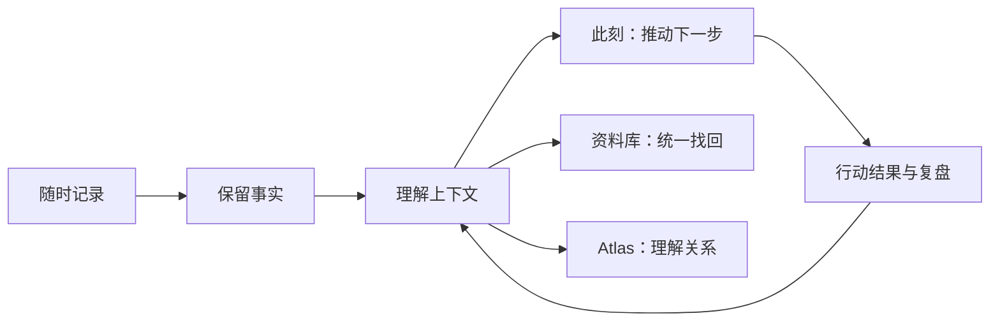

# Human Context

这份文档给人看。DeepWiki 是主要阅读入口，这里保留一份更短的接手清单。

## 一句话判断

Axiom 已有可运行的 VPS 后端与跨端基线，当前产品主线已经从“功能工作台集合”收敛为以“此刻”为中心的个人外脑：随时记录，由系统理解上下文，再通过“此刻 / 资料库 / Atlas”支持行动、找回和关系理解。

当前默认协作原则是：如果一个功能没有时间约束，就尽量先做完整，少做“先临时能用”的妥协，优先减少返工和来回迭代。
同时默认节流：小改动只记 `ITERATION_LOG`，测试按影响范围分层执行，DeepWiki 和全套文档只在阶段节点统一刷新。

## 先理解的四件事

- VPS 是当前线上运行节点，路径是 `/opt/axiom`。
- 文件系统保存内容本体，SQLite 保存索引。
- `/app` 的 Vue 主前端只有“此刻 / 资料库 / Atlas”三个一级目的地，记录是全局动作；旧 PWA 位于 `/app/legacy`，只承担兼容与迁移参考。
- “此刻”已经能从真实任务事实中选出一个主要行动，解释为什么，并在完成后自动重排；确认目标会作为承诺脉络参与判断，没有下一步的确认目标会被识别为承诺断点。候选目标不参与排序，系统也不假装掌握尚未记录的精力、依赖或影响后果。
- 早期技术边界已经松绑，以后可以改架构，但大改必须先做决策说明、备份、迁移和回滚设计。

## 当前状态图

```mermaid
flowchart LR
    A["随时记录"] --> B["保留事实"]
    B --> C["理解上下文"]
    C --> D["此刻：推动下一步"]
    C --> E["资料库：统一找回"]
    C --> F["Atlas：理解关系"]
    D --> G["行动结果与复盘"]
    G --> C
```

## 需要完全掌握的位置

1. `docs/PRODUCT_MODEL.md`
   需要掌握：Axiom 为什么只有“此刻 / 资料库 / Atlas”三个一级目的地，以及任务、记忆、决策和竞赛项目为什么不能重新膨胀为平级工作台。
2. `frontend/src/`
   需要掌握：Vue 主前端的产品壳、全局记录、统一资料库、此刻工作面和 Atlas 边界。
3. `core/context_engine.py`、`core/context_commitments.py` 与 `core/routes/context.py`
   需要掌握：此刻如何只基于已知事实给出可解释判断，确认目标如何形成承诺与断点，如何区分完成结果与显式反馈，以及 `context.now.v3` 契约。
4. `core/receiver.py` 与 `core/routes/`
   需要掌握：receiver 如何装配领域路由，具体能力优先沿各领域模块阅读，不再把所有逻辑视为一个文件。
5. `scripts/check_consistency.py`
   需要掌握：如何检查 DB 记录缺文件、storage 孤立文件、缺失 `file_path` 的记录，以及 `/opt/axiom/...` 到本地 `--root` 的映射。
6. `scripts/backup_axiom.py`
   需要掌握：备份范围、SQLite backup API、zip 输出、manifest、`--keep`、`--dry-run`。
7. `scripts/smoke_test_receiver.py` 与领域 smoke tests
   需要掌握：receiver 主链路如何在临时目录里被验证。
8. `core/templates/app.html` 与 `core/static/v2/`
   需要掌握：Vite 产物如何由 Flask 提供；不要直接在构建产物里开发。
9. `core/static/manifest.webmanifest`、`core/static/sw.js`、`core/static/icons/axiom-mark.svg`
   需要掌握：PWA 壳、主屏幕安装入口和前端静态资源边界。
10. `scripts/build_review_markdown.py` 和 `scripts/save_review_snapshot.py`
   需要掌握：日回顾、周回顾如何生成和落盘。
11. `scripts/build_inbox_processing_report.py`
   需要掌握：inbox 条目如何被规则判断为“补描述”“归档候选”等动作。
12. `scripts/apply_inbox_actions.py` 和 `scripts/save_inbox_action_snapshot.py`
   需要掌握：dry-run、`--apply`、`--only-id`、`--exclude-id`、`--max-items` 这些安全开关。
13. `scripts/list_inbox_action_snapshots.py`、`scripts/build_inbox_action_history_markdown.py`、`scripts/save_inbox_action_history_snapshot.py`
   需要掌握：action snapshots 如何被回看和汇总。
14. `deploy/*.service` 和 `deploy/*.timer`
   需要掌握：receiver、备份、回顾、inbox 处理和 action history 在 VPS 上如何自动运行。
15. `docs/SHORT_TERM.md`
   需要掌握：当前短期推进顺序和架构决策方式。

## 可以先略读的位置

- `deep-research-report.md`
  先知道它是长期目标来源，第一次不用逐字读完。
- `docs/ITERATION_LOG.md`
  用来回看每一步已经做了什么。
- `docs/DEEPWIKI.md`
  需要刷新 DeepWiki 时再看。

## 推荐阅读顺序

1. `README.md`
2. `docs/PRODUCT_MODEL.md`
3. `docs/AI_CONTEXT.md`
4. `frontend/src/`
5. `core/context_engine.py`
6. `core/receiver.py` 与 `core/routes/`
7. `scripts/smoke_test_context.py`
8. `scripts/smoke_test_receiver.py`
9. `scripts/check_consistency.py`
10. `scripts/backup_axiom.py`
11. `deep-research-report.md`

## 当前真正要盯住的问题

- 真实数据是否始终可备份、可恢复、可校验。
- “此刻”的判断是否只基于可核对事实，并能把确认目标转成下一步，再通过完成、改期和反馈逐步校准。
- 一级产品结构是否始终保持收敛，没有重新长回对象类型工作台。
- 自动处理链路是否默认安全、有留痕、可回看。
- 文档是否能让新加入的人快速理解当前基线。
- 架构升级是否基于证据和迁移方案，而不是基于冲动。
