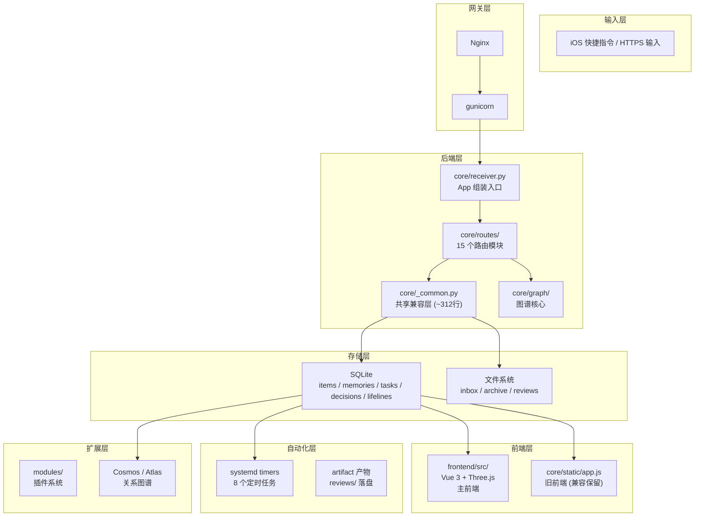

# Short Term

这份文档只讲短期目标。它回答一个问题：

`Axiom 现在最应该推进什么？`

## 当前阶段

当前阶段：`v0.2+`（历史标签：`v0.1 alpha`）

> 本文件各章节已更新至 v0.2+ 状态。当前真实状态细节以 `docs/axiom_current_status_2026-05-27.md` 为准，
> 债务清理以 `docs/DEBT_BOARD.md` 为准，演进总览见 `docs/PROJECT_EVOLUTION.md`。

当前主线：

```text
对象关系链打通 → 图谱交互增强 → AI 推理层建设 → 白板与空间思维
```

当前阶段核心方向：
- 打通 item → memory → task → decision → lifeline → association → review 全链
- Atlas v1 交互增强（搜索、路径查找、实体/关联编辑、数据导出导入）
- Cosmos 关联自动生成（规则初筛 + LLM 分类：co_occurrence / causal / tension / derived_from）
- 模块系统扩展（以减脂模块为模板，承载更多垂直领域）
- AI 从工具层向主动推理层过渡

当前已经不再把早期技术边界作为硬约束。Flask、SQLite、文件系统和 VPS 是已验证基线；如果后续有明确收益，可以调整架构，但必须先完成决策说明、迁移方案、回滚方案和验证方案。

当前推进原则：
- 如果一个功能没有时间限制，优先一次做得更完整，减少为了“暂时能用”做的临时妥协。
- 默认追求更稳、更完整和更少返工，而不是单纯追求更快出结果。

## 当前状态图



## 当前已经有的东西

- HTTPS 域名入口：`pengweitai.me`
- Nginx 反向代理
- gunicorn + systemd receiver 服务
- `/health`
- `/stats`
- `/add`
- `/upload`
- `/item/<id>`
- `/file/<id>`
- `/archive/<id>`
- `/restore/<id>`
- `/recent`
- `/search`
- `/overview`
- `/overview/text`
- `/artifacts`
- `/artifacts/summary`
- `/artifacts/file/<path>`
- `/app`：当前主前端入口
- `/atlas`：Atlas 深链接
- `/app/legacy`：旧移动 Web App 兼容入口
- SQLite `items` 表
- `data/inbox` 和 `data/archive`
- 每日自动备份
- 一致性检查脚本
- receiver 冒烟测试
- inbox processing 冒烟测试
- Markdown 导出
- daily / weekly review
- inbox processing report
- inbox action snapshot
- inbox action history
- 对应的 VPS systemd timers
- 移动优先 Web App / PWA 壳

## 当前已稳住的点

**输入与存储：**
- 文本、图片、PDF/Word 文档和常见音频都能进入 inbox 并写入 SQLite。
- PDF/DOCX 上传后自动抽取正文，进入搜索和文档查看器。
- 音频支持直接携带 `transcript_text` 或通过 sidecar 文件导入转写（txt/md/srt/vtt），srt/vtt 自动清洗时间轴。
- 文件取回、元数据读取、统计、类型/来源/存储区/处理状态/时间范围过滤已验证。
- 归档和恢复不破坏取回路径。
- 备份包含 SQLite、inbox、archive 和 manifest，每日自动执行。

**检索与前端：**
- FTS5 中文全文搜索（BM25 排序 + CJK 字符级分词），覆盖 content / original_name / derived_text / transcript_text。
- `/app` 为当前主前端入口（Vue 3，Capture/Atlas/近况 三模式），`/app/legacy` 保留旧处理工作台兼容。
- PWA 主屏入口，移动端低摩擦使用。

**AI 预处理：**
- 音频自动转写（`audio_transcribe_day`），图片自动描述（`image_describe_day`），缺 key 时跳过并留痕。
- 所有 AI 预处理产物落盘 `data/reviews/`，可回看。

**结构化对象：**
- 五类记忆系统（fact / preference / goal / relationship / event），candidate → confirmed → archived。
- 任务系统（三级优先级 high/medium/low + due_date）。
- 决策系统（pending → reviewed），支持复盘记录。
- Item → Memory 反向链：`promote-to-memory` 已打通。

**自动化与治理：**
- 8 个 systemd timers 线上运行（日/周回顾、inbox 处理、action 执行+留痕、音频转写、图片描述、备份）。
- 自动化默认 dry-run，真执行需显式 `--apply`；支持 `--max-items`、`--only-id`、`--exclude-id` 分批操作。
- 审计日志覆盖 items / memories / tasks CUD 操作。
- `/system` 端点提供 DB 大小、表计数、FTS 条目、备份年龄、孤立引用、健康分数等运行指标。
- 部署脚本化：`deploy_to_vps.py` 一键部署 + 验证。

**关系图谱：**
- Cosmos 聚合 items / tasks / memories / decisions / lifelines / associations 为统一图谱数据源。
- Lifelines 树结构（parent_id + order_index），支持实体挂载与卸载。
- 关联自动生成（规则初筛：同 lifeline、时间邻接、bigram 文本相似 → LLM 分类：co_occurrence / causal / tension / derived_from / none）。
- Atlas v1 前端（Three.js 3D 图，搜索、路径查找、实体/关联编辑、数据导出/导入）。

**模块系统：**
- 自动模块发现、Blueprint 注册、Prompt 模板加载、前端 nav item。
- 减脂模块为第一个垂直领域示例（体重/饮食/运动/围度/备注）。
- Learning Board v0.1。

## 当前最重要的风险

### _common.py 过重（P0 — DEBT_BOARD DB-001）

- `core/_common.py` 已从巨型共享核心降到约 312 行，主体职责已拆到 `core/config.py`、`core/fetch.py`、`core/database.py`、`core/search.py`、`core/artifacts.py`、`core/automation_core.py`、`core/items.py`、`core/text_extract.py`、`core/audit.py`、`core/vector_search.py`、`core/system_state.py`、`core/http_utils.py`。
- `core/routes/*.py` 和 `core/receiver.py` 已移除 `from core._common import *`，隐式共享命名空间风险已收窄。
- 下一步收口：把 route 从 `_common.py` 兼容层逐步迁到具体模块直接导入，并为 DB / Items / Search / HTTP 工具补最小单元测试。

### 文档漂移（P0 — DEBT_BOARD DB-002）

- `docs/AI_CONTEXT.md` 和 `docs/SHORT_TERM.md` 版本标签长期停留在 v0.1 alpha，与代码实际 v0.2+ 脱节。
- Cosmos/Atlas/Lifelines 在 README 和 AI_CONTEXT 中完全缺失，新接手者不知道关系图谱主线已存在。
- 自动生产状态快照基础脚本已补（DB-004），后续需要随部署启用 systemd timer 并观察线上报告质量。

### 前端双轨并存（P1 — DEBT_BOARD DB-005）

- 主前端 `frontend/src/`（Vue 3 + Vite）+ 旧前端 `core/static/app.js`（~4200 行 vanilla JS）同时维护。
- 旧前端不再加新功能，只修 bug；新功能一律进入 Vue 3 前端。
- 处理工作台、自动化中心、记忆/任务/决策面板仍在旧前端，需逐步小块迁移。

### AI 层深度不足（P1 — DEBT_BOARD DB-006）

- AI 当前只做被动调用响应（parse/transcribe/describe/suggestions），未形成主动推理层。
- 不会主动检测"用户三天没记录"、不会在 inbox 积压时自动建议处理优先级。
- 关联生成（cosmos_associations）只在手动触发时运行。
- 生产状态快照基础设施已补，下一步可在其基础上做 alarm / suggestion 定时主动推送。

### 数据安全

- 涉及真实数据的操作要先备份。
- 真执行前优先 dry-run。
- 归档、恢复、自动处理后都要跑一致性检查。

### 自动化误操作

- `apply_inbox_actions.py` 默认 dry-run。
- `--apply` 只在确认候选条目后使用。
- 大批量处理前加 `--max-items`，单条优先 `--only-id`。

### 架构升级

- 解除硬约束不等于马上迁移。
- 每次升级都要先证明当前基线在哪里挡住了进展。
- 影响持久化和部署的改动必须有回滚路径。

## 短期优先级

基于 `docs/DEBT_BOARD.md` 当前债务结构。

### 第一优先级（P0 — 阻塞级）

- `_common.py` 收口：已降到约 312 行；旧 route / receiver 的 `import *` 已清理，继续推进具体模块直连导入和核心单元测试。
- 统一文档版本标签：AI_CONTEXT.md / HUMAN_CONTEXT.md / README.md → v0.2+，核心文档补 Cosmos / Atlas / Lifelines 描述。
- 保持 VPS 运行稳定，备份/恢复/一致性检查持续可用。

### 第二优先级（P1 — 重要）

- 部署并观察自动生产状态快照（每日 system-status 报告，含 /health /system /stats /metrics 摘要）。
- 旧前端功能逐步小块迁移到 Vue 3 前端（处理工作台、自动化中心、记忆/任务/决策面板）。
- AI 层向主动推理过渡：先做 alarm / suggestion 定时主动推送。
- 改善人类阅读层，让 review / inbox report / action history 更容易消费。

### 第三优先级（P2 — 改善级）

- `_common.py` 拆分后为核心模块补最小单元测试（DB / Items / Search 优先）。
- `.gitignore` 补全 desktop 构建产物（tauri target / gen / node_modules）。
- 旧前端代码不单独投入，随迁移自然消除。

## 当前建议顺序

1. 同步 README、AI/Human/Short Term 和 DeepWiki，明确新架构决策规则。
2. 重新生成 DeepWiki 缓存。
3. 跑本地冒烟测试和 `compileall`。
4. 提交并推送。
5. 下一轮优先做读取层体验或架构评估模板。

## 最近操作习惯

- 能一起做且不耽误推进的测试，集中放在一轮功能末尾执行。
- 小功能做完后继续推进。
- 需要用户消化或拍板的节点再停下来。
