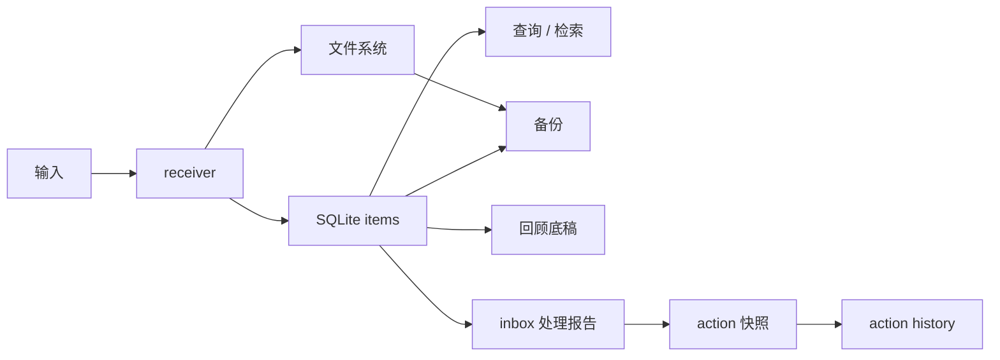

# Short Term

这份文档只讲短期目标。它回答一个问题：

`Axiom 现在最应该推进什么？`

## 当前阶段

当前阶段：`v0.1 alpha`

当前主线：

```text
稳定接收 -> 可靠存储 -> 可查可取 -> 可备份恢复 -> 可回顾 -> 可安全处理 inbox
```

当前已经不再把早期技术边界作为硬约束。Flask、SQLite、文件系统和 VPS 是已验证基线；如果后续有明确收益，可以调整架构，但必须先完成决策说明、迁移方案、回滚方案和验证方案。

当前推进原则：
- 如果一个功能没有时间限制，优先一次做得更完整，减少为了“暂时能用”做的临时妥协。
- 默认追求更稳、更完整和更少返工，而不是单纯追求更快出结果。

## 当前状态图



## 当前已经有的东西

- HTTPS 域名入口：`pengweitai.me`
- Nginx 反向代理
- gunicorn + systemd receiver 服务
- `/health`
- `/stats`
- `/add`
- `/upload`
- `/item/<id>`
- `/file/<id>`
- `/archive/<id>`
- `/restore/<id>`
- `/recent`
- `/search`
- `/overview`
- `/overview/text`
- `/artifacts`
- `/artifacts/summary`
- `/artifacts/file/<path>`
- `/app`
- SQLite `items` 表
- `data/inbox` 和 `data/archive`
- 每日自动备份
- 一致性检查脚本
- receiver 冒烟测试
- inbox processing 冒烟测试
- Markdown 导出
- daily / weekly review
- inbox processing report
- inbox action snapshot
- inbox action history
- 对应的 VPS systemd timers
- 移动优先 Web App / PWA 壳

## 当前已稳住的点

- 文本和图片都能进入 inbox 并写入 SQLite。
- 文件取回、元数据读取、统计、类型过滤、来源过滤、存储区过滤、时间范围过滤已经验证。
- `/app` 已经能直接覆盖文本写入、图片上传、总览、最近记录、搜索和自动化产物浏览。
- 归档和恢复不会破坏 `/file/<id>` 的取回路径。
- 备份包含 SQLite、inbox、archive 和 manifest。
- 一致性检查覆盖 inbox 与 archive。
- review、inbox processing、action snapshot、action history 都已经能落盘。
- 自动处理默认 dry-run，真正执行需要显式 `--apply`。
- action 执行支持 `--only-id`、`--exclude-id`、`--max-items`，用于降低误操作风险。

## 当前最重要的风险

### 数据安全

- 涉及真实数据的操作要先备份。
- 真执行前优先 dry-run。
- 归档、恢复、自动处理后都要跑一致性检查。

### 自动化误操作

- `apply_inbox_actions.py` 默认 dry-run。
- `--apply` 只在确认候选条目后使用。
- 大批量处理前加 `--max-items`。
- 对单条数据处理时优先使用 `--only-id`。

### 文档漂移

- 小改动只更新 `docs/ITERATION_LOG.md`。
- 大改动同步 README、DeepWiki、AI/Human/Short Term 上下文。
- DeepWiki 生成脚本要和真实代码保持一致。

### 架构升级

- 解除硬约束不等于马上迁移。
- 每次升级都要先证明当前基线在哪里挡住了进展。
- 影响持久化和部署的改动必须有回滚路径。

## 短期优先级

第一优先级：

- 保持 VPS 运行稳定。
- 保持备份、恢复、一致性检查可用。
- 保持 action snapshot 和 history 可回看。
- 把新治理规则写入项目文档和 DeepWiki。

第二优先级：

- 改善人类阅读层，让 review、inbox report、action history 更容易消费。
- 为图片补描述和后续 AI 摘要准备更清晰的数据入口。
- 梳理需要架构升级时的决策模板。

第三优先级：

- 在证据足够时评估数据模型、检索层或服务结构升级。
- 引入 AI 摘要、分类建议、周回顾增强。

## 当前建议顺序

1. 同步 README、AI/Human/Short Term 和 DeepWiki，明确新架构决策规则。
2. 重新生成 DeepWiki 缓存。
3. 跑本地冒烟测试和 `compileall`。
4. 提交并推送。
5. 下一轮优先做读取层体验或架构评估模板。

## 最近操作习惯

- 能一起做且不耽误推进的测试，集中放在一轮功能末尾执行。
- 小功能做完后继续推进。
- 需要用户消化或拍板的节点再停下来。
