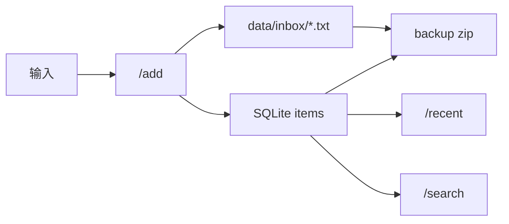

# Short Term

这份文档只讲短期目标。

它负责回答一个问题：

`Axiom 现在最应该做什么？`

## 当前阶段

当前阶段：`v0.1 alpha`

当前主线：

```text
接收输入 -> 持久化存储 -> 基础检索 -> 手动备份
```

## 当前状态图



## 当前已经有的东西

- `/health`
- `/add`
- `/recent`
- `/search`
- SQLite `items` 表
- `data/inbox` 文件落盘
- `scripts/backup_axiom.py` 手动备份脚本
- `scripts/check_consistency.py` 一致性检查脚本
- `scripts/smoke_test_receiver.py` receiver 冒烟测试
- `deploy/axiom-receiver.service` systemd 服务模板
- `.env.example` 环境变量示例

## 本轮已稳住的点

- `/add` 支持 GET 和 POST JSON
- `/add` 文件名加入微秒和短 UUID，降低碰撞风险
- `/add` 写文件先落临时文件，再替换为正式 txt
- `/add` 入库失败时会清理已经写入的 txt 文件
- `/recent` 支持 `page`、`page_size`，兼容 `limit`
- `/recent` 和 `/search` 的 `page_size` 上限统一为 `50`
- `/search` 支持 `relevance`、`newest`、`oldest`
- 错误返回统一为 JSON
- `core/init_db.py` 复用 `receiver.py` 的建表逻辑
- 新增文件和数据库一致性检查脚本
- 一致性检查支持把数据库里的 `/opt/axiom/...` 映射到本地 `--root`
- 新增 VPS systemd 服务模板和 `.env.example`
- receiver 支持 `AXIOM_LOG_PATH` 文件日志

## 当前最重要的风险

### 运行稳定性

- 仓库中已有 `systemd` 服务模板
- 暂未在 VPS 上真实启用并验证
- VPS 上还需要用真实路径跑一次 `/health`

### 数据一致性

- `/add` 已补受控失败清理逻辑
- 进程崩溃等非受控中断仍可能留下孤立文件
- 已有 `scripts/check_consistency.py` 可发现孤立文件和缺失文件
- 本地旧数据库可能会暴露 VPS 文件未同步的问题，这是正常诊断信号

### 备份闭环

- 手动备份脚本已经落地
- 本地尚未替代 VPS 真实验证
- 还没有做恢复演练

## 短期优先级

第一优先级：

- 在 VPS 上安装并确认 receiver systemd 服务
- 在 VPS 上跑 `scripts/backup_axiom.py`
- 做一次恢复演练
- 在 VPS 上跑 `scripts/check_consistency.py`

第二优先级：

- 在 VPS 上确认 `journalctl` 和 `/opt/axiom/logs/receiver.log` 都可用
- 继续观察 `/recent` 和 `/search` 的实际使用感受

第三优先级：

- 图片上传
- 多类型 item 支持

## 当前建议顺序

1. 把新 receiver 部署到 VPS
2. 按 `deploy/axiom-receiver.service` 启动 systemd 服务
3. 用真实快捷指令打一次 `/add`
4. 在 VPS 上调用 `/health`、`/recent` 和 `/search`
5. 跑一次真实备份
6. 做恢复演练
7. 跑一致性检查脚本

## 当前明确暂缓

- 切换数据库
- 引入新框架
- 复杂 agent
- 向量检索
- 多服务化
