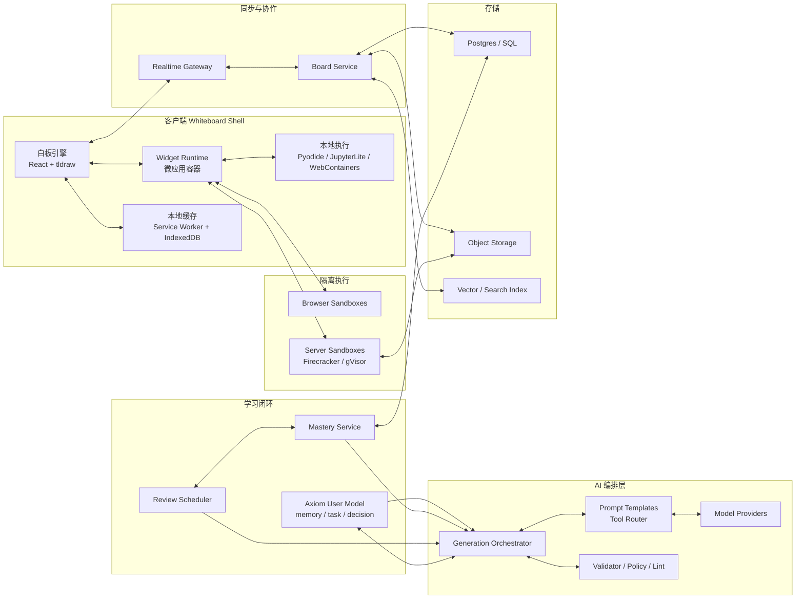
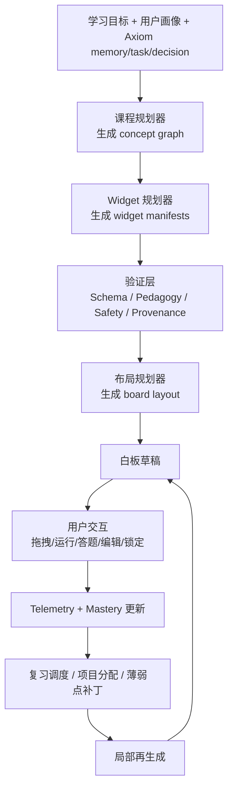

# 白板式 AI 学习平台的产品与工程分析

## 执行摘要

这条产品方向是**可行而且有明显空缺**的，但前提不是做一个“AI 帮用户往白板上贴卡片”的笔记工具，而是做一个“**白板即学习运行时**”的系统：白板负责空间组织与导航，widget 负责讲解、可视化、练习、执行、项目推进、评估与复习，Axiom 的 memory / task / decision 数据负责把这些部件编排成个性化学习闭环。现有产品已经分别验证了其中的几个关键部件：Obsidian 验证了无限画布、开放格式与本地数据 ownership；Heptabase 验证了白板对复杂主题 sense-making 的价值；Miro 验证了白板原生 item/SDK/生态；Apple WidgetKit 验证了“尺寸受控、信息密度高、可点击的小组件”这一视觉语法；学习科学则说明，真正提升学习效果的不是“内容被摆在白板上”，而是主动学习、练习测试、分散复习、外部可视化与概念图这些机制。citeturn17view0turn17view1turn17view2turn3view2turn16view5turn1search1turn11search0turn11search1turn10search2turn10search3turn19view4

从工程上看，最关键的不是「AI 能不能生成内容」，而是**是否能把白板内容拆成“可校验、可再生、可交互、可追踪”的 typed widgets**。如果继续沿用传统笔记工具把白板节点视为富文本或任意 HTML，系统会很快遇到四个问题：内容不可重现、交互难以安全执行、掌握度无法挂到概念层、局部再生成会破坏用户布局。相反，如果把每个 widget 设计成一个带 manifest 的微应用，白板就能稳定承载“函数交互器、代码沙箱、可执行练习、概念图、闪卡、项目卡、小测”等教学部件，并允许 AI 在**概念图—widget 规格—布局**三层分别生成与修补。JSON Canvas 的开放 spec、tldraw 的自定义 shape 与 sync、React Flow 的自定义节点、Pyodide/JupyterLite/WebContainers 的浏览器执行能力、以及 service worker + IndexedDB 的离线缓存能力，为这一路径提供了现实的技术底座。citeturn17view5turn17view6turn16view8turn25search0turn25search1turn25search2turn16view9turn16view11turn22view1turn16view12turn16view13turn16view14

如果把它当成产品战略问题，最重要的判断是：**你真正要卖的不是白板，而是“AI 自动生成的、可执行的学习空间”**。因此，短期 MVP 应该优先覆盖最能体现优势的学科和场景，例如数学、编程、理工基础课、考试复习与项目型学习，因为这些场景最能受益于参数拖动、动态可视化、即时反馈与可执行练习；而且学习效果更容易通过完成率、正确率、迁移题表现与复习留存来量化。对于实现路径，长期最优解是独立产品；如果只是低成本验证需求，可以先用 tldraw 风格的独立 Web 原型，或者用 Obsidian Canvas/JSON Canvas 的开放格式快速验证 layout 与 export，但不建议把长期产品建立在 Notion 或 Miro 之上，因为前者是 page/database 中心且公共 API 有较低限流，后者则明显偏云协作、缺少离线模式，并且许多 board 外部资源要求公开 URL。citeturn10search2turn19view4turn20view2turn20view3turn16view3turn16view8turn17view6

## 产品定位与用户场景

以下分析采用题设假设：**跨平台 Web + Desktop 优先，移动次之；需支持离线缓存**。在这个前提下，产品最合理的定位不是“知识管理工具”或“AI Tutor 聊天框”，而是**以白板为主界面的 AI 学习操作台**。Obsidian 把 Canvas 定义为“playground for thought”，Heptabase 则把白板、卡片与标签明确描述为一个 knowledge network，并建议使用两层白板结构管理复杂主题；这些官方表述都说明，白板天然适合承载“主题结构、关系、进度与上下文切换”，而不是只做稿纸。你的机会在于把这种空间组织能力进一步推进到“课程运行时”：进入白板，不是看到一堆笔记，而是看到一个可以直接学习、操作、测试与复习的课程空间。citeturn17view0turn3view1turn3view2

目标用户最适合从三类开始。第一类是**大学生与自学者**，尤其是面对线性代数、微积分、数据结构、操作系统、概率统计等需要不断在“概念—例题—推导—图形—代码”之间切换的课程。第二类是**考试/面试备考者**，他们需要把学习时间压缩成若干主题冲刺板，快速知道哪些概念已经掌握、哪些必须复习。第三类是**项目型学习者**，例如在做算法题、课程设计、数据分析项目时，希望课程内容、代码实验、任务跟踪与复盘都停留在同一界面内。之所以这些人群更优先，是因为研究普遍支持主动学习、实践测试、概念映射与可视化交互对学习表现有正向作用，而这些机制在白板+widget 的界面里更容易同时出现。citeturn11search0turn11search1turn10search2turn10search3turn19view4

核心需求可以概括为四件事。其一，**减少切换成本**：同一主题的讲解、推导、图、代码、练习、项目、复习不要分散在书、网页、视频和 IDE 之间。其二，**把复杂关系外化**：用户需要看到 prerequisite、主题簇、项目路线与当前薄弱点，而不是只得到一条线性目录。其三，**允许即时操控**：调整参数、运行代码、提交答案、折叠/展开概念簇、进入子白板，都要在数百毫秒内完成。其四，**允许 AI 先起稿，但不剥夺人类控制权**：用户必须能 pin、锁定、改写、拒收、再生成局部内容，而不是每次都被整板重写。Heptabase 之所以对白板学习有吸引力，在于它已经支持把 AI 聊天、卡片、PDF、视频等内容拖回白板、再组织为节点和结构；你的方案需要再往前走一步，让这些节点本身变成可执行 widget。citeturn3view0turn18view0turn18view1

一个典型使用流程会是：用户输入目标，例如“在两周内学会一元微积分基础并能解常见题”；Axiom 先基于课程模板、用户历史掌握度和最近任务负载生成一张主题白板；白板出现后不是只有说明文字，而是自动排出“课程地图、今日任务、函数图交互器、关键概念卡、例题拆解、小测、复习队列、项目卡”等 widget；用户在白板内部拖动参数、运行代码、回答小测、标注疑问和重排布局；系统则在后台更新 mastery、调度下一次复习，并在下次打开时只补丁式更新受影响的 widget。这个流程把“规划—学习—练习—评估—复习—再规划”留在同一空间中，避免了知识和操作分离。citeturn11search1turn19view4turn17view0turn3view2

## 竞品与参考

| 产品 | 核心内容/布局模型 | 强项 | 对你的方案最有价值的启发 | 主要短板 | 生态与扩展 | 证据 |
|---|---|---|---|---|---|---|
| Obsidian | 本地 Markdown vault + Canvas；Canvas 可嵌入笔记、图片、PDF、视频、音频和交互网页。 | 本地优先、开放格式、数据 ownership 强；Canvas 已有无限画布；JSON Canvas 已开源并可自由实现。 | 把**开放文件格式**和**本地数据控制权**作为底层原则；白板节点不该被锁死在私有格式里。 | 更像“笔记与嵌入容器”，不是学习运行时；交互与评估主要依赖插件或外部嵌入。 | 官方 2026 年称社区已有 4,000+ 插件/主题、1.2 亿次下载；Community 目录和自动审查体系较成熟。 | 官方 Canvas/JSON Canvas/数据存储/插件博客。 citeturn17view0turn17view1turn17view2turn17view3turn17view4turn17view5turn17view6 |
| Heptabase | 卡片 + 白板 + 标签构成 knowledge network；支持 Section、mindmap、sub-whiteboard、AI chat/actions。 | 最接近“复杂主题 sense-making”场景；白板、子白板、卡片网络、AI 动作与白板上下文 AI 已很成熟。 | 证明**白板可以成为学习与研究的主界面**；尤其适合用“父白板/子白板/Section”管理课程层级。 | 更偏知识梳理与研究协作，白板 item 仍以卡片/文本/连接为主；可执行 widget 与原生评估闭环仍弱。 | 官方资料突出 AI actions、MCP、CLI、AI Tutor；本次查阅未见与 Obsidian/Miro 对等的公开插件市场，这是基于官方资料的推断。 | 官方 whiteboard、AI、roadmap、changelog。 citeturn3view0turn3view1turn3view2turn3view3turn18view0turn18view1turn18view2turn18view3 |
| Notion | Block/Page/Database 模型；Board 是数据库视图；页面可嵌入大量外部内容。 | 结构化内容与数据库能力强；连接（connections）与权限模型清晰；嵌入灵活。 | 启发在于**typed block/data model**与权限能力，而不是白板本身。 | 不是无限画布；Board 更接近看板；公共 API 平均约 3 req/s，不适合作为高频白板运行时底座。 | 支持 internal/public connections、capabilities 和大量 embeds，但生态更偏集成，而非板内可执行 runtime。 | 官方 API、board、embed、rate limit 文档。 citeturn16view0turn16view1turn16view2turn20view0turn20view1turn20view2 |
| Miro | 板上 item 模型；支持 card、app card、connector、embed、frame、image、shape 等；Web SDK / REST / Marketplace。 | 白板原生 SDK、实时事件、强协作、应用生态和 app card 很强；近期还新增 code widget API。 | 对你最重要的是**board-native widget 平台**思路：白板 item 应该是类型化对象，而不是富文本块。 | 云协作优先；官方明确 offline mode 不在规划中；外部资源多要求公开绝对 URL；code widget 仍只是源码展示，不是完整执行环境。 | Marketplace 有数百个受信任 apps/integrations，开发者平台成熟。 | 官方 board items、events、Marketplace、system requirements、code widget changelog。 citeturn16view3turn16view4turn16view5turn20view3turn21view0 |
| Apple Widgets | WidgetKit，强调 glanceable、尺寸 family、系统级 surfaces；支持按钮与 toggle。 | 视觉密度、尺寸系统、交互节制、状态摘要做得极强。 | 你的白板可以借鉴它的**widget size families、卡面信息层级、可点不啰嗦**的设计语言。 | 官方 widgets 由 WidgetKit/SwiftUI 呈现，支持 many-but-not-all SwiftUI views，且由系统单独渲染，不是完整应用 runtime；更适合作为视觉参考而不是产品模板。 | 扩展性建立在 Apple 应用扩展体系中，不是白板 SDK 生态。 | Apple WidgetKit / HIG / interactivity 文档摘要。 citeturn1search1turn8search0turn8search1turn8search5turn8search13turn8search18turn8search21 |

综合来看，这五类产品分别代表了五种你需要吸收的“基因”：**Obsidian 的开放格式与本地控制、Heptabase 的白板学习工作流、Notion 的 typed content/data thinking、Miro 的 board-native 平台化能力、Apple Widgets 的密度与视觉语法**。真正的产品机会不在于复制其中任何一个，而在于把这五者组合成“**AI 自动生成、可执行、可测量的学习白板**”。特别值得强调的是，Miro 近期把 code widget 作为原生 board item 暴露到 API，说明行业正在承认“白板上的代码/技术对象不该只是一张截图”；但 Miro 当前仍只是格式化代码展示，距离你的“能跑、能测、能回传掌握度”的学习 widget 还有明显距离。citeturn21view0turn16view3turn17view6turn3view0turn1search1

如果从“实现基底”而不是“产品灵感”来排序，我会给出这样的建议：**长期第一选择是独立产品；快速原型第二选择是基于 tldraw/JSON Canvas 的独立 Web 原型；Obsidian 插件可以做概念验证；Miro 应用与 Notion 集成更适合作为分发/展示接口，而不是主运行时**。原因很简单：你的目标需要本地缓存、细粒度 widget 状态、浏览器内执行、补丁式再生和 learning telemetry，而 Notion 的 page/database 中心模型与 Miro 的云协作/离线缺失都不适合作为核心 substrate。citeturn20view2turn20view3turn16view3turn17view1turn16view8

## 核心功能与小组件体系

从学习科学角度看，白板要真正成为“课程”，至少要覆盖五类经过较多证据支持的活动：**主动参与、外部可视化、检索练习、分散复习、概念映射**。仅仅把内容排版得更漂亮并不足够；有效的白板必须把“看”“做”“答”“改”“复习”都放进 widget。研究综述显示，practice testing 和 distributed practice 具有较高效用；可视化干预对数学学习有中等效应；概念图对学业成绩也有明显正效应；近期研究还显示，足量的 retrieval practice 能改善复杂概念的 retention 与 transfer。citeturn11search1turn10search2turn10search3turn10search9turn19view4

因此，widget 体系不应围绕“媒体类型”组织，而应围绕“学习动作”组织。下面这张表给出一个适合 Axiom 白板的最小但完整的 widget 分类。这里的表是**产品提案**，不是现有产品事实，因此列的是建议的数据契约与复用方式。

| Widget 类型 | 主要输入 | 主要输出 | 交互方式 | 数据依赖 | 可复用性 |
|---|---|---|---|---|---|
| 概念讲解卡 | concept_id、目标层级、用户前置掌握度 | 定义、直觉解释、误区、关联概念、来源 | 展开/折叠、切换难度、追问、固定到复习区 | concepts、sources、mastery | 很高；所有课程都需要 |
| 例题拆解卡 | 概念、题型模板、难度 | 分步解法、常见错因、变式题 | 分步显示、隐藏答案、切换类似题 | concepts、problem_templates | 很高 |
| 函数/参数可视化 | 表达式、参数范围、默认值、问题提示 | 图像、表格、关键点说明、轨迹变化 | 拖动 slider、点击关键点、重置、导出截图 | spec_json、math runtime | 数学/物理/统计最强 |
| 代码沙箱 | 题目、starter code、tests、语言/runtime | stdout、图表、测试结果、错误提示 | 编辑、运行、重置、提交、查看 hint | sandbox_policy、submission、tests | 编程/数据课核心 |
| 可执行练习 | 题干、答案类型、评分器 | 得分、反馈、下一题推荐 | 选择/输入/拖拽/排序/作图 | question_bank、evaluator | 很高 |
| 项目任务卡 | 学习目标、约束、里程碑 | 任务分解、验收标准、交付物要求 | 勾选、附作品、请求 AI 反馈、推进阶段 | tasks、decision、course milestones | 项目型学习关键 |
| 闪卡/复习队列 | concept_id、记忆状态、到期时间 | Q/A、回忆提示、评级、下次复习时间 | 翻卡、自评、标记不会 | mastery、review_schedule | 很高 |
| 概念图 widget | 节点、先修关系、主题簇 | 图谱、路径、高亮弱点 | 拖动、聚类、展开子图、过滤 | concepts、edges、mastery | 很高 |
| 小测 widget | 主题范围、题量、时限 | 分数、解释、薄弱点映射 | 限时答题、分段提交、错题回放 | question_bank、mastery | 很高 |
| 错题/薄弱点卡 | 最近提交、错误模式、掌握度阈值 | 错因聚合、补救建议、推荐复习卡 | 一键生成补救板、加入今日任务 | submissions、mastery | 很高 |
| 资料引用卡 | 引文、原始材料片段、来源元数据 | 来源、摘录、关联概念、可信度说明 | 查看原文、固定引用、切换摘要 | source_refs、imports | 对“自足课程”非常重要 |
| 今日学习面板 | 时间预算、任务、到期复习、项目进度 | 今日计划、预计时长、优先级 | 拖动排序、开始专注、推迟 | task、review_schedule、layout | 高频入口 widget |
| 子白板入口 | 单元主题、课程层级、聚类结果 | 通往下一级白板的导航卡 | 双击进入、预览缩略图、返回上层 | layout、board hierarchy | 课程规模化必须 |
| Notebook/实验台 | 数据、notebook 模板、可视化库 | 可运行笔记本、代码/图表/文本混排结果 | 运行 cell、保存快照、复制为报告 | Pyodide/JupyterLite、object store | 高价值但实现更重 |

这些 widget 的一个核心原则是：**输入输出必须结构化，不能只是一段让 LLM 直接渲染的 HTML**。例如，函数可视化 widget 的真正输入不应该是“帮我画一个函数页面”的自然语言，而应该是 `expression`、`parameters`、`question_prompts`、`renderer_mode` 这类结构化字段；代码沙箱 widget 的输出也不应只是“AI 认为你写对了”，而应该包含测试通过率、stderr/stdout、运行资源使用、评分维度与建议补救主题。只有做到这一点，系统才能安全执行、稳定复现，也才能把 telemetry 回写到 mastery。citeturn19view4turn11search1

从复用角度看，最值得优先做成平台级 widget 的其实只有三类：**参数可视化、可执行练习、评估/复习**。这是因为它们最能拉开与静态笔记工具的差距，也是最容易量化效果的环节。讲解卡、例题卡、项目卡和概念图固然重要，但这些类型更容易被其他产品部分替代；真正决定用户是否愿意长期停在白板里学的，往往是“我能不能当场拖参数看变化”“我能不能直接跑代码”“我能不能马上知道自己会不会”。citeturn10search2turn19view4turn17view0

## 技术架构与数据模型

从技术选型上，我建议把系统拆成四层：**白板壳层、widget 运行层、AI 编排层、学习闭环层**。白板壳层负责无限画布、布局、缩放、分组、子白板导航与局部协作；widget 运行层负责把每个 widget 当成一个受控微应用执行；AI 编排层把用户目标与 Axiom 数据转换成概念图、widget 规格、布局 proposal 和后续补丁；学习闭环层则负责 mastery、review、project scheduling 与 analytics。这个拆分不是抽象美学，而是为了避免 UI 更新、AI 再生、代码执行和学习状态互相污染。citeturn16view8turn16view10turn16view13

在前端上，最稳妥的组合是：**React + TypeScript 作为应用框架；tldraw 作为主白板引擎；React Flow 作为“图类 widget”的内部引擎；局部 CRDT/协作能力由 tldraw sync 和必要时的 Yjs 提供**。tldraw 已经明确支持 custom shapes、custom UI、slot-based UI 覆盖和 realtime sync；React Flow 则明确支持 custom nodes，把表单、图表和其他交互元素嵌入节点内部；Yjs 则以共享数据类型自动合并冲突见长，适合文本、批注或某些 widget 内部状态的协作同步。换言之，主白板不用自己从零做；真正需要你投入精力的，是“如何把 typed widget 嵌进白板对象系统”。citeturn16view8turn25search0turn25search1turn25search2turn25search3turn25search16turn16view9turn16view10

在浏览器执行层上，建议采用**浏览器优先、服务端回退**的双栈。Python 与数据科学类 widget 最适合用 Pyodide，必要时叠加 JupyterLite 来获得 notebook 体验与 ipywidgets/plotly/matplotlib 支持；JavaScript/TypeScript/Node 教学最适合用 WebContainers，因为它能在浏览器里运行 Node.js 应用与命令。不过这里必须非常清醒：WebContainers 的官方文档说明其在 Chromium 桌面端支持最好，Firefox/Safari 多为 beta，移动端支持部分且存在内存限制，并且 embedding WebContainers-based projects 只正式支持 Chromium-based browsers。因此，移动端或 Safari/Firefox 上的代码 widget 需要更轻的 fallback——例如只给静态 AST 可视化、只运行测试子集，或回退到服务端隔离执行。citeturn16view11turn22view1turn16view12turn23view0

离线与本地缓存应该被视为第一天的约束，而不是上线后补。Service worker 可以在离线时拦截请求并从 cache 或本地算法返回内容；但官方也提醒其内存状态可能不持久，因此需要把可恢复状态放进 IndexedDB 或其他持久存储。IndexedDB 本身就是为结构化大体量客户端数据设计的；JupyterLite 也已经展示了在浏览器内把 notebook 文件、设置与可视化状态保存到浏览器索引数据库这条路。对于你的产品，这意味着至少要把 `layout`、`widget local state`、`draft submissions`、`review queue` 与最近几次 `generation output` 做本地持久化。citeturn16view13turn16view14turn22view1

在后端上，建议使用“**可追溯生成 + 受控执行**”的服务化架构，而不是把所有逻辑塞到一个 chat completion handler 里。最小后端应包含：board service、generation orchestrator、mastery service、review scheduler、object store、realtime gateway、execution broker 和 audit log。对于高风险或高负载的执行任务，服务端隔离层可以用 Firecracker microVM 或 gVisor。Firecracker 的官方资料强调 microVM 的快速启动和高密度；gVisor 的文档则强调其通过将系统接口移入独立 application kernel 来降低容器逃逸风险。你不一定两个都上，但“浏览器先跑、服务端隔离兜底”几乎是这类平台做执行安全的最务实路径。citeturn16view15turn16view16



在数据模型上，我建议把**布局**和**内容**明确分离。布局层最好兼容 JSON Canvas 的基本心智模型：board 拥有 `nodes` 和 `edges`，节点至少有 `id / x / y / width / height / type` 等几何字段；但内部真正的 widget 规格不要直接塞进 JSON Canvas 本体，而是放到独立的 `widgets` 表 / 文档里，再由 `layout` 只引用 widget ID。这样一来，你仍然可以借用 JSON Canvas 的开放 interchange，同时保留学习系统所需的 version、telemetry、sandbox capability 等扩展字段。citeturn17view5turn17view6

| 表名 | 核心字段 | 说明 |
|---|---|---|
| `concepts` | `concept_id`, `course_id`, `title`, `summary_md`, `prereq_ids`, `difficulty`, `tags`, `source_refs`, `generator_version`, `status` | 课程/单元的概念图谱源数据。`prereq_ids` 建议显式存储，不只靠 embedding 或文本推断。 |
| `widgets` | `widget_id`, `board_id`, `concept_id`, `widget_type`, `spec_json`, `runtime_kind`, `source_refs`, `generation_id`, `pinned`, `locked`, `status` | 白板上的真实教学部件。`spec_json` 是 typed manifest，不是任意 HTML。 |
| `user_state` | `user_id`, `widget_id`, `board_id`, `local_state_json`, `hidden`, `collapsed`, `last_viewed_at`, `draft_data`, `interaction_count` | 用户对 widget 的个体状态，例如展开、已看、草稿答案、滚动位置等。 |
| `mastery` | `user_id`, `concept_id`, `mastery_score`, `attempts`, `correct_rate`, `latency_p50_ms`, `confidence`, `last_reviewed_at`, `next_review_at`, `weakness_code` | 概念层掌握度。不要只在题目层记分，要最终回写到概念层。 |
| `layout` | `board_id`, `node_id`, `widget_id`, `x`, `y`, `w`, `h`, `z`, `parent_node_id`, `group_id`, `viewport_preset`, `edge_refs` | 白板几何布局；允许用户改 layout 而不改 widget 内容。 |
| `generations` | `generation_id`, `board_id`, `parent_generation_id`, `prompt_template_version`, `model_id`, `seed`, `input_snapshot_hash`, `validator_report`, `created_at` | 可追溯生成记录；用于重放与 diff。 |
| `submissions` | `run_id`, `user_id`, `widget_id`, `language`, `code_or_answer`, `stdout`, `stderr`, `score`, `tests_passed`, `resource_usage`, `sandbox_backend` | 练习与代码执行结果。 |
| `review_queue` | `user_id`, `concept_id`, `reason`, `priority`, `scheduled_for`, `widget_bundle_id` | 把“复习任务”显式化，便于生成下次打开白板时的 review widgets。 |

如果只选一个外部开放格式做互操作，我会优先选 **JSON Canvas** 作为 export/import 层；如果只选一个白板 SDK 做主引擎，我会优先选 **tldraw**。原因是二者一个解决数据可携带性，一个解决对象级白板交互；这正好分别击中“长期可持续”与“短期可落地”两个维度。citeturn17view6turn16view8turn25search5

## AI 内容生成与交互体验

AI 生成流水线的核心原则应该是：**LLM 负责提出教学意图和 widget 规格，渲染器、评分器和安全边界尽量由确定性系统接管**。这是因为你要的不是一次性生成一张好看的白板，而是一个可以局部重算、局部回滚、局部纠错、长期复用的学习界面。比如函数可视化 widget 中，LLM 可以决定“此处适合用函数交互器，并给出参数区间与问题提示”，但真正的绘图、滑块、采样和验证应该由固定 renderer 完成；代码练习 widget 中，LLM 可以生成题面、starter code 和 hints，但真正评分依赖测试用例与执行结果，而不是模型的主观判断。Miro 新增的 code widget API 也说明“把代码作为白板对象”是条现实路径，但它目前仍停留在源码展示层，这恰恰强化了你的方向：**学习白板需要的是 executable widget，不只是 formatted code**。citeturn21view0turn19view4

一个可重复再现的生成流程，最好固定为“课程规划—widget 规划—验证—布局—局部补丁”五段，而不是让一个大 prompt 一次产出所有结果。推荐的最小流水线是：首先用 planner model 把目标拆成概念图和教学路径；其次由 generator model 按概念与用户状态生成 widget manifests；再次经过 schema validator、pedagogical lint、source/provenance checker 和 sandbox policy filter；然后由 layout planner 把 widgets 放进白板；最后由 patch generator 只针对修改概念、错题集或用户请求重算局部区域。这样做的好处是，白板既能 AI 自动起稿，也能像设计文档一样保留结构化版本历史。citeturn17view5turn17view6turn16view8

下面这张流程图展示了一种适合 Axiom 的生成与再生成流程。图中的节点名称是产品提案，而非现成产品能力。



在 prompt 模板上，建议所有核心生成都输出 JSON，而不是 Markdown 或 HTML。至少要显式要求模型返回：`concepts[]`、`widgets[]`、`edges[]`、`layoutHints[]`、`pedagogicalRationale[]`、`sourceRefs[]`。同时，每个 widget 需要一个 `specVersion` 和 `capabilities[]` 字段，用来声明它是否允许本地执行、是否需要服务端沙箱、是否有评分器、是否能被复习引擎调用。这样做其实是在把“prompt engineering”升级成“schema engineering”，会显著降低长期维护成本。citeturn17view5turn25search2

在 explainability 与 editability 上，一个 AI 原生白板必须回答两个问题：“**为什么我会看到它**？”以及“**我改过之后它还会不会被覆盖**？”最佳实践是给每个 widget 增加一个 info 面板，至少展示：生成时间、模型版本、依据概念、上游资料、导致它出现的触发原因（例如用户薄弱点、今日任务、考前压缩）、以及它是否被用户 pin/lock。只要用户手工改写了内容，就应写入 user override，并在后续再生成时采用 patch + merge，而不是整卡重写。Heptabase 已经证明“把 AI 结果拖回白板后再组织”是可用工作流；你的产品要做的，是把这种“人机协作编辑”变成系统级默认行为。citeturn18view0turn18view1

白板交互本身应采用“**自由摆放 + 网格吸附 + 尺寸家族**”的混合模式。Obsidian 和 Heptabase 证明了自由空间对思考和知识组织的价值；Apple Widgets 则证明了有限尺寸和高密度卡面可以显著提高扫视效率。因此，更合适的 UX 不是纯 Miro 式自由涂抹，也不是纯首页小组件网格，而是：默认用 `S / M / L / XL` 家族控制 widget 尺寸和信息密度，但允许用户在无限画布上拖出非规则探索区；大多数“学习卡”遵循栅格，小部分“研究/推导/草稿”区允许打破栅格。Heptabase 的 Section、sub-whiteboard 与两层白板结构也说明，课程规模一大，就必须用层级与容器控制认知负荷。citeturn17view0turn3view0turn3view2turn1search1turn8search0turn8search18

一个建议中的桌面端界面大致可以长这样：

```text
┌─────────────────────── 课程白板 ───────────────────────┐
│ 课程地图        今日任务          复习队列              │
│ [概念图 XL]    [任务面板 M]      [闪卡堆 M]            │
│                                                        │
│ 函数探索区                                          练习区 │
│ [函数可视化 L] [例题拆解 M] [可执行小测 M] [错题卡 S] │
│                                                        │
│ 项目区                                                │
│ [项目任务 L] [代码沙箱 XL] [实验记录 M]              │
│                                                        │
│ 资料与来源区                                          │
│ [引用卡 S] [概念讲解 M] [子白板入口 S] [AI 注释 S]    │
└───────────────────────────────────────────────────────┘
```

桌面与移动的差异应该从一开始就拉开，而不是硬把桌面白板缩进手机。原因不只是 ergonomics，也包括运行时约束：WebContainers 在移动端官方就提示存在部分支持和内存限制。更实用的策略是，桌面端承担“生成、重排、代码执行、复杂图形交互”，移动端优先承担“复习、轻量答题、卡片浏览、任务勾选、语音记录和简单编辑”。这与 Apple widgets 的“glanceable + quick action”逻辑相吻合，也更符合移动环境。citeturn23view0turn1search1turn8search5

## 个性化闭环与安全合规

Axiom 的优势不在于“也能调一个大模型”，而在于它已经积累了 memory / task / decision 这类比普通白板工具更接近用户长期状态的数据。如果把这些数据正确接到学习白板，个性化就不只是“你喜欢什么颜色”这一级别，而是能做到三类真正有价值的适配。第一类是**内容适配**：memory 里已经出现过的项目、兴趣、类比素材可以用来生成更贴近用户背景的解释和案例。第二类是**负载适配**：task 数据可以告诉系统用户最近有没有考试、项目 deadline、碎片时间多不多，从而决定今天白板是弹出完整单元，还是只给 15 分钟 review board。第三类是**目标适配**：decision 数据可以理解用户正在做“考前冲刺、长期素养提升、短期项目交付”哪种决策，从而切换 widget 的主轴——例如偏 flashcard、偏小测，还是偏项目任务卡。citeturn11search1turn19view4

掌握度跟踪不能只停留在“这题做对没”。更合理的模型是把每个交互事件都回写到概念层，至少记录：尝试次数、首次正确率、提示使用情况、完成时长、自评信心、错误类型、最近复习时间和下次复习时间。这样做的原因在于，学习研究反复指出 practice testing 与 distributed practice 对长期保持更有效，而近期研究也表明 retrieval practice 对复杂概念的 transfer 有益。换言之，白板里的评估 widget 不是附属功能，而是驱动白板下一次如何重排的核心输入。citeturn11search1turn10search9turn19view4

从实现上看，个性化闭环最好遵循“**concept-first mastery, widget-second delivery**”原则：掌握度存储在概念层，widget 只是概念状态的一个表现面。这样，当某个概念的 mastery 连续下降时，系统可以自由选择是生成闪卡、变式题、概念图高亮、函数交互补救，还是项目阶段回退，而不是死守一种复习形式。这也会让 A/B 实验更清晰，因为你能比较的是“同样一个 concept gap，用不同 widget 填补哪个更有效”。citeturn10search2turn10search3turn19view4

安全与隐私方面，最重要的原则是：**能在浏览器里安全跑的，就不要发到服务器；必须上服务器的，一定跑在强隔离环境里**。前端层面，任何第三方或用户生成的可嵌入内容都应使用 iframe sandbox，并配合严格 CSP 限制脚本来源、连接来源与嵌入策略；MDN 的文档明确说明 iframe `sandbox` 会为嵌入内容施加额外限制，而 CSP 用于控制资源加载、降低 XSS 和 clickjacking 风险，CSP `sandbox` 还可以像 iframe sandbox 一样进一步限制页面行为。对代码 widget 而言，这意味着：用户代码 iframe 默认 `allow-scripts` 但不允许任意 network/connect；如果必须放行，也要基于 capability 白名单逐项开放。citeturn24view0turn24view1turn24view2turn24view3

服务端隔离层应采用多租户友好的沙箱策略：短任务优先浏览器执行；需要文件系统、长时间运行或非浏览器兼容语言时，调度到 Firecracker microVM 或 gVisor 隔离环境；资源限额包括 CPU 时间、内存、磁盘、进程数和网络策略；任务结束后立即销毁上下文，仅保留必要的审计信息。Firecracker 官方强调其快速启动与高密度；gVisor 官方强调其通过独立 application kernel 缩小宿主内核暴露面，这两点都很适合在线学习平台的“短、频、多租户”代码执行模式。citeturn16view15turn16view16

在合规与可追溯性上，建议把“生成责任链”做成默认功能，而不是企业版附加项。每个 widget 最少应带有：数据来源、生成模型 ID、模板版本、最后一次自动修改时间、用户 override 状态、执行日志引用。评估题与练习题尤其要能追踪来源和再生版本，因为它们可能直接影响成绩判定或学习路径调整。若未来接入教师端或团队空间，则还需要内容审查、未成年人保护、课堂/组织级数据隔离与管理员可见的审计视图。这里的关键不是法规条文，而是**从数据库层就预留 traceability**。citeturn24view3turn16view1turn16view2

## 工程路线、资源估算与验证实验

分阶段推进时，最怕的是一上来同时做“无限画布、原生 widget SDK、浏览器代码运行、AI 自动生成、复习闭环、移动端、多人协作”。更可行的策略是先证明**三件事**：用户愿不愿意在白板里学、widget 是否显著提升完成率/理解度、以及 AI 生成能否在不破坏布局的前提下稳定工作。Obsidian、Heptabase、Miro 都说明白板 本身可被接受，但你要验证的是“**白板作为课程**”而不是“白板作为笔记容器”。同时，WebContainers 的浏览器支持差异与 Miro 对离线的取舍也提醒你，执行运行时和离线支持应该尽早面对，而不是后置。citeturn17view0turn3view2turn23view0turn20view3

| 阶段 | MVP 范围 | 关键里程碑 | 验收指标 | 主要风险 | 风险缓解 |
|---|---|---|---|---|---|
| Phase 1 | 单人使用；白板主界面；AI 生成课程地图、讲解卡、函数可视化、可执行小测、闪卡；离线缓存；局部再生成；桌面优先 | 能从“学习目标 + 用户画像”生成首张课程白板；支持 pin/lock/局部重算；掌握度回写概念层 | 首板生成 < 20 秒；P95 打开白板 < 2 秒；学习会话完成率 > 40%；小测完成率 > 60%；用户对“能继续用而不跳出”评分 > 4/5 | AI 生成噪声大；布局被覆写；白板性能差 | typed widget spec、layout/content 分离、懒加载、虚拟化、只做 4–6 个高价值 widget |
| Phase 2 | 代码沙箱、项目卡、Notebook/实验台、子白板、错题补救板、复习调度、更多课程模板 | Python/JS 本地执行可用；服务端回退沙箱上线；项目/复习闭环跑通 | 代码练习平均运行成功率 > 90%；错题回访率 > 30%；Day-7 复习回访率提升；局部再生成命中率 > 70% | 浏览器兼容与移动端限制；执行安全 | 浏览器优先 + 服务端兜底；能力分级；移动端降级为 review mode |
| Phase 3 | 多人协作、教师模板、widget SDK、模板市场、组织级审计、数据导入导出 | 第三方/内部团队可提供 widget；团队白板共享与权限体系完成 | 板内协作编辑稳定；模板复用率；课程发布到学习完成的转化率；企业试点留存 | 权限复杂、插件安全、生态冷启动 | 先做受控模板市场，再放第三方 SDK；审计和 capability 模型先行 |

如果按“能商用而不是只能 demo”的标准估算，Phase 1 往往至少需要 **24–30 人月**，Phase 2 追加 **15–25 人月**，Phase 3 再追加 **15–20 人月**，总量大约在 **45–70 人月**。一个较稳妥的核心团队通常包括：产品经理 1、前端/白板工程师 2、后端/平台工程师 1–2、AI/编排工程师 1、设计师 1、QA/测试 0.5–1、以及按需的安全/DevOps 支援。真正难的不是把白板画出来，而是让“生成、编辑、执行、评分、同步、回放”互不打架。这个估算是工程预算，不是市场报价。  

费用上，早期成本结构通常由三部分组成：**模型调用、执行沙箱、实时/存储基础设施**。在 1,000 月活、每人每周 2–3 次白板生成与少量代码执行的情况下，月度基础设施与模型总成本粗估可能在 **2,000–8,000 美元/月**；到 10,000 月活，如果大量使用长上下文生成与频繁执行，小心保守估计可达 **10,000–40,000 美元/月**。其中最不稳定的是模型与执行成本，而不是数据库本身。因此最应该优先做的不是“再加十种 widget”，而是“控制再生成频率、缓存可复用产物、把执行尽量前移到浏览器”。  

最后，建议立刻做以下六个原型实验，因为它们最直接决定这个方向是不是“漂亮但不耐用”的伪需求。

| 实验 | 目标 | 方法 | 成功标准 |
|---|---|---|---|
| 白板优于线性页实验 | 验证“白板式课程”是否比线性文档更适合复杂主题学习 | 同一主题做两版：线性 lesson vs widget 白板；比较完成率、停留时长、迁移题正确率 | 白板组在至少两个指标上显著优于线性组，且主观负担不显著上升 |
| 参数可视化价值实验 | 验证函数/参数交互是否真正提高理解 | 选微积分或概率主题；一组用静态图，一组用 slider widget | 交互组在“图像到公式”“参数变化解释”题上显著更好 |
| 代码沙箱可用性实验 | 验证浏览器执行是否足够稳定 | 选 JS/TS 与 Python 题各一批；记录本地执行成功率、耗时、失败回退率 | 桌面端本地执行成功率 > 90%，平均冷启动在可接受范围内，回退逻辑可用 |
| 局部再生成信任实验 | 验证 AI 自动更新是否破坏用户控制感 | 给用户固定一张板，让系统只对某个概念簇补丁式更新；对比整板重生成 | 局部补丁版在“可控感/信任感/愿继续编辑”上明显更高 |
| 个性化示例实验 | 验证 Axiom memory/task/decision 是否能提升相关性 | 一组使用泛化示例，一组使用基于用户 Axiom 数据生成的示例/项目 | 个性化组在内容相关性评分、开始学习转化率、任务完成率上更高 |
| 复习闭环实验 | 验证 mastery + review widgets 是否提升留存与 retention | 启用自动复习队列与错题补救板，对照无复习调度版本 | Day-7 / Day-14 回访率和延迟测试正确率提升 |

综合评价是：**这个方向最大的价值，不在“白板”本身，而在“把课程变成可运行、可追踪的小组件空间”**。如果你能把开放布局、受控 widget 规格、本地执行、补丁式 AI 再生成和概念层 mastery 串起来，它会比传统笔记工具更像“AI 原生学习系统”；如果做不到，产品就很容易退化成一个看起来很酷、但学习效果难以稳定兑现的白板笔记应用。citeturn17view6turn16view8turn16view11turn22view1turn19view4turn11search1