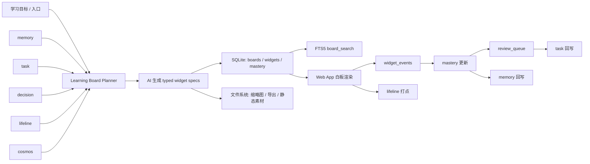
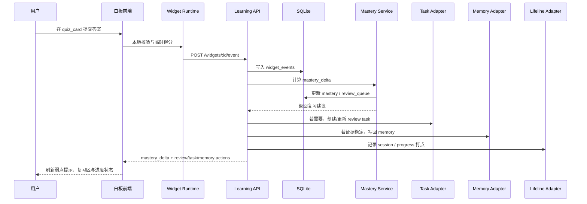

# Axiom Learning Board v0.1 研究报告

## Executive Summary

前序《白板功能研究报告》已经把方向判断对了：Axiom 不该做“AI 往白板上贴卡片”的笔记板，而应做“白板即学习运行时”。但落地路径必须收缩到 **Axiom 内的增量式模块**，而不是重写现有 Flask + SQLite + 文件系统底座。fileciteturn0file0

基于本次重新审视，**Learning Board v0.1** 最合理的定义是：复用 Axiom 现有 `memory / task / decision / lifeline / cosmos` 作为上下文和回写宿主，新增最小的 `boards / board_nodes / widgets / widget_events / mastery / review_queue` 层；AI 只允许输出 **typed widgets 的结构化 JSON spec**，不允许任意 HTML、任意脚本或复杂沙箱。Obsidian 已证明无限画布、开放 JSON Canvas、本地文件和嵌套 Canvas 的可行性；Heptabase 已证明 whiteboards + cards + AI Tutor 可以承载结构化学习与课程分段；因此 Axiom 应吸收两者的交互模式，但保持自己的数据闭环。 citeturn3view0turn3view1turn22view3turn23view0turn23view1turn26view0

在工程上，v0.1 最该做的不是引入代码沙箱，而是把白板内容变成 **可验证、可重放、可局部再生成、可回写 mastery/review/task 的 typed widgets**。前端优先采用 React + tldraw 作为白板壳层，React Flow 只用于局部图类 widget；本地缓存用 Service Worker + IndexedDB；后端继续走 Flask + SQLite + FTS5，不做数据库迁移。SQLite FTS5 原生支持外部内容表、触发器维护索引、`highlight()` 和 `snippet()`，足够支撑白板搜索与命中高亮。 citeturn35view0turn34view0turn34view1turn34view2turn18view2turn18view5turn36view0turn36view3turn16view0

Learning Board v0.1 的 MVP 应只包含四类 widget：`concept_map`、`function_visualizer`、`quiz_card`、`example_card`。其中 `function_visualizer` 必须是 **安全表达式渲染器**，而不是任意代码执行器；`quiz_card` 与 `example_card` 负责最早的 mastery 证据；`concept_map` 则承担课程导航、先修关系和弱点高亮。基于学习科学综述，实践测试与分散练习都属于高效用学习技术，这使得 “白板—测验—复习队列—任务回写” 成为 v0.1 最值得优先验证的闭环。 citeturn31view0

## 设计边界与 Axiom 接缝

本报告以下方案，**完全以题设给定的 Axiom 现有边界为前提**：后端仍是 Flask + SQLite + 文件系统；已有对象包括 `memory / task / decision / lifeline / cosmos`；前端已有移动 Web App、FTS5 搜索与模块系统。凡题设未给出的现有字段名、现有 API 路径、现有认证会话机制，一律标注为 **未指定**。因此，下文所有设计都遵守两个原则：其一，只做“新增表 + 适配层 + 新模块”，不重构宿主；其二，Learning Board 只消费并回写已有对象，不再平行造第二套用户模型。



Learning Board 与现有 Axiom 对象的最小接缝，建议如下。这里的“现有字段依赖”一栏故意保守，因为题设没有给出这些表的精确 schema；v0.1 只假定这些对象至少存在一个稳定的主键与可读文本字段，其它字段名保持未指定。

| 现有 Axiom 对象 | Learning Board 的读取用途 | Learning Board 的写回用途 | 建议桥接方式 | 现有字段依赖 |
|---|---|---|---|---|
| `memory` | 读取兴趣、已知事实、常见误区、偏好类比、近期主题 | 写回“已掌握概念”“持续误解”“偏好示例”与用户手工 pin 的学习摘要 | 新增 `board_refs(ref_kind='memory')`；可选 `widget_writebacks` | 除主键与正文外均未指定 |
| `task` | 读取今日学习负载、考试/DDL、待复习项 | 创建 `learning_review`、`learning_session`、`learning_project_step` 类任务 | 优先直接复用现有 task create/update API；若 task 类型枚举刚性，则加 `task_meta_learning` | task 字段与 API 未指定 |
| `decision` | 读取“考前冲刺 / 长线学习 / 项目带学”等模式 | 记录系统建议路径被接受/拒绝 | `board_refs(ref_kind='decision')` + `decision_feedback` | 字段未指定 |
| `lifeline` | 读取课程时间线、周次、主题进度 | 写入 session 完成、单元推进、阶段里程碑 | `board_sessions` 存板级会话，再异步同步进 lifeline | entry 结构未指定 |
| `cosmos` | 读取 topic/entity 关系、先修簇、关联主题 | 可选写入 `course_concept`、`prerequisite`、`applies_to` 等实体/关系 | v0.1 先本地存 `concept_key`，只保留 `cosmos_ref_id` 可选映射 | entity/association 结构未指定 |
| 文件系统 | 提供本地导出与静态资源宿主 | 保存缩略图、导出 JSON、白板快照、附件 | `/boards/<board_id>/` 风格目录；根路径未指定 | 路径规则未指定 |

Axiom 现有栈足以承载这个模块，不需要为了白板先迁移数据库。Flask 官方文档本身就把 SQLite 作为一个“按需连接、请求结束自动关闭”的轻量模式来说明，并建议通过 `schema.sql` 初始化独立的增量 schema；同时可直接使用 `sqlite3.Row` 获得字典式访问。SQLite FTS5 又明确支持 **external content tables**，可以通过触发器把外部表同步到 FTS 索引，并为命中结果返回 `highlight()` 和 `snippet()`。这意味着 `widgets` 与 `board_search` 可以完全停留在 SQLite 内，而不需要先引入 Elasticsearch、Postgres 或单独的搜索服务。 citeturn35view0turn35view1turn34view0turn34view1turn34view2

因此，接缝策略应当是：**现有对象不搬家，Learning Board 新增一层“板—节点—widget—事件—掌握度—复习队列”的局部 schema，再通过 `board_refs` 和 writeback adapter 与 `memory/task/decision/lifeline/cosmos` 连接。** 这让白板可以先作为独立模块验证，而不会把 Axiom 现有数据模型拖进一次高风险重构。这样的分层，也和前序报告“白板即学习运行时”的判断一致，只是把它缩成了一个可施工的 MVP。fileciteturn0file0

## Heptabase 与 Obsidian 以及 Apple Widget 借鉴

竞品的价值，不在于复制一整套产品，而在于拆出 **Axiom v0.1 应该借什么、绝不该借什么**。Obsidian 给的是开放格式与本地所有权；Heptabase 给的是白板作为学习与研究主界面的可行工作流；Apple Widget 给的是小组件的视觉语法，而不是白板引擎。

| 产品 | 核心单位与布局 | 最值得借鉴的点 | 不该照搬的点 | 数据持久化差异 | 对 Axiom v0.1 的结论 | 来源 |
|---|---|---|---|---|---|---|
| Obsidian Canvas | 无限画布；卡片可嵌入笔记、图片、PDF、视频、音频与交互网页；支持嵌套 Canvas | `JSON Canvas` 开放格式；本地文件/离线优先；嵌套画布；白板节点可混合承载多种资源 | 过度依赖插件生态；把学习交互寄托在任意网页 embed 上 | 官方帮助明确说明数据以 vault 文件夹中的本地文件存储，离线可访问；Canvas 文件使用开放的 JSON Canvas 格式；社区已有 4,316 个插件与 541 个主题 | **借其开放 interchange 与本地持久化思路；不要让 widget 退化成任意网页嵌入** | citeturn3view0turn3view1turn25view0turn26view0 |
| Heptabase | whiteboards + cards + connected knowledge base；以白板组织来源、笔记与讨论 | “whiteboards + cards to clarify your thinking”；AI Tutor 把学习目标展开成 syllabus、lesson parts、progress、review | 当前公开页没有公开白板文件格式；公开信息更偏应用体验，不适合作为开放底座复刻 | 官方公开首页强调“visual knowledge base”与 AI Tutor，但未检索到类似 JSON Canvas 的公开文件规范，公开持久化格式记为 **未指定** | **借其课程层级、lesson progress、review 分段与白板留在学习流程中央的交互** | citeturn22view3turn23view0turn23view1turn23view2 |
| Apple Widget 风格 | 小尺寸、密度高、快速扫视的卡片式信息块 | `S / M / L / XL` 尺寸族、摘要优先、操作克制、状态一眼可读 | 宿主模型是系统 widget，不是自由白板；不适合作为白板持久化或运行时模型 | 以系统宿主为中心；在本次可检索官方页面中，细节展开受限，持久化实现细节记为 **未指定** | **只借视觉语法，不借宿主机制** | 前序报告归纳 fileciteturn0file0 |
| Axiom Learning Board 目标态 | AI 生成 typed widgets，嵌入现有移动 Web App；布局、题目、掌握度、复习与任务在同一空间 | 白板作为课程操作台；所有 widget 结构化；事件可回写 `mastery / review_queue / task / memory` | 不追求一开始做插件市场、多人协作、任意代码运行 | SQLite + 文件系统为主，浏览器侧用 IndexedDB 缓存与草稿状态 | **MVP 先做“开放结构 + 课程运行时 + 回写闭环”三件事** | 题设给定边界 + 本报告方案 |

从产品结论上看，**Obsidian 适合给 Axiom 一个“开放板文件 + 本地文件持久化”的底线；Heptabase 适合给 Axiom 一个“课程 / lesson / review / progress 都放在白板里”的上层交互模板；Apple Widget 则只适合提供白板上每个 widget 的尺寸与信息密度语言。** Obsidian 官方页面把 Canvas 定义为“playground for thought”，并且明确支持嵌入 fully interactive web pages、嵌套 Canvas，以及本地存储在开放 `JSON Canvas` 文件中；Heptabase 官方首页则直接把 whiteboards、cards、AI Tutor、syllabus、lesson planning、review 摆在同一产品故事里。两者叠加起来，已经足以构成 Learning Board v0.1 的交互骨架。 citeturn3view0turn3view1turn22view3turn23view0turn23view1

这也带来一个很重要的决策：**Axiom 应把 JSON Canvas 当作 import/export 与可迁移格式，而不是当作内部 source of truth。** 理由很简单：JSON Canvas 1.0 的 `nodes` / `edges` 很适合表示几何布局和可视连接，但它没有为 `mastery evidence`、`review scheduling`、`provenance`、`security capability`、`state schema` 这些学习运行时字段预留位子。它适合做板级互操作，但不适合单独承载 typed widget 的全部语义。 citeturn3view1

## Typed Widget 规范

Learning Board v0.1 的底层合同，不应该是“AI 生成一个白板页面”，而应该是“AI 生成一组 **受控 widget manifest**，由确定性的 renderer 去渲染和记事件”。因此，所有 widget 应共享一个统一包络层。

| 通用字段 | 作用 | v0.1 约束 |
|---|---|---|
| `widget_id` | 白板内稳定 ID | AI 可留空，由后端补发 |
| `type` | widget 类型 | 仅允许 `concept_map / function_visualizer / quiz_card / example_card` |
| `spec_version` | spec 版本 | 采用 semver；v0.1 统一为 `1.0.0` |
| `title` | 卡面标题 | 纯文本，不允许 HTML |
| `concept_refs` | 指向概念或 `cosmos_ref_id` | 可为空；现有 cosmos 字段未指定时用本地 `concept_key` |
| `input` | widget 初始输入 | 必须满足 JSON Schema；`additionalProperties: false` |
| `state` | 用户态/局部状态 | 只允许 JSON 标量、数组、对象；不允许函数与 HTML |
| `output_schema` | 事件产出的结构 | 用于校验评分和写回 |
| `events` | 合法事件类型白名单 | 前端只能上报白名单事件 |
| `security` | 执行/渲染能力 | v0.1 仅允许 `pure_client` / `trusted_renderer` |
| `provenance` | 生成与来源信息 | 必含 `generation_id`、`source_refs`、`template_version` |
| `ui` | 默认尺寸与交互偏好 | 支持 `S / M / L / XL` |
| `writeback` | 允许写回什么 | 仅允许 `mastery / review / task / memory / lifeline` |

下面这张表给出 v0.1 四类必做 widget 的最小规范。表里的 JSON 只保留关键字段，真实实现中建议补齐 `provenance`、`ui`、`writeback` 与 `security`。

| Widget | 输入 / 输出 | 主要 state | 事件类型 | spec 示例 JSON 模板 |
|---|---|---|---|---|
| `concept_map` | 输入：概念节点、先修边、焦点概念；输出：被聚焦概念、完成状态、路径点击 | `collapsed_groups`、`selected_node`、`viewport` | `node_opened`、`node_focused`、`path_highlighted`、`concept_marked_done` | `{"type":"concept_map","spec_version":"1.0.0","input":{"nodes":[{"id":"limit","label":"极限"}],"edges":[{"from":"limit","to":"derivative","relation":"prerequisite"}],"focus":"limit"},"state":{"collapsed_groups":[],"selected_node":null}}` |
| `function_visualizer` | 输入：表达式、参数滑块、定义域、问题提示；输出：当前参数组、关键点答案、完成状态 | `params`、`last_curve_hash`、`question_answers` | `slider_changed`、`graph_reset`、`point_hovered`、`question_answered`、`completed` | `{"type":"function_visualizer","spec_version":"1.0.0","input":{"expression":"a*x^2+b*x+c","parameters":[{"name":"a","min":-3,"max":3,"step":0.1,"default":1}],"domain":{"x":[-10,10],"y":[-10,10]},"prompts":["当 a<0 时开口如何变化？"]},"state":{"params":{"a":1,"b":0,"c":0}}}` |
| `quiz_card` | 输入：题目、答案类型、评分规则与概念映射；输出：得分、错误模式、hint 使用情况 | `current_attempt`、`revealed_hints`、`submitted` | `quiz_started`、`answer_changed`、`hint_opened`、`answer_submitted`、`retry_requested` | `{"type":"quiz_card","spec_version":"1.0.0","input":{"items":[{"id":"q1","kind":"single_choice","prompt":"导数的几何意义是？","options":["切线斜率","面积","极限值"],"answer":"切线斜率","concept_refs":["derivative.geometry"]}],"scoring":{"mode":"deterministic"}},"state":{"current_attempt":1,"revealed_hints":[]}}` |
| `example_card` | 输入：题干、步骤、错因、变式；输出：用户看到哪一步、是否独立作答、是否加入复习 | `visible_step`、`self_solve_first`、`bookmarked` | `step_revealed`、`self_try_started`、`variant_requested`、`bookmark_review`、`completed` | `{"type":"example_card","spec_version":"1.0.0","input":{"problem":"求 y=x^2 在 x=1 处切线斜率","steps":["写出导数定义","化简","取极限"],"common_errors":["把切线斜率当函数值"],"variants":["求 x=2 处切线斜率"]},"state":{"visible_step":0,"self_solve_first":true}}` |

这个规范最关键的不是字段多少，而是 **权限边界清晰**。例如 `function_visualizer` 在 v0.1 必须被限制为 **安全表达式 DSL**：只允许 `+ - * / ^`、基础初等函数、变量 `x` 与已声明参数名；不能接受自定义 JS、不能访问网络、不能注入 DOM。`quiz_card` 的评分也要尽量走确定性规则，而不是“把答案交给 LLM 口头评分”。这使得 widget 的计算行为可以留在浏览器 renderer 中，而不是把白板变成一组不可复现的 AI 片段。

版本控制也必须前置。tldraw 的官方示例既展示了 **shape props validator**，也展示了 **custom shape migrations** 和 `persist to storage` / `meta migrations` 这样的模式；这恰好适合作为 widget schema 的实现参照：`spec_version` 管 manifest，`renderer_version` 管前端渲染器，必要时通过 migration 脚本把旧 spec 升级到新版。这样就算后续补充 `example_card` 的新字段，也不会破坏旧板。 citeturn36view2turn36view3turn36view0

安全边界应写入 spec，而不是靠约定。浏览器侧对任何潜在嵌入内容都应遵守 `<iframe sandbox>` 与 CSP 的最小权限原则：iframe 可以被赋予独立的 `sandbox` 限制；MDN 也明确提醒不要把 `allow-scripts` 与 `allow-same-origin` 随意同时用于同源嵌入，因为这样会显著削弱隔离；CSP 则负责限制资源加载、抑制 XSS 与 clickjacking 风险。对 v0.1 而言，最简单的选择就是根本不允许 AI 生成 iframe、HTML 或脚本字段，只允许 JSON spec。 citeturn19view0turn20view0turn20view2

## AI 生成约束与前端实现

AI 生成流程建议拆成 **四段式**，而不是一个大 prompt 一次生成整板。顺序应是：`planner` 先产出概念簇与板面需求；`widget_builder` 再按允许类型生成 widget spec；`layout_planner` 输出 board 节点几何信息；最后由 `validator` 做 schema、安全与来源校验。这样做的好处，是可以局部再生成：只要某个 quiz 表现很差，就只重算那一簇 widget，而不是把整个白板重做。

推荐的 prompt 结构如下。这里展示的是系统模板骨架，而不是唯一文案。

```text
System:
你是 Axiom Learning Board builder。
你只能输出合法 JSON。
禁止输出 HTML、Markdown 页面、脚本、iframe、URL embed、解释性文本。
允许的 widget 类型只有:
- concept_map
- function_visualizer
- quiz_card
- example_card

Input:
- learning_goal
- user_context_from_memory_task_decision_lifeline_cosmos
- allowed_widget_types
- max_widgets
- board_size_hint
- prior_mastery
- source_refs

Output JSON schema:
{
  "board": {...},
  "widgets": [...],
  "nodes": [...],
  "board_refs": [...],
  "review_hints": [...]
}

Hard rules:
- additionalProperties=false
- 每个 widget 必须带 spec_version
- function_visualizer 只能使用 safe expression grammar
- quiz_card 必须给出 deterministic scoring mode
- example_card 必须包含 steps 与 common_errors
- concept_map 必须给出 prerequisites 或 relation labels
```

为了可复现性，后端应在 `board_generations` 中强制记录：`prompt_template_version`、`model_id`、`seed`、`temperature`、`input_snapshot_hash`、`raw_output`、`normalized_output`、`validator_report`。其中 `temperature` 建议在 `0.0–0.2`，并做字段名排序与 canonical JSON 序列化；同一输入快照与同一模板版本产生的 spec，最好能做到“结构近似一致，局部可比对”。这不是因为生成一定要一模一样，而是因为白板系统最怕 **用户布局被无意覆盖**。只有 generation 记录充分，局部 patch 才能可信。

验证层必须做三类拦截。第一类是 **schema validation**：所有 widget 都必须过 JSON Schema，未知字段一律拒收。第二类是 **policy validation**：禁止 HTML、`script`、`srcdoc`、`iframe_url`、任意外链与未在 allowlist 中的资源引用。第三类是 **pedagogical lint**：例如 `quiz_card` 不能没有概念映射，`example_card` 不能没有错因，`function_visualizer` 不能没有问题提示。也就是说，Axiom 要把“prompt engineering”升级成“spec engineering”。

前端实现建议优先采用 **React + tldraw 做白板壳层**。理由很直接：tldraw 官方示例已经覆盖了 `custom shape`、`custom tool`、`persist to storage`、`meta migrations`、`multiplayer sync`、`education canvas` 等场景，而且它的 shape props 使用 validator 库做数据约束，非常接近 Learning Board 需要的“受控 widget shape”模型。真正需要你自己写的，不是无限画布，而是“如何把 widget spec 安全地挂到 shape props 和右侧详情面板上”。 citeturn14view0turn33view1turn36view0turn36view2turn36view3

对于图类 widget，**React Flow 更适合作为局部组件，而不是整板引擎**。React Flow 官方文档明确指出，自定义节点可以嵌入表单、图表和其他交互元素，而且自定义节点本质上就是一个 React 组件，框架会自动为它注入拖拽、选择与连接句柄能力。这正适合 `concept_map` 这样的局部图渲染：白板壳层交给 tldraw，`concept_map` 内部的小图谱则交给 React Flow。 citeturn16view0turn16view1

`function_visualizer` 的 MVP 实现应严格避免任意代码执行。建议做法是：前端内置一个安全表达式解析器，只接受固定 DSL；滑块变化时只更新参数，不重新编译整个表达式；渲染层在点数较少时用 SVG，在持续拖动或点数较多时用 Canvas；事件上报只在 `pointerup` 或节流后的关键帧发送，而不是每次拖动都落库。这样既能得到接近“拖动变量看函数趋势”的体验，也不会引入任何浏览器沙箱复杂度。

移动端要单独对待。Axiom 已经有移动 Web App，因此 v0.1 不应强求手机上完整复刻桌面自由排布。更稳妥的模式是：**桌面端负责生成、布局、概念图重排与函数探索；移动端优先承担 review、quiz、例题浏览与任务勾选。** 这样做不仅符合现实交互，也符合运行时约束。StackBlitz 官方页面对 WebContainers 的浏览器支持说明非常明确：桌面 Chromium 支持最好，Firefox/Safari 仍属 beta，而移动端只部分支持，并且大型项目受内存限制明显；JupyterLite 与 Pyodide 虽然都能在浏览器里运行，但它们更适合作为 Phase 2 之后的实验台，而不是 v0.1 的默认前提。 citeturn15view1turn15view3turn21view0

本地缓存是 v0.1 的刚需，而不是锦上添花。Service Worker 可以拦截请求、缓存静态资源并在离线时提供代理逻辑；MDN 也说明它运行在 worker context 中，没有 DOM 访问权限、异步且非阻塞。IndexedDB 则是浏览器里的事务型结构化存储，适合保存大量结构化数据和 file/blob。对 Learning Board 来说，至少以下数据应先写本地：`board layout draft`、`widget_user_state`、`quiz draft answers`、最近一次 `generation output` 与缩略搜索缓存。 citeturn18view2turn18view3turn18view4turn18view5

## 后端 Schema 与交互闭环

由于 v0.1 不重构后端，后端 schema 应该遵守一个核心原则：**布局归布局，widget 归 widget，写回归写回。** 这意味着不能把整板都塞到一列 JSON 里，也不能把 widget 直接混成富文本。下面给出一份适合 SQLite 的最小 schema。字段中凡涉及现有 Axiom 表的外键，若现有主键类型未指定，则统一先用 `TEXT` 存连接引用。

```sql
CREATE TABLE boards (
  id TEXT PRIMARY KEY,
  user_id TEXT NOT NULL,
  title TEXT NOT NULL,
  source_type TEXT NOT NULL CHECK (source_type IN ('goal','memory','task','decision','lifeline','cosmos','manual')),
  source_ref_id TEXT,
  status TEXT NOT NULL DEFAULT 'ready' CHECK (status IN ('draft','ready','archived')),
  board_version INTEGER NOT NULL DEFAULT 1,
  generation_id TEXT,
  created_at TEXT NOT NULL,
  updated_at TEXT NOT NULL
);

CREATE TABLE board_refs (
  board_id TEXT NOT NULL,
  ref_kind TEXT NOT NULL CHECK (ref_kind IN ('memory','task','decision','lifeline','cosmos')),
  ref_id TEXT NOT NULL,
  ref_role TEXT NOT NULL, -- source / prerequisite / personalization / writeback
  created_at TEXT NOT NULL,
  PRIMARY KEY (board_id, ref_kind, ref_id, ref_role),
  FOREIGN KEY (board_id) REFERENCES boards(id) ON DELETE CASCADE
);

CREATE TABLE widgets (
  id TEXT PRIMARY KEY,
  board_id TEXT NOT NULL,
  type TEXT NOT NULL CHECK (type IN ('concept_map','function_visualizer','quiz_card','example_card')),
  title TEXT NOT NULL,
  spec_version TEXT NOT NULL,
  spec_json TEXT NOT NULL,
  source_refs_json TEXT,
  locked_by_user INTEGER NOT NULL DEFAULT 0,
  pinned_by_user INTEGER NOT NULL DEFAULT 0,
  generation_id TEXT,
  created_at TEXT NOT NULL,
  updated_at TEXT NOT NULL,
  FOREIGN KEY (board_id) REFERENCES boards(id) ON DELETE CASCADE
);

CREATE TABLE board_nodes (
  board_id TEXT NOT NULL,
  widget_id TEXT NOT NULL,
  user_id TEXT NOT NULL,
  x REAL NOT NULL,
  y REAL NOT NULL,
  w REAL NOT NULL,
  h REAL NOT NULL,
  z_index INTEGER NOT NULL DEFAULT 0,
  size_family TEXT NOT NULL DEFAULT 'M' CHECK (size_family IN ('S','M','L','XL')),
  collapsed INTEGER NOT NULL DEFAULT 0,
  hidden INTEGER NOT NULL DEFAULT 0,
  updated_at TEXT NOT NULL,
  PRIMARY KEY (board_id, widget_id, user_id),
  FOREIGN KEY (board_id) REFERENCES boards(id) ON DELETE CASCADE,
  FOREIGN KEY (widget_id) REFERENCES widgets(id) ON DELETE CASCADE
);

CREATE TABLE widget_user_state (
  user_id TEXT NOT NULL,
  widget_id TEXT NOT NULL,
  state_json TEXT NOT NULL,
  state_version INTEGER NOT NULL DEFAULT 1,
  local_revision INTEGER NOT NULL DEFAULT 0,
  updated_at TEXT NOT NULL,
  PRIMARY KEY (user_id, widget_id),
  FOREIGN KEY (widget_id) REFERENCES widgets(id) ON DELETE CASCADE
);

CREATE TABLE widget_events (
  id TEXT PRIMARY KEY,
  user_id TEXT NOT NULL,
  board_id TEXT NOT NULL,
  widget_id TEXT NOT NULL,
  event_type TEXT NOT NULL,
  event_payload_json TEXT NOT NULL,
  client_ts TEXT,
  server_ts TEXT NOT NULL,
  idempotency_key TEXT,
  FOREIGN KEY (board_id) REFERENCES boards(id) ON DELETE CASCADE,
  FOREIGN KEY (widget_id) REFERENCES widgets(id) ON DELETE CASCADE
);

CREATE TABLE mastery (
  user_id TEXT NOT NULL,
  concept_key TEXT NOT NULL,
  cosmos_ref_id TEXT,          -- 未指定时可为空
  score REAL NOT NULL DEFAULT 0.0,
  evidence_count INTEGER NOT NULL DEFAULT 0,
  recent_correct_rate REAL NOT NULL DEFAULT 0.0,
  hint_rate REAL NOT NULL DEFAULT 0.0,
  avg_latency_ms REAL,
  last_reviewed_at TEXT,
  next_review_at TEXT,
  updated_at TEXT NOT NULL,
  PRIMARY KEY (user_id, concept_key)
);

CREATE TABLE review_queue (
  id TEXT PRIMARY KEY,
  user_id TEXT NOT NULL,
  concept_key TEXT NOT NULL,
  board_id TEXT,
  priority INTEGER NOT NULL DEFAULT 50,
  reason TEXT NOT NULL,        -- low_mastery / wrong_answer / due_review / manual_pin
  scheduled_for TEXT NOT NULL,
  status TEXT NOT NULL DEFAULT 'todo' CHECK (status IN ('todo','done','skipped')),
  created_at TEXT NOT NULL,
  updated_at TEXT NOT NULL
);

CREATE TABLE board_generations (
  id TEXT PRIMARY KEY,
  board_id TEXT,
  prompt_template_version TEXT NOT NULL,
  model_id TEXT NOT NULL,
  seed INTEGER,
  temperature REAL NOT NULL DEFAULT 0.1,
  input_snapshot_hash TEXT NOT NULL,
  raw_output TEXT NOT NULL,
  normalized_output TEXT NOT NULL,
  validator_report_json TEXT NOT NULL,
  created_at TEXT NOT NULL
);
```

如果当前 SQLite 已启用 JSON1，则 `spec_json / state_json / event_payload_json` 可以追加 `CHECK(json_valid(...))`；是否启用 JSON1，题设 **未指定**。同样地，若现有 `task` 或 `memory` API 已允许附带 `metadata_json`，则最好直接复用；如果现有对象 schema 非常刚性，再补一个轻量 `*_meta_learning` 表。因为题设没有给出现有对象的精确字段结构，这里不建议对 `memory / task / decision / lifeline / cosmos` 本体做硬性迁移假设。

为了复用现有 FTS5 搜索，本模块还应增加一个板内搜索源表，并使用 FTS5 external content table 维护索引。SQLite 官方文档明确给出了 external content table 与触发器同步的模式，这正适合 `widgets` 的标题、正文、标签与概念文本被外部搜索，而不用复制整份业务数据。命中结果还可以用 `highlight()` 与 `snippet()` 生成搜索高亮摘要。 citeturn34view0turn34view1turn34view2

```sql
CREATE TABLE widget_search_source (
  rowid INTEGER PRIMARY KEY AUTOINCREMENT,
  widget_id TEXT NOT NULL UNIQUE,
  board_id TEXT NOT NULL,
  title TEXT NOT NULL,
  body TEXT NOT NULL,
  tags TEXT DEFAULT ''
);

CREATE VIRTUAL TABLE board_search USING fts5(
  title,
  body,
  tags,
  content='widget_search_source',
  content_rowid='rowid'
);
```

API 设计上，建议作为独立 Flask blueprint 暴露在 `/api/learning/*` 下；若当前路由前缀不同，则以现有模块系统为准，具体注册路径 **未指定**。认证方式复用现有 Axiom 会话；现有认证头或 cookie 机制 **未指定**。

| API | 方法 | 作用 | 关键请求字段 | 关键响应字段 |
|---|---|---|---|---|
| `/api/learning/boards/generate` | POST | 从目标与上下文生成新白板 | `goal`、`source_refs`、`allowed_widget_types`、`max_widgets` | `board_id`、`widgets`、`nodes`、`generation_id` |
| `/api/learning/boards/<board_id>` | GET | 读取白板、widget 与布局 | 路径参数 | `board`、`widgets`、`nodes`、`mastery_summary` |
| `/api/learning/boards/<board_id>/layout` | PATCH | 持久化节点位置、尺寸、折叠态 | `updates[]` | `ok`、`updated_at` |
| `/api/learning/widgets/<widget_id>/event` | POST | 记录事件并触发 mastery/review/writeback | `event_type`、`payload`、`idempotency_key` | `mastery_delta`、`review_actions`、`task_actions` |
| `/api/learning/widgets/<widget_id>/regenerate` | POST | 局部重算单个 widget | `reason`、`preserve_layout` | `widget`、`generation_id` |
| `/api/learning/reviews/queue` | GET | 拉取待复习概念列表 | `due_before` 可选 | `items[]` |
| `/api/learning/boards/<board_id>/search` | GET | 板内搜索 | `q` | `hits[]`，可含 `snippet/highlight` |

示例请求与响应如下。

```json
POST /api/learning/boards/generate
{
  "goal": "两周内学会一元函数基础，并具备导数图像直觉",
  "source_refs": [
    {"kind": "decision", "id": "dec_exam_calc"},
    {"kind": "lifeline", "id": "life_calc_week1"},
    {"kind": "memory", "id": "mem_pref_visual_learning"}
  ],
  "allowed_widget_types": [
    "concept_map",
    "function_visualizer",
    "quiz_card",
    "example_card"
  ],
  "max_widgets": 6,
  "board_size_hint": "desktop_first"
}
```

```json
200 OK
{
  "board_id": "board_01J2...",
  "generation_id": "gen_01J2...",
  "board": {
    "title": "函数基础学习板",
    "source_type": "decision",
    "source_ref_id": "dec_exam_calc"
  },
  "widgets": [
    {"id": "w_map", "type": "concept_map", "title": "课程地图"},
    {"id": "w_func", "type": "function_visualizer", "title": "一次函数与二次函数变化"},
    {"id": "w_quiz", "type": "quiz_card", "title": "快速小测"},
    {"id": "w_ex", "type": "example_card", "title": "例题拆解"}
  ],
  "nodes": [
    {"widget_id": "w_map", "x": 48, "y": 40, "w": 560, "h": 360, "size_family": "XL"},
    {"widget_id": "w_func", "x": 640, "y": 40, "w": 520, "h": 360, "size_family": "XL"}
  ]
}
```

```json
POST /api/learning/widgets/w_quiz/event
{
  "event_type": "answer_submitted",
  "idempotency_key": "evt_7afc4d",
  "payload": {
    "question_id": "q1",
    "selected": "切线斜率",
    "correct": true,
    "attempt_index": 1,
    "latency_ms": 9200,
    "hint_used": false,
    "confidence": 0.72,
    "concept_refs": ["derivative.geometry"]
  }
}
```

```json
200 OK
{
  "accepted": true,
  "mastery_delta": {
    "concept_key": "derivative.geometry",
    "old_score": 0.42,
    "new_score": 0.57
  },
  "review_actions": [
    {
      "action": "schedule",
      "concept_key": "derivative.geometry",
      "scheduled_for": "2026-06-03T09:00:00Z",
      "reason": "due_review"
    }
  ],
  "task_actions": [],
  "memory_actions": []
}
```

Learning Board 的事件闭环建议采用以下时序。这里用 `quiz_card` 举例，因为它最容易体现 mastery 与 review 的回写。



`mastery_score` 不建议在 v0.1 就做 IRT 或复杂贝叶斯模型。更务实的做法是基于概念粒度做一个 **加权证据模型**。例如：`correctness`、`first_try`、`hint_used`、`latency_ms`、`confidence`、`explanation_quality` 各给定权重；每次事件产生一个 `evidence_score`；最终 `mastery_new = 0.7 * old + 0.3 * evidence_score`。其中 `explanation_quality` 在 v0.1 可以先缺省为未启用，因为开放式自解释评分容易把系统拖进新的复杂性。真正重要的是先把“概念级证据汇总”做起来，而不是沉迷于花哨算法。

`review_queue` 可采用非常朴素但稳定的区间调度。因为 Dunlosky 等人的综述明确把 **practice testing** 与 **distributed practice** 评为高效用学习技术，v0.1 完全可以用简单的 mastery 桶来安排复习：例如 `score < 0.45` 安排 1 天内复习，`0.45–0.70` 安排 3 天内，`0.70–0.85` 安排 7 天内，连续两次正确再拉长到 14 天。先让复习环真正跑起来，再考虑更细的节律模型。 citeturn31view0

回写到 `task` 和 `memory` 也要克制。建议规则是：**不是每个 widget event 都值得进入长期记忆**。`task` 只承接真正需要后续动作的条目，比如 “某概念需要复习”“今天应完成一块学习板”“项目步骤待推进”；`memory` 只接收稳定且对后续个性化有价值的信息，比如“用户对图像类解释更有效”“某概念连续两次混淆”“用户手工 pin 的总结”。至于 `lifeline`，每完成一次板级学习会话即可打一条 session 记录；`cosmos` 则建议晚一点启用同步，等概念键值与本地图谱稳定后再写全局图，避免把实验性课程图直接污染到全局知识网络。

## 分阶段落地 验证与施工任务单

MVP 范围必须锁死。Learning Board v0.1 的胜负，不在于“能不能跑 Python”或“有没有多人协作”，而在于能否证明 **AI 生成的四类 typed widgets，在 Axiom 现有栈里，能形成一个可度量的学习闭环**。因此建议按三阶段推进。

| 阶段 | 范围 | 可交付物 | 验收指标 | 主要风险 | 缓解措施 |
|---|---|---|---|---|---|
| Phase 0 | 合同与骨架阶段 | `boards/widgets/mastery/review_queue` schema；4 类 widget JSON Schema；生成验证器；空白板 + 静态样例板；Axiom 模块注册 | 开发环境能渲染 1 张样例板；所有 spec 通过 validator；局部布局可保存与恢复 | 早期 schema 反复变动 | 先冻结 widget contract，再做 UI |
| Phase 1 | Learning Board v0.1 功能阶段 | AI 生成板；4 类 widget 真实可用；layout 持久化；widget_events；mastery/review/task 回写；板内搜索；移动端 review 模式 | 首板生成 P95 < 12s；白板打开 P95 < 1.5s；至少 60% 用户在首板发生一次有效交互；quiz 首次提交成功率可统计 | AI 噪声大、白板过满、移动端难操作 | 首板 widget 数限制为 4–6；默认模板优先；移动端关闭自由拖拽 |
| Phase 2 | 验证与优化阶段 | 局部再生成；弱点高亮；A/B 实验面板；更稳的 review_queue；lifeline 打点；可选 cosmos 同步 | Day-7 复习回访率提升；延迟测验通过率优于对照组；用户“可控感”评分提升 | 布局被覆盖、用户不信任 AI 改板 | `pin/lock` 默认可见；再生成只改局部；显示 provenance |

验证计划建议围绕 **白板是否真的优于现有线性学习页** 来做，而不是只看主观好不好看。A/B 测试可分三层。第一层是使用层：首屏到首次交互时间、每次会话停留时间、widget 完成率、局部再生成使用率。第二层是学习层：即时测验正确率、首答正确率、hint 使用率、错因复发率。第三层是保持层：Day-7 / Day-14 回访率，以及同概念延迟回忆表现。由于 Axiom 当前活跃用户规模、课程品类、实验流量配额 **未指定**，严格的样本量与检验功效不能在此精确给出，但实验设计应尽量保持“同主题、同长度、不同呈现形式”的可比条件。

| 研究问题 | 对照设计 | 主要指标 | 次要指标 | 备注 |
|---|---|---|---|---|
| 白板是否优于线性 lesson | 同一单元：线性页 vs Learning Board | 会话完成率、首答正确率 | 退出率、首个有效交互时间 | 最重要的 MVP 实验 |
| `function_visualizer` 是否提升理解 | 静态图版 vs slider 交互版 | 图像直觉题正确率 | 二次打开率、停留时长 | 适合数学/物理单元 |
| 局部再生成是否提高信任 | 整板重生 vs 局部 patch | “可控感”主观评分 | pin/lock 使用率 | 用于验证 AI 改板策略 |
| review_queue 是否提升保持 | 开启复习队列 vs 不开启 | Day-7 recall | 回访率、task 完成率 | 最能体现闭环价值 |

工程成本方面，若按“增量模块、4 类 widget、无复杂沙箱”来估算，Learning Board v0.1 本身并不需要上一版报告那种平台级投入，但也不算轻。粗略人月可按下表估算；预算题设未给出，因此标注为 **未指定**。日历工期取决于现有前端是否已是 React、是否已有统一 API 层与现成会话系统，这些前置条件目前都 **未指定**。

| 角色 / 方向 | Phase 0 | Phase 1 | Phase 2 | 合计人月 | 说明 |
|---|---:|---:|---:|---:|---|
| 前端 | 0.8 | 1.8 | 0.9 | 3.5 | 白板壳层、4 类 widget、移动端 review 模式 |
| 后端 | 0.6 | 1.2 | 0.8 | 2.6 | schema、API、事件回写、FTS5、生成记录 |
| AI Prompt / Validator | 0.5 | 0.8 | 0.5 | 1.8 | planner、builder、schema validator、patch regen |
| QA | 0.2 | 0.4 | 0.4 | 1.0 | 交互回放、事件一致性、移动端回归 |
| 产品 / 设计 | 0.4 | 0.5 | 0.4 | 1.3 | 白板信息架构、尺寸家族、实验设计 |
| 合计 | 2.5 | 4.7 | 3.0 | 10.2 | 预算未指定 |

最后，下面这张清单可以直接转成 Agent 施工任务。它有意避开了多人协作、任意代码执行、外部插件市场等高风险项，把所有动作锁在 v0.1 的必要范围内。

| Agent 任务 | 输入 | 产出 | 完成定义 |
|---|---|---|---|
| `LB-CONTRACT` | 本报告 widget 规范 | 4 类 widget JSON Schema + validator | 后端可拒收非法字段，前端可生成 TS 类型 |
| `LB-SCHEMA` | 本报告 SQL | migration 脚本 + rollback 脚本 | SQLite 可创建核心表，含 FTS5 搜索表 |
| `LB-API` | API contract 示例 | Flask blueprint + OpenAPI 文档 | 能生成板、取板、存布局、记事件、局部重算 |
| `LB-TLDRAW` | `boards/widgets/board_nodes` | 白板壳层页面 | 能渲染 widget 节点并保存布局 |
| `LB-CONCEPT-MAP` | `concept_map` spec | 交互式课程地图 widget | 至少支持节点点击、聚焦、完成标记 |
| `LB-FUNC-VIZ` | `function_visualizer` spec | 安全表达式渲染器 | 至少支持参数 slider、图像更新、问题提示 |
| `LB-QUIZ` | `quiz_card` spec | 确定性评分小测 widget | 提交后能生成 mastery 证据 |
| `LB-EXAMPLE` | `example_card` spec | 分步例题 widget | 支持逐步展开、变式、加入复习 |
| `LB-WRITEBACK` | widget_events | mastery/review/task/memory 适配层 | 正确答题后能更新 mastery 并按规则排复习 |
| `LB-SEARCH` | widgets 内容文本 | 板内搜索接口 | `highlight/snippet` 可在结果中展示 |
| `LB-ABTEST` | 线性页与白板页 | 实验开关 + 指标面板 | 能比较完成率、首答正确率、Day-7 recall |
| `LB-MOBILE` | 现有移动 Web App | review 模式与 quiz 优化 | 手机上可完成复习与小测，不强制自由拖拽 |

最终结论很明确：**Learning Board v0.1 完全可以在 Axiom 现有 Flask + SQLite + 文件系统 + 模块系统之上增量落地，而且不需要先引入复杂沙箱。** 最优施工顺序不是“先做最炫的函数 demo”或“先做完整白板平台”，而是先把 **typed widget contract、布局持久化、事件日志、mastery/review/task 回写** 四件事做稳。只要这四件事成立，Heptabase 式的课程组织、Obsidian 式的开放互操作、Apple Widget 式的高密度卡面才会真正变成 Axiom 的优势，而不是停留在视觉灵感。 fileciteturn0file0 citeturn3view0turn3view1turn22view3turn23view1turn35view0turn34view0turn31view0